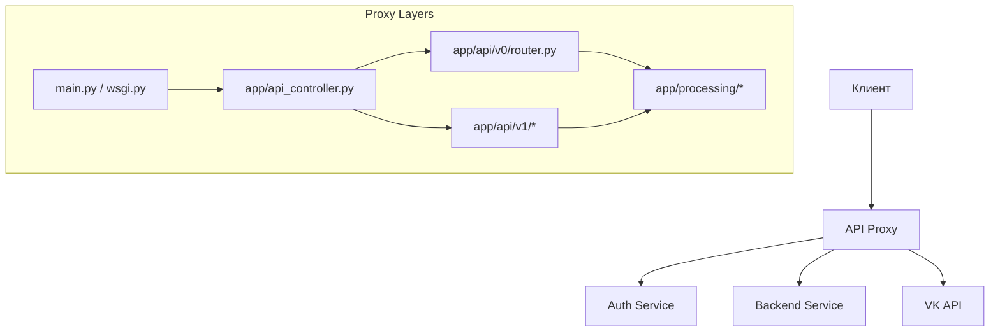
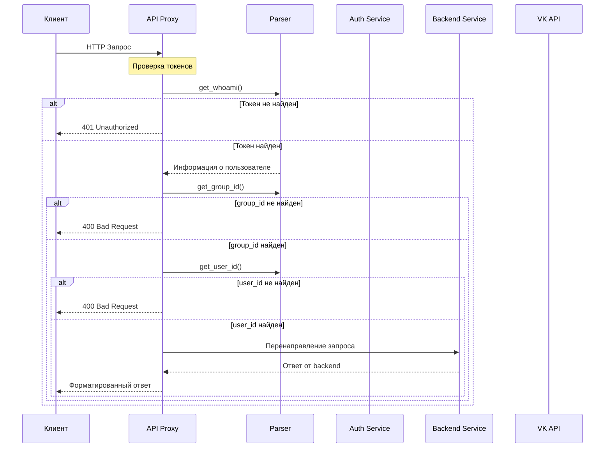

# API Proxy Documentation

## 1. Введение

**api-proxy** — это прокси-сервер на Flask, который перенаправляет запросы к backend-сервисам (`auth-service`, `backend-service`) и предоставляет унифицированный API интерфейс.

### Архитектура



### Структура проекта

```
api-proxy/
├── main.py                    # Точка входа (разработка)
├── wsgi.py                    # Точка входа (production)
├── app/
│   ├── __init__.py
│   ├── api_controller.py      # Декораторы маршрутизации
│   ├── status.py              # HTTP статус коды
│   ├── api/
│   │   ├── v0/
│   │   │   ├── __init__.py
│   │   │   └── router.py      # v0 endpoints
│   │   └── v1/
│   │       ├── __init__.py
│   │       ├── items/
│   │       │   ├── __init__.py
│   │       │   ├── parser.py  # Парсинг параметров
│   │       │   └── router.py  # Items endpoints
│   │       ├── notes/
│   │       │   ├── __init__.py
│   │       │   └── note.py    # Notes endpoints
│   │       ├── users/
│   │       │   └── __init__.py
│   │       └── groups/
│   │           └── __init__.py
│   └── processing/
│       ├── common_methods.py  # Общие методы
│       ├── request_parser.py  # Парсинг запросов
│       ├── vk_methods.py      # VK API методы
│       ├── founder.py
│       ├── group_controller.py
│       └── v1_methods.py
├── tests/
├── variables.py               # Константы токенов
└── README.md
```

---

## 2. API Endpoints

### 2.1 Версия v0

#### Endpoint: `/api/get_api`

| Параметр | Тип | Обязательный | Описание |
|----------|-----|--------------|----------|
| — | — | — | — |

**Метод:** `GET`  
**Доступ:** `all` (без авторизации)

**Ответ (200 OK):**
```json
{
  "api_methods": {
    "v0": [
      {
        "access_to": "all",
        "methods": ["GET"],
        "url": "/api/get_api"
      }
    ],
    "v1": [...]
  }
}
```

---

#### Endpoint: `/api/auth`

| Параметр | Тип | Обязательный | Описание |
|----------|-----|--------------|----------|
| `access_token` | string | Да (в ответе) | Токен авторизации пользователя |

**Метод:** `POST`  
**Доступ:** `all` (без авторизации)

**Запрос:**
```json
{
  "access_token": "VK_ID_from_vk"
}
```

**Ответ (200 OK):**
```json
{
  "access_token": "user_access_token"
}
```

---

#### Endpoint: `/api/check_access`

| Параметр | Тип | Обязательный | Описание |
|----------|-----|--------------|----------|
| — | — | — | — |

**Метод:** `GET`  
**Доступ:** `users_and_groups`

**Ответ (200 OK):**
```json
{
  "access.type": "user \| group"
}
```

**Ответ (401 Unauthorized):**
```json
{
  "error": "Unauthorized"
}
```

---

#### Endpoint: `/api/groups`

| Параметр | Тип | Обязательный | Описание |
|----------|-----|--------------|----------|
| — | — | — | — |

**Метод:** `GET`  
**Доступ:** `users`

**Ответ (200 OK):**
```json
{
  "groups": [
    {
      "id": 1,
      "name": "Название группы",
      "privileges": []
    }
  ]
}
```

---

### 2.2 Версия v1

#### Endpoint: `/api/v1/notes`

| Параметр | Тип | Обязательный | Описание |
|----------|-----|--------------|----------|
| — | — | — | — |

**Метод:** `GET`  
**Доступ:** `users_and_groups`

**Ответ (200 OK):**
```json
{
  "notes": [
    {
      "id": 1,
      "header": "Заголовок",
      "body": "Текст заметки",
      "last_modify": "2026-04-10 06:00:00",
      "group_id": 1,
      "owner_id": 1,
      "author": {
        "vk_id": 123,
        "first_name": "Иван",
        "last_name": "Иванов",
        "photo": "https://..."
      }
    }
  ]
}
```

---

#### Endpoint: `/api/v1/notes/{note_id}`

| Параметр | Тип | Обязательный | Описание |
|----------|-----|--------------|----------|
| `note_id` | string | Да | ID заметки (формат: `{character_id}{note_index}`) |

**Методы:** `GET`, `PUT`, `DELETE`  
**Доступ:** `users_and_groups`

**GET — Ответ (200 OK):**
```json
{
  "id": 1,
  "header": "Заголовок",
  "body": "Текст заметки",
  "last_modify": "2026-04-10 06:00:00",
  "group_id": 1,
  "owner_id": 1,
  "author": {
    "vk_id": 123,
    "first_name": "Иван",
    "last_name": "Иванов",
    "photo": "https://..."
  }
}
```

**PUT — Запрос:**
```json
{
  "header": "Новый заголовок",
  "body": "Новое тело"
}
```

**PUT — Ответ (200 OK):**
```json
{
  "id": 1,
  "header": "Новый заголовок",
  "body": "Новое тело",
  "last_modify": "2026-04-10 06:05:00",
  "group_id": 1,
  "owner_id": 1,
  "author": {
    "vk_id": 123,
    "first_name": "Иван",
    "last_name": "Иванов",
    "photo": "https://..."
  }
}
```

**DELETE — Ответ (204 No Content):**
```json
{}
```

---

#### Endpoint: `/api/v1/notes/add`

| Параметр | Тип | Обязательный | Описание |
|----------|-----|--------------|----------|
| `header` | string | Да | Заголовок заметки |
| `body` | string | Да | Тело заметки |
| `group_id` | integer | Да (для пользователя) | ID группы |
| `user_id` | integer | Да (для группы) | ID пользователя |

**Метод:** `POST`  
**Доступ:** `users_and_groups`

**Запрос:**
```json
{
  "header": "Новая заметка",
  "body": "Текст заметки",
  "group_id": 1
}
```

**Ответ (201 Created):**
```json
{
  "last_id": 1
}
```

---

#### Endpoint: `/api/v1/groups`

| Параметр | Тип | Обязательный | Описание |
|----------|-----|--------------|----------|
| — | — | — | — |

**Метод:** `GET`  
**Доступ:** `users_and_groups`

**Ответ (200 OK) — от имени пользователя:**
```json
{
  "groups": [
    {
      "id": 1,
      "is_admin": true,
      "name": "Название группы"
    }
  ]
}
```

**Ответ (200 OK) — от имени группы:**
```json
{
  "id": 1,
  "name": "Название группы",
  "admins": [
    {
      "id": 123,
      "first_name": "Админ",
      "last_name": "Админов"
    }
  ],
  "users": [
    {
      "id": 456,
      "first_name": "Пользователь",
      "last_name": "Пользователь"
    }
  ]
}
```

---

#### Endpoint: `/api/v1/groups/{group_id}`

| Параметр | Тип | Обязательный | Описание |
|----------|-----|--------------|----------|
| `group_id` | integer | Да | ID группы |

**Метод:** `GET`  
**Доступ:** `users_and_groups`

**Ответ (200 OK):**
```json
{
  "id": 1,
  "name": "Название группы",
  "admins": [
    {
      "id": 123,
      "first_name": "Админ",
      "last_name": "Админов"
    }
  ],
  "is_admin": true,
  "users": [
    {
      "id": 456,
      "first_name": "Пользователь",
      "last_name": "Пользователь"
    }
  ]
}
```

---

#### Endpoint: `/api/v1/users`

| Параметр | Тип | Обязательный | Описание |
|----------|-----|--------------|----------|
| — | — | — | — |

**Метод:** `GET`  
**Доступ:** `users_and_groups`

**Ответ (200 OK) — от имени группы:**
```json
{
  "admins": [
    {
      "id": 123,
      "first_name": "Админ",
      "last_name": "Админов"
    }
  ],
  "users": [
    {
      "id": 456,
      "first_name": "Пользователь",
      "last_name": "Пользователь"
    }
  ]
}
```

**Ответ (200 OK) — от имени пользователя:**
```json
{
  "id": 123,
  "first_name": "Иван",
  "last_name": "Иванов",
  "photo_link": "https://..."
}
```

---

#### Endpoint: `/api/v1/users/{user_id}`

| Параметр | Тип | Обязательный | Описание |
|----------|-----|--------------|----------|
| `user_id` | integer | Да | ID пользователя |

**Методы:** `GET`, `DELETE`  
**Доступ:** `groups`

**GET — Ответ (200 OK):**
```json
{
  "id": 123,
  "first_name": "Иван",
  "last_name": "Иванов",
  "photo_link": "https://..."
}
```

**DELETE — Ответ (204 No Content):**
```json
{}
```

---

#### Endpoint: `/api/v1/users/add`

| Параметр | Тип | Обязательный | Описание |
|----------|-----|--------------|----------|
| `user_id` | integer | Да | ID пользователя |
| `is_admin` | boolean | Да | Статус администратора |

**Метод:** `POST`  
**Доступ:** `groups`

**Запрос:**
```json
{
  "user_id": 123,
  "is_admin": true
}
```

**Ответ (201 Created):**
```json
{
  "user_id": 123,
  "is_admin": true
}
```

---

#### Endpoint: `/api/v1/items`

| Параметр | Тип | Обязательный | Описание |
|----------|-----|--------------|----------|
| `group_id` | integer | Да (для пользователя) | ID группы |
| `owner_id` | integer | Да (для инвентаря) | ID владельца |

**Метод:** `GET`  
**Доступ:** `users_and_groups`

**Ответ (200 OK):**
```json
{
  "items": [
    {
      "id": 1,
      "name": "Меч",
      "description": "Стальной меч",
      "amount": 1,
      "icon": "https://..."
    }
  ]
}
```

---

#### Endpoint: `/api/v1/items/{item_id}`

| Параметр | Тип | Обязательный | Описание |
|----------|-----|--------------|----------|
| `item_id` | string | Да | ID или название предмета |

**Методы:** `GET`, `PUT`, `DELETE`, `POST`  
**Доступ:** `users_and_groups`

**GET — Ответ (200 OK):**
```json
{
  "id": 1,
  "name": "Меч",
  "description": "Стальной меч",
  "amount": 1,
  "icon": "https://..."
}
```

**PUT — Запрос (от лица группы):**
```json
{
  "name": "Новое название",
  "description": "Новое описание"
}
```

**PUT — Запрос (от лица пользователя):**
```json
{
  "amount": 5
}
```

**PUT — Ответ (200 OK):**
```json
{
  "id": 1,
  "name": "Новое название",
  "description": "Новое описание",
  "amount": 5,
  "icon": "https://..."
}
```

**DELETE — Ответ (204 No Content):**
```json
{}
```

**POST — Запрос (добавление предмета):**
```json
{
  "name": "��овый предмет",
  "description": "Описание",
  "amount": 1
}
```

**POST — Ответ (201 Created):**
```json
{
  "id": 2,
  "name": "Новый предмет",
  "description": "Описание"
}
```

---

#### Endpoint: `/api/v1/items/create`

| Параметр | Тип | Обязательный | Описание |
|----------|-----|--------------|----------|
| `name` | string | Да | Название предмета |
| `description` | string | Да | Описание предмета |

**Метод:** `POST`  
**Доступ:** `users_and_groups` (только группы/админы)

**Запрос:**
```json
{
  "name": "Новый предмет",
  "description": "Описание предмета"
}
```

**Ответ (201 Created):**
```json
{
  "created_item": {
    "id": 2,
    "name": "Новый предмет",
    "description": "Описание предмета"
  }
}
```

---

## 3. Парсинг запросов

### 3.1 Модуль `app/processing/request_parser.py`

#### Функция: `get_service_token(request)`

Извлекает сервисный токен из заголовков запроса.

**Параметры:**
- `request: Request` — объект запроса Flask

**Возвращает:**
- `service_token: str | None` — сервисный токен или `None`

---

#### Функция: `get_access_token(request)`

Извлекает токен доступа пользователя из заголовков запроса.

**Параметры:**
- `request: Request` — объект запроса Flask

**Возвращает:**
- `token: str | None` — токен доступа или `None`

---

#### Функция: `from_bot(request)`

Проверяет, является ли запрос от бота (наличие сервисного токена).

**Параметры:**
- `request: Request` — объект запроса Flask

**Возвращает:**
- `bool` — `True` если запрос от бота, `False` иначе

---

#### Функция: `from_user(request)`

Проверяет, является ли запрос от пользователя (наличие токена доступа).

**Параметры:**
- `request: Request` — объект запроса Flask

**Возвращает:**
- `bool` — `True` если запрос от пользователя, `False` иначе

---

#### Функция: `get_my_id()`

Получает ID текущего пользователя/группы из токена.

**Параметры:**
- `request: Request` — объект запроса Flask

**Возвращает:**
- `str | None` — ID пользователя/группы или `None`

---

#### Функция: `get_user_id(request)`

Получает ID пользователя из запроса.

**Параметры:**
- `request: Request` — объект запроса Flask

**Возвращает:**
- `str | None` — ID пользователя или `None`

**Логика:**
1. Если запрос от бота — ищет `user_id` в параметрах запроса или теле
2. Если запрос от пользователя — возвращает `get_my_id()`

---

#### Функция: `get_group_id(request)`

Получает ID группы из запроса.

**Параметры:**
- `request: Request` — объект запроса Flask

**Возвращает:**
- `str | None` — ID группы или `None`

**Логика:**
1. Если запрос от пользователя — ищет `group_id` в параметрах запроса или теле
2. Если запрос от бота — возвращает `get_my_id()`

---

#### Функция: `get_admin_status(request)`

Получает статус администратора из тела запроса.

**Параметры:**
- `request: Request` — объект запроса Flask

**Возвращает:**
- `bool | None` — статус администратора или `None`

---

#### Функция: `get_whoami(request)`

Проверяет токен и получает информацию о пользователе/группе.

**Параметры:**
- `request: Request` — объект запроса Flask

**Возвращает:**
- `dict | None` — информация о пользователе/группе или `None`

**Структура ответа:**
```json
{
  "access": {
    "type": "user | group",
    "id": 123
  },
  "first_name": "Иван",
  "last_name": "Иванов"
}
```

---

### 3.2 Модуль `app/api/v1/items/parser.py`

#### Функция: `search_by_name(request)`

Проверяет, должен ли поиск выполняться по имени предмета.

**Параметры:**
- `request: Request` — объект запроса Flask

**Возвращает:**
- `bool` — `True` если поиск по имени, `False` иначе

**Параметр запроса:**
- `by-name` — флаг поиска по имени

---

#### Функция: `get_owner_id(request)`

Получает ID владельца предмета.

**Параметры:**
- `request: Request` — объект запроса Flask

**Возвращает:**
- `str | None` — ID владельца или `None`

**Логика:**
1. Если запрос от бота — получает `user_id`
2. Иначе ищет параметр `owner_id` в запросе

---

#### Функция: `get_item_data(request)`

Парсит и валидирует данные предмета.

**Параметры:**
- `request: Request` — объект запроса Flask

**Возвращает:**
- `tuple[list[str], str | None, str | None, int | None]` — `(ошибки, name, description, amount)`

**Валидация:**
```python
fields = {
    "name": str,
    "description": str,
    "amount": int
}
```

---

#### Функция: `get_item_id(request)`

Получает ID предмета из параметров запроса.

**Параметры:**
- `request: Request` — объект запроса Flask

**Возвращает:**
- `str | None` — ID предмета или `None`

**Параметр запроса:**
- `item_id` — ID предмета

---

## 4. Обработка запросов

### 4.1 Модуль `app/processing/common_methods.py`

#### Функция: `get_current_time()`

Получает текущее время в формате `YYYY-MM-DD HH-MM-SS`.

**Возвращает:**
- `str` — текущее время

---

#### Функция: `check_token(token)`

Проверяет токен и получает информацию о пользователе/группе.

**Параметры:**
- `token: str` — токен для проверки

**Возвращает:**
- `dict | None` — информация о пользователе/группе или `None`

**URL запроса:**
```
{AUTH_SERVICE_URL}/whoami
```

**Заголовки:**
```json
{
  "token": "token_value"
}
```

---

#### Функция: `get_request_meta_data(without_data=False)`

Собирает метаданные запроса (заголовки, cookies, данные).

**Параметры:**
- `without_data: bool` — не включать данные из тела запроса

**Возвращает:**
- `dict` — метаданные запроса

**Структура:**
```python
{
  "headers": {
    "Content-Type": "application/json; charset=utf-8",
    ...
  },
  "cookies": {...},
  "data": {...}
}
```

---

#### Функция: `get_character_id(group_id, meta_data)`

Получает ID персонажа для группы.

**Параметры:**
- `group_id: str` — ID группы
- `meta_data: dict` — метаданные запроса

**Возвращает:**
- `str | None` — ID персонажа или `None`

**URL запроса:**
```
{BACKEND_SERVICE_URL}/groups/{group_id}/characters
```

---

### 4.2 Модуль `app/processing/vk_methods.py`

#### Функция: `_get_response(response)`

Парсит ответ от VK API.

**Параметры:**
- `response: Response` — ответ от VK API

**Возвращает:**
- `tuple[int, dict]` — `(ошибка, данные)`

---

#### Функция: `get_user_info(user_id)`

Получает информацию о пользователе.

**Параметры:**
- `user_id: str` — ID пользователя

**Возвращает:**
- `dict | None` — информация о пользователе или `None`

---

#### Функция: `get_vk_account_info(user_id)`

Получает информацию о аккаунте пользователя от VK API.

**Параметры:**
- `user_id: str` — ID пользователя

**Возвращает:**
- `tuple[int, dict]` — `(ошибка, данные)`

**URL запроса:**
```
https://api.vk.com/method/users.get
```

**Параметры:**
```
v=5.131&user_ids={user_id}&fields=photo_100&access_token={service_token}&lang=0
```

---

#### Функция: `save_client(user_id)`

Сохраняет информацию о клиенте в базу данных.

**Параметры:**
- `user_id: str` — ID пользователя

**Возвращает:**
- `bool` — результат сохранения

---

### 4.3 Модуль `app/api/v1/items/router.py`

#### Функция: `get_items(request)`

Получает список предметов для группы/пользователя.

**Параметры:**
- `request: Request` — объект запроса Flask

**Возвращает:**
- `tuple[Response, list]` — ответ и список предметов

**Логика:**
1. Проверяет авторизацию через `get_whoami()`
2. Определяет источник запроса (пользователь/бот)
3. Формирует URL запроса к backend
4. Получает и обрабатывает ответ

---

#### Функция: `gets(request)`

Удобная обёртка для `get_items()` с форматированием ответа.

**Параметры:**
- `request: Request` — объект запроса Flask

**Возвращает:**
- `tuple[Response, list]` — ответ и список предметов

---

#### Функция: `get(request, item_id)`

Получает информацию о конкретном предмете.

**Параметры:**
- `request: Request` — объект запроса Flask
- `item_id: str` — ID предмета

**Возвращает:**
- `tuple[Response, dict]` — ответ и данные предмета

---

#### Функция: `put(request, item_id)`

Изменяет предмет (не реализовано).

**Параметры:**
- `request: Request` — объект запроса Flask
- `item_id: str` — ID предмета

**Возвращает:**
- `Response` — ответ 501 Not Implemented

---

#### Функция: `delete(request, item_id)`

Удаляет предмет (не реализовано).

**Параметры:**
- `request: Request` — объект запроса Flask
- `item_id: str` — ID предмета

**Возвращает:**
- `Response` — ответ 501 Not Implemented

---

#### Функция: `post_add(request, item_id)`

Добавляет предмет (не реализовано).

**Параметры:**
- `request: Request` — объект запроса Flask
- `item_id: str` — ID предмета

**Возвращает:**
- `Response` — ответ 501 Not Implemented

---

#### Функция: `post_new(request)`

Создаёт новый предмет (не реализовано).

**Параметры:**
- `request: Request` — объект запроса Flask

**Возвращает:**
- `Response` — ответ 501 Not Implemented

---

### 4.4 Модуль `app/api/v1/notes/note.py`

#### Функция: `get_notes()`

Получает список всех заметок группы.

**Возвращает:**
- `list` — список заметок

**Логика:**
1. Получает список персонажей группы
2. Для каж��ого персонажа получает заметки
3. Формирует итоговый список

---

#### Функция: `generate_note()`

Генерирует объект заметки из тела запроса.

**Параметры:**
- `request: Request` — объект запроса Flask

**Возвращает:**
- `dict | None` — объект заметки или `None`

**Обязательные поля:**
- `header` — заголовок
- `body` — тело

---

#### Функция: `get(note_id)`

Получает конкретную заметку.

**Параметры:**
- `note_id: str` — ID заметки

**Возвращает:**
- `Response` — ответ с заметкой

---

#### Функция: `put(note_id)`

Изменяет существующую заметку.

**Параметры:**
- `note_id: str` — ID заметки

**Возвращает:**
- `Response` — ответ с изменённой заметкой

---

#### Функция: `delete(note_id)`

Удаляет заметку.

**Параметры:**
- `note_id: str` — ID заметки

**Возвращает:**
- `Response` — ответ об удалении

---

#### Функция: `add()`

Создаёт новую заметку.

**Возвращает:**
- `Response` — ответ с ID созданной заметки

---

#### Функция: `get_all()`

Получает все заметки с форматированным ответом.

**Возвращает:**
- `Response` — ответ со списком заметок

---

## 5. Конфигурация

### 5.1 Переменные токенов (`variables.py`)

```python
_at = "token"           # имя поля токена доступа пользователя
_st = "Service-Token"   # имя поля сервисного токена
```

### 5.2 URL сервисов (`app/__init__.py`)

```python
AUTH_SERVICE_URL = os.environ.get("AUTH_SERVICE_URL")
BACKEND_SERVICE_URL = os.environ.get("BACKEND_URL")
```

### 5.3 Точка входа

#### `main.py` (разработка)

```python
from app import application

if __name__ == "__main__":
    application.run(host="0.0.0.0", port=5000, debug=True)
```

#### `wsgi.py` (production)

```python
from app import application

if __name__ == "__main__":
    application.run()
```

### 5.4 Контроллер (`app/api_controller.py`)

#### Декоратор `route()`

Регистрирует маршрут и добавляет информацию о нём.

**Параметры:**
- `url: str` — URL маршрута
- `methods: list` — методы HTTP
- `access: Access` — уровень доступа

**Возвращает:**
- `decorator` — декоратор для функции обработчика

#### Перечисление `Access`

```python
class Access(Enum):
    all = None              # доступ всем
    users = 1               # доступ пользователям
    groups = 2              # доступ группам
    users_and_groups = users + groups  # доступ пользователям и группам
```

#### Функция `version()`

Устанавливает версию API и регистрирует маршруты.

**Параметры:**
- `version: str` — версия API
- `clear: bool` — очистить старые маршруты

---

## Диаграммы потоков данных

### 5.5 Поток обработки запроса



---

## Статус реализации

| Компонент | Статус | Примечания |
|-----------|--------|------------|
| v0 endpoints | ✅ Реализовано | get_api, auth, check_access, groups |
| v1 notes | ✅ Реализовано | GET, PUT, DELETE, POST |
| v1 groups | ✅ Реализовано | GET |
| v1 users | ✅ Реализовано | GET, DELETE, POST |
| v1 items | ⚠️ Частично | GET реализован, PUT/POST/DELETE не реализованы |
| Парсинг запросов | ✅ Реализовано | request_parser.py |
| Обработка запросов | ✅ Реализовано | common_methods.py, vk_methods.py |

---

## Следующие шаги

1. Реализовать PUT/POST/DELETE для items
2. Добавить валидацию входных данных
3. Добавить обработку ошибок
4. Добавить документацию по ошибкам
5. Добавить примеры запросов в curl/bash формат
