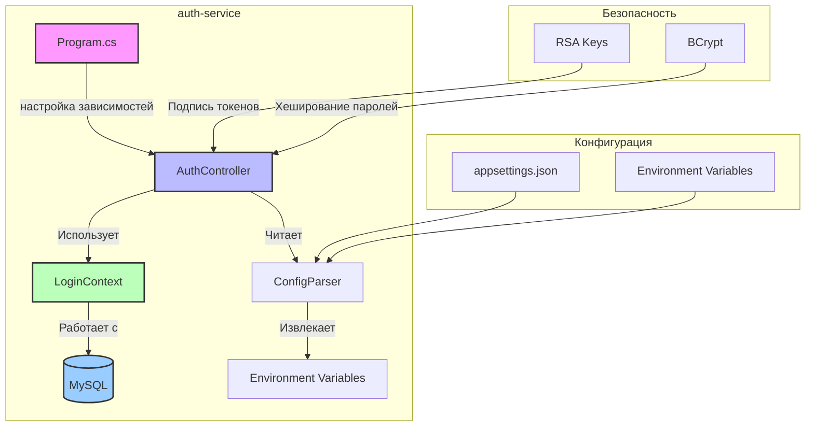
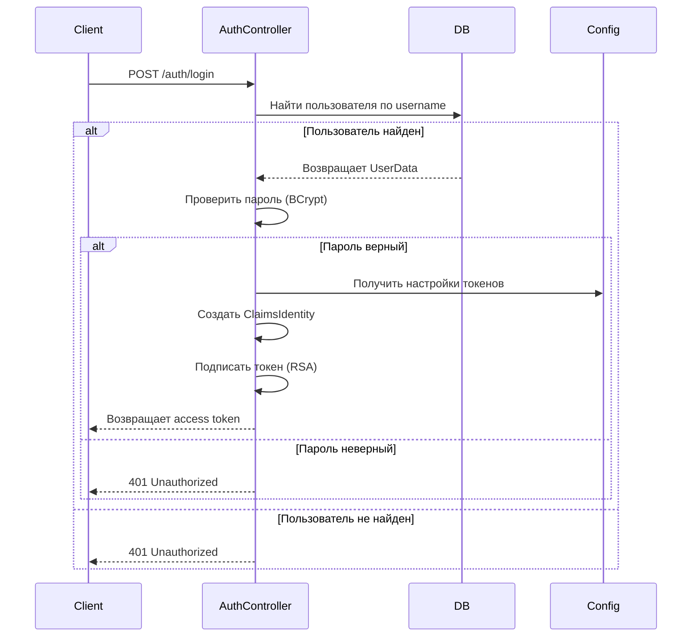
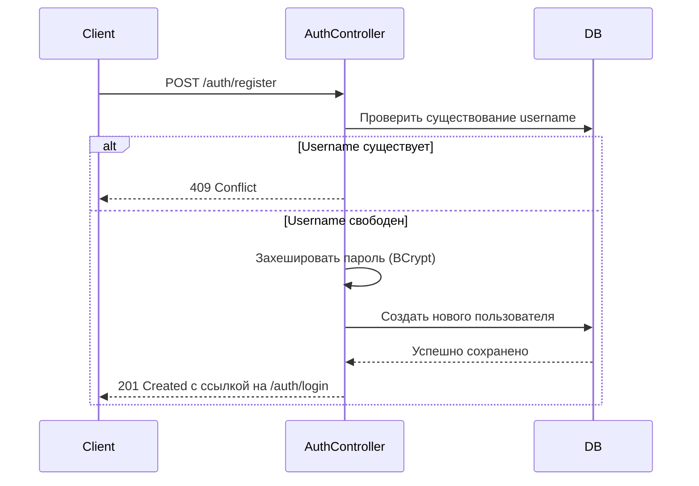
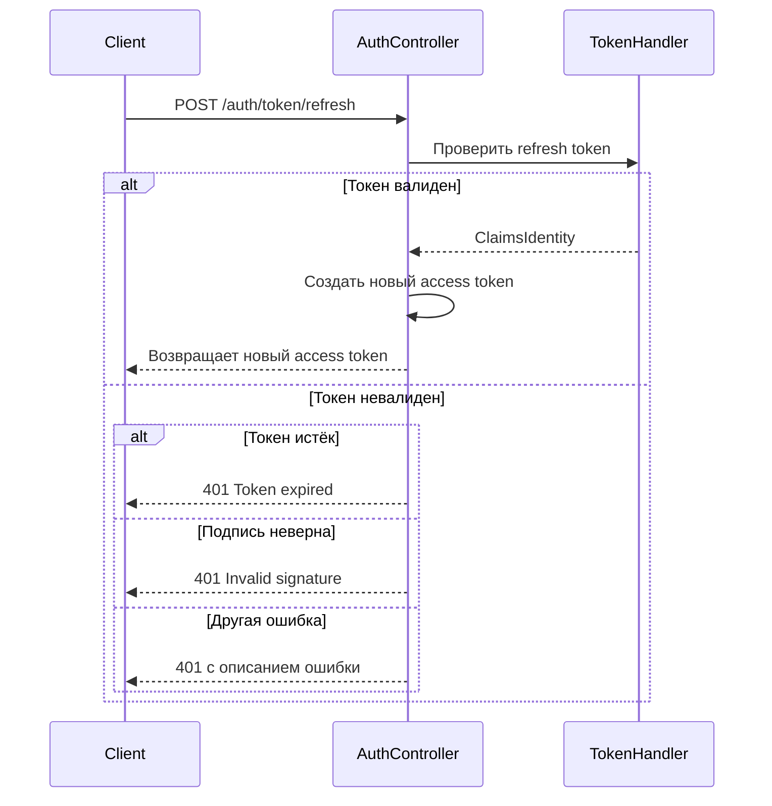
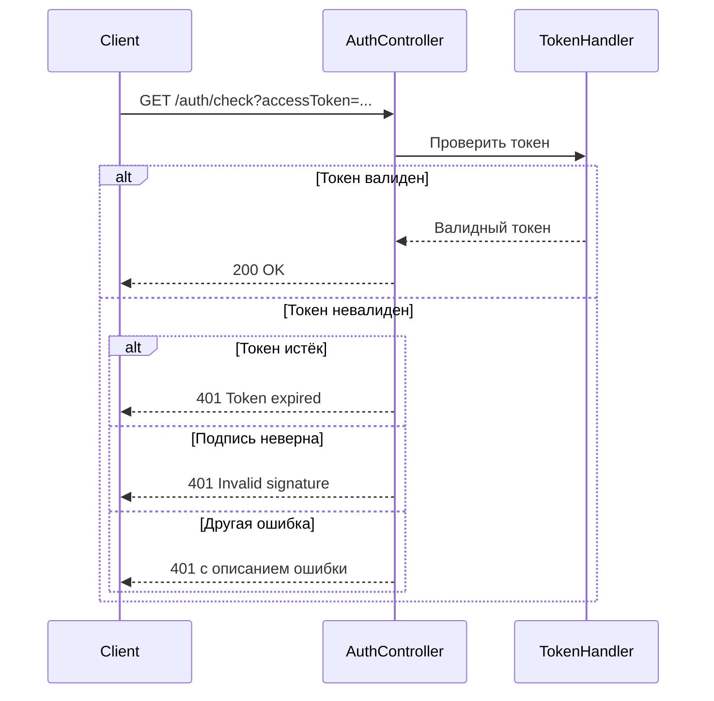
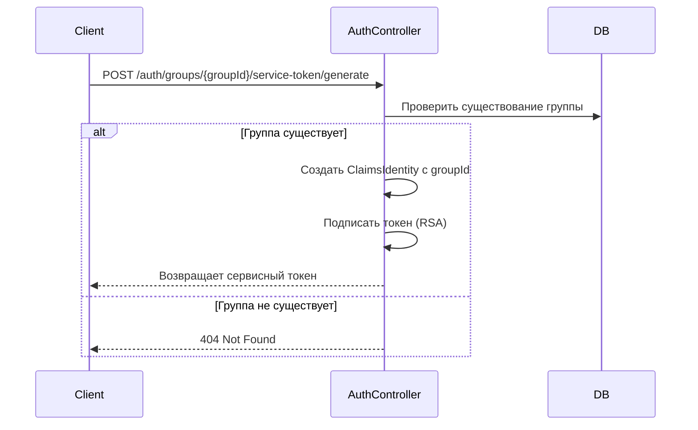

# auth-service

auth-service — критически важный сервис аутентификации и авторизации в экосистеме TheDungeonNotebook. Он отвечает за:

- Регистрация пользователей
- Аутентификацию через JWT-токены
- Управление сессиями (access token, refresh token)
- Генерацию сервисных токенов для групп

**Приоритет:** Высокий (критическая инфраструктура)  
**Сложность:** Высокая (работа с криптографией, токенами, безопасностью)

---

## 1. Введение

### 1.1 Описание сервиса

auth-service предоставляет централизованный механизм аутентификации и авторизации для всех сервисов экосистемы. Серис использует JWT-токены с RSA-подписью для безопасной передачи сессий между клиентом и сервисами.

### 1.2 Роль в архитектуре



### 1.3 Структура проекта

```
backend/auth-service/
├── Program.cs                          # Точка входа, настройка DI
├── Source/
│   ├── Controllers/
│   │   └── AuthController.cs          # Контроллер аутентификации
│   ├── Db/
│   │   ├── Contexts/
│   │   │   ├── BaseDbContext.cs       # Базовый контекст
│   │   │   └── LoginContext.cs        # Контекст для аутентификации
│   │   └── Entities/
│   │       └── LoginEntities.cs       # Сущности (UserData)
│   └── ConfigParser.cs                # Парсинг конфигурации
├── sql_script.sql                      # Миграции БД
├── appsettings.json                    # Настройки приложения
└── README.md                           # Существующая документация
```

---

## 2. API endpoints

### 2.1 Регистрация пользователя

**Endpoint:** `POST /auth/register`

Регистрация нового пользователя в системе.

#### Запрос

```http
POST /auth/register
Content-Type: application/json

{
  "username": "john_doe",
  "password": "securePassword123"
}
```

**Схема запроса:**

```csharp
public struct RegistrationRequest
{
    public string Username { get; set; }
    public string Password { get; set; }
}
```

| Параметр | Тип | Описание |
|----------|-----|----------|
| `username` | string | Имя пользователя (уникальное, мин. длина 3 символа) |
| `password` | string | Пароль (мин. длина 8 символов) |

#### Ответы

**Успешный ответ (201 Created):**

```json
{
  "id": 1
}
```

**Ошибки:**

| Код | Описание | Ответ |
|-----|----------|-------|
| 409 Conflict | Пользователь с таким именем уже существует | `{}` |
| 400 Bad Request | Неверный формат запроса | `{ "error": "..." }` |

#### Пример

```bash
curl -X POST http://localhost:5000/auth/register \
  -H "Content-Type: application/json" \
  -d '{"username":"john_doe","password":"securePassword123"}'
```

---

### 2.2 Вход в систему

**Endpoint:** `POST /auth/login`

Аутентификация пользователя и получение access token.

#### Запрос

```http
POST /auth/login
Content-Type: application/json

{
  "username": "john_doe",
  "password": "securePassword123"
}
```

**Схема запроса:**

```csharp
public struct LoginRequest
{
    public string Username { get; set; }
    public string Password { get; set; }
}
```

#### Ответы

**Успешный ответ (200 OK):**

```json
{
  "token": "eyJhbGciOiJSUzI1NiIsInR5cCI6IkpXVCJ9..."
}
```

**Оши��ки:**

| Код | Описание | Ответ |
|-----|----------|-------|
| 401 Unauthorized | Неверные учетные данные | `{ "Error": "Invalid credentials" }` |

#### Пример

```bash
curl -X POST http://localhost:5000/auth/login \
  -H "Content-Type: application/json" \
  -d '{"username":"john_doe","password":"securePassword123"}'
```

---

### 2.3 Обновление access token

**Endpoint:** `POST /auth/token/refresh`

Обновление access token через refresh token.

#### Запрос

```http
POST /auth/token/refresh
Content-Type: application/json

{
  "refreshToken": "eyJhbGciOiJSUzI1NiIsInR5cCI6IkpXVCJ9..."
}
```

**Схема запроса:**

```csharp
public struct RefreshTokenRequest
{
    public string RefreshToken { get; set; }
}
```

#### Ответы

**Успешный ответ (200 OK):**

```json
{
  "accessToken": "eyJhbGciOiJSUzI1NiIsInR5cCI6IkpXVCJ9..."
}
```

**Ошибки:**

| Код | Описание | Ответ |
|-----|----------|-------|
| 401 Unauthorized | Токен истёк | `{ "error": "Token expired." }` |
| 401 Unauthorized | Неверная подпись | `{ "error": "Invalid signature." }` |
| 401 Unauthorized | Другая ошибка | `{ "error": "Error validating token: {message}" }` |

#### Пример

```bash
curl -X POST http://localhost:5000/auth/token/refresh \
  -H "Content-Type: application/json" \
  -d '{"refreshToken":"eyJhbGciOiJSUzI1NiIsInR5cCI6IkpXVCJ9..."}'
```

---

### 2.4 Генерация сервисного токена для группы

**Endpoint:** `POST /auth/groups/{groupId}/service-token/generate`

Генерация сервисного токена для доступа к ресурсам группы.

#### Запрос

```http
POST /auth/groups/1/service-token/generate
Content-Type: application/json

{
  "years": 1
}
```

**Схема запроса:**

```csharp
public struct ServiceTokenRequest
{
    public int Access { get; set; }
    public int? Years { get; set; }
}
```

| Параметр | Тип | Описание |
|----------|-----|----------|
| `access` | int | (не используется) |
| `years` | int? | Срок действия токена в годах (по умолчанию 1) |

#### Ответы

**Успешный ответ (200 OK):**

```json
{
  "token": "eyJhbGciOiJSUzI1NiIsInR5cCI6IkpXVCJ9..."
}
```

#### Пример

```bash
curl -X POST http://localhost:5000/auth/groups/1/service-token/generate \
  -H "Content-Type: application/json" \
  -d '{"years":1}'
```

---

### 2.5 Проверка валидности токена

**Endpoint:** `GET /auth/check`

Проверка валидности access token.

#### Запрос

```http
GET /auth/check?accessToken=eyJhbGciOiJSUzI1NiIsInR5cCI6IkpXVCJ9...
```

#### Ответы

**Успешный ответ (200 OK):**

```
HTTP/1.1 200 OK
```

**Ошибки:**

| Код | Описание | Ответ |
|-----|----------|-------|
| 401 Unauthorized | Токен истёк | `{ "error": "Token expired." }` |
| 401 Unauthorized | Неверная подпись | `{ "error": "Invalid signature." }` |
| 401 Unauthorized | Другая ошибка | `{ "error": "Error validating token: {message}" }` |

#### Пример

```bash
curl -X GET "http://localhost:5000/auth/check?accessToken=eyJhbGciOiJSUzI1NiIsInR5cCI6IkpXVCJ9..."
```

---

## 3. Модели данных

### 3.1 IndexedData (базовая сущность)

Базовая сущность для всех сущностей, использующих автоинкрементный идентификатор.

```csharp
public class IndexedData
{
    public int Id;
}
```

| Поле | Тип | Описание |
|------|-----|----------|
| `Id` | int | Автоматический первичный ключ |

### 3.2 UserData (пользователь)

Сущность пользователя, наследуется от `IndexedData`.

```csharp
public class UserData : IndexedData
{
    public string Username = "";
    public string PasswordHash = "";
}
```

| Поле | Тип | Описание |
|------|-----|----------|
| `Id` | int | Автоматический первичный ключ |
| `Username` | string | Имя пользователя (уникальное) |
| `PasswordHash` | string | Хешированный пароль (BCrypt) |

### 3.3 Процесс хеширования паролей

Пароли пользователей хешируются с использованием библиотеки **BCrypt** с добавлением случайной соли (salt).

**Процесс регистрации:**

```csharp
string passwordHash = BCrypt.Net.BCrypt.HashPassword(data.Password);
```

**Процесс проверки пароля:**

```csharp
bool isValid = BCrypt.Net.BCrypt.Verify(model.Password, user?.PasswordHash);
```

**Политика хранения:**
- Исходные пароли никогда не хранятся в базе данных
- Хеш хранится в поле `password_hash` (VARCHAR(255))
- Salt генерируется автоматически при хешировании

**Валидация username:**
- Минимальная длина: 3 символа
- Максимальная длина: 255 символов
- Уникальность в базе данных

---

## 4. Контексты БД

### 4.1 BaseDbContext<T>

Абстрактный базовый класс для всех контекстов Entity Framework Core.

```csharp
public abstract class BaseDbContext<T> : DbContext where T : BaseDbContext<T>
{
    private IEntityBuildersConfigurer _configurer;
    
    public BaseDbContext(DbContextOptions<T> options, IEntityBuildersConfigurer configurer): base(options)
    {
        _configurer = configurer;
    }
    
    protected IEntityBuildersConfigurer Configurer => _configurer;
}
```

**Конструктор:**

```csharp
public BaseDbContext(DbContextOptions<T> options, IEntityBuildersConfigurer configurer)
```

**Свойства:**
- `Configurer` — доступ к `IEntityBuildersConfigurer` для конфигурации моделей

### 4.2 LoginContext

Контекст для работы с таблицей пользователей.

```csharp
public class LoginContext : BaseDbContext<LoginContext>
{
    public LoginContext(DbContextOptions<LoginContext> options, IEntityBuildersConfigurer configurer) : base(options, configurer)
    {
    }
    
    protected override void OnModelCreating(ModelBuilder builder)
    {
        Configurer.ConfigureModel(builder.Entity<UserData>());
        base.OnModelCreating(builder);    
    }

    public DbSet<UserData> Users => Set<UserData>();
}
```

**Наследование:** `LoginContext : BaseDbContext<LoginContext>`

**Настройка моделей:**
- `OnModelCreating` — конфигурация через `IEntityBuildersConfigurer`
- Регистрация `DbSet<UserData>`

**Подключение к БД:**
- MySQL 9.0.1
- Подключение через `IEntityBuildersConfigurer`

---

## 5. Конфигурация и миграции

### 5.1 ConfigParser

Парсинг конфигурации из переменных окружения.

```csharp
public class ConfigParser
{
    private string? _databaseName;
    private string? _mysqlConnectionString;
    
    private string? _connection = null;
    public string Connection { get {
        if (_connection == null)
            _connection = _mysqlConnectionString!;
        return _connection;
    }
}

    public ConfigParser(){
        _mysqlConnectionString = Environment.GetEnvironmentVariable("MYSQL_CONNECTION_STRING");
        _databaseName = Environment.GetEnvironmentVariable("MYSQL_DATABASE");
        if (_mysqlConnectionString == null || _databaseName == null)
        {
            throw new Exception($"Can't find information to connect to databases:\n"+
                                $" |-mysql:{_mysqlConnectionString}\n"+
                                $" |-dbname: {_databaseName}"
                            );
        }
    }

    public void ConfigDbConnections(DbContextOptionsBuilder opt)
    {
        opt.UseMySql(Connection, new MySqlServerVersion(new Version(9, 0, 1)));
    }
    
    public Configs GetConfigs()
    {
        var result = new Configs();
        return result;
    }
}
```

**Переменные окружения:**

| Переменная | Описание |
|-----|----------|
| `MYSQL_CONNECTION_STRING` | Строка подключения к MySQL |
| `MYSQL_DATABASE` | Имя базы данных |

**Логика инициализации:**

```csharp
public ConfigParser()
{
    _mysqlConnectionString = Environment.GetEnvironmentVariable("MYSQL_CONNECTION_STRING");
    _databaseName = Environment.GetEnvironmentVariable("MYSQL_DATABASE");
    // Выбрасывает исключение, если переменные не заданы
}
```

**Методы:**
- `ConfigDbConnections(DbContextOptionsBuilder opt)` — настройка подключения к MySQL
- `GetConfigs()` — получение конфигураций (возвращает пустой Configs)

### 5.2 Program.cs (настройка зависимостей)

```csharp
var builder = WebApplication.CreateBuilder(args);
var config = new ConfigParser();

// General
builder.Services.AddMvc();
builder.Services.AddHttpContextAccessor();
builder.Services.AddLogging(e => e.AddConsole());

builder.Services.AddSingleton<IEntityBuildersConfigurer, EntityBuildersConfigurer>();
builder.Services.AddSingleton<Configs, Configs>((_) => config.GetConfigs());
builder.Services.AddDbContext<LoginContext>(config.ConfigDbConnections);

// General
builder.Services.AddEndpointsApiExplorer();
builder.Services.AddControllers();
var app = builder.Build();
app.UseHttpMetrics();
app.MapMetrics();
app.MapControllers();
app.Run();
```

**Зависимости:**

```csharp
builder.Services.AddMvc();
builder.Services.AddHttpContextAccessor();
builder.Services.AddLogging(e => e.AddConsole());
builder.Services.AddSingleton<IEntityBuildersConfigurer, EntityBuildersConfigurer>();
builder.Services.AddSingleton<Configs, Configs>((_) => config.GetConfigs());
builder.Services.AddDbContext<LoginContext>(config.ConfigDbConnections);
builder.Services.AddEndpointsApiExplorer();
builder.Services.AddControllers();
```

**Настройка middleware:**

```csharp
app.UseHttpMetrics();
app.MapMetrics();
app.MapControllers();
```

### 5.3 Миграции БД (sql_script.sql)

**Таблица auth_data:**

```sql
CREATE TABLE IF NOT EXISTS `auth_data` (
    `user_id` INT AUTO_INCREMENT PRIMARY KEY,
    `username` VARCHAR(255) NOT NULL UNIQUE,
    `password_hash` VARCHAR(255) NOT NULL
) ENGINE=InnoDB AUTO_INCREMENT=0 DEFAULT CHARSET=utf8mb4 COLLATE=utf8mb4_0900_ai_ci;
```

**Поля:**

| Поле | Тип | Описание |
|------|-----|----------|
| `user_id` | INT AUTO_INCREMENT | Первичный ключ |
| `username` | VARCHAR(255) | Имя пользователя (уникальное) |
| `password_hash` | VARCHAR(255) | Хешированный пароль |

---

## 6. Бизнес-процессы

### 6.1 Процесс аутентификации



### 6.2 Процесс регистрации



### 6.3 Процесс обновления токена (refresh)



### 6.4 Процесс проверки токена



### 6.5 Процесс генерации сервисного токена



---

## 7. Меры безопасности

### 7.1 Меры безопасности

| Мера | Описание |
|------|----------|
| RSA-шифрование | Подпись токенов с использованием RSA-ключей |
| BCrypt | Хеширование паролей с salt |
| Валидация токенов | Проверка подписи, срока действия |
| ClockSkew | Смещение времени 4 часа для токенов |
| Секреты из env | Чтение ключей из переменных окружения |

### 7.2 Управление ключами

**Получение ключей:**

```csharp
var publicKeyPath = _configuration["PUBLIC_KEY_PATH"];
var privateKeyPath = _configuration["PRIVATE_KEY_PATH"];
```

**Импортирование ключей:**

```csharp
RSA rsaPublic = RSA.Create();
rsaPublic.ImportFromPem(publicKeyText);

RSA rsaPrivate = RSA.Create();
rsaPrivate.ImportFromPem(privateKeyText);
```

### 7.3 Параметры токенов

| Параметр | Значение | Описание |
|-----|---|----------|
| IssuerSigningKey | RSA-ключ | Ключ для подписи |
| ValidateIssuer | false | Не проверяем issuer |
| ValidateAudience | false | Не проверяем audience |
| ValidateLifetime | true | Проверяем срок действия |
| ClockSkew | 4 часа | Допустимое смещение времени |

### 7.4 Генерация ключей

Для работы сервиса необходимо сгенерировать пару RSA-ключей:

```bash
# Генерация ключей (пример для OpenSSL)
openssl genrsa -out private.pem 2048
openssl rsa -in private.pem -pubout -out public.pem
```

**Хранение ключей:**
- `PRIVATE_KEY_PATH` — путь к приватному ключу
- `PUBLIC_KEY_PATH` — путь к публичному ключу
- Ключи должны храниться в защищённых переменных окружения

---

## 8. Обработка ошибок

### 8.1 Коды ошибок

| Код | Описание | Когда возникает |
|-----|----------|-----------|
| 200 OK | Успешный запрос | - |
| 201 Created | Пользователь создан | Регистрация |
| 401 Unauthorized | Неавторизован | Неверный пароль, истёкший токен |
| 409 Conflict | Конфликт | Username уже существует |
| 404 Not Found | Не найдено | Группа не существует |

### 8.2 Исключения токенов

| Исключение | Описание | Ответ |
|-----|----------|-------|
| SecurityTokenExpiredException | Токен истёк | `{"error": "Token expired."}` |
| SecurityTokenInvalidSignatureException | Неверная подпись | `{"error": "Invalid signature."}` |
| Exception | Другая ошибка | `{"error": "Error validating token: {message}"}` |

---

## 9. Переменные окружения

| Переменная | Описание | Пример |
|-----|----------|--------|
| `MYSQL_CONNECTION_STRING` | Строка подключения к MySQL | `server=localhost;database=tdn;user=root;password=secret` |
| `MYSQL_DATABASE` | Имя базы данных | `tdn` |
| `PUBLIC_KEY_PATH` | Путь к публичному RSA-ключу | `/keys/public.pem` |
| `PRIVATE_KEY_PATH` | Путь к приватному RSA-ключу | `/keys/private.pem` |

---

## 10. Примеры использования

### 10.1 Регистрация и вход

```bash
# Регистрация
curl -X POST http://localhost:5000/auth/register \
  -H "Content-Type: application/json" \
  -d '{"username":"john_doe","password":"securePassword123"}'

# Вход
curl -X POST http://localhost:5000/auth/login \
  -H "Content-Type: application/json" \
  -d '{"username":"john_doe","password":"securePassword123"}'
```

### 10.2 Обновление токена

```bash
# Получение нового access token
curl -X POST http://localhost:5000/auth/token/refresh \
  -H "Content-Type: application/json" \
  -d '{"refreshToken":"eyJhbGciOiJSUzI1NiIsInR5cCI6IkpXVCJ9..."}'
```

### 10.3 Проверка токена

```bash
curl -X GET "http://localhost:5000/auth/check?accessToken=eyJhbGciOiJSUzI1NiIsInR5cCI6IkpXVCJ9..."
```

---

## 11. Примечания

- auth-service является критически важным сервисом — любые ошибки в документации могут привести к проблемам с аутентификацией
- Важно подробно описать процесс хеширования паролей и не хранить исходные пароли
- RSA-ключи должны храниться в защищённых переменных окружения
- ClockSkew в 4 часа — это нестандартное значение, требует пояснения
- Все примеры запросов должны быть валидными и проверенными
