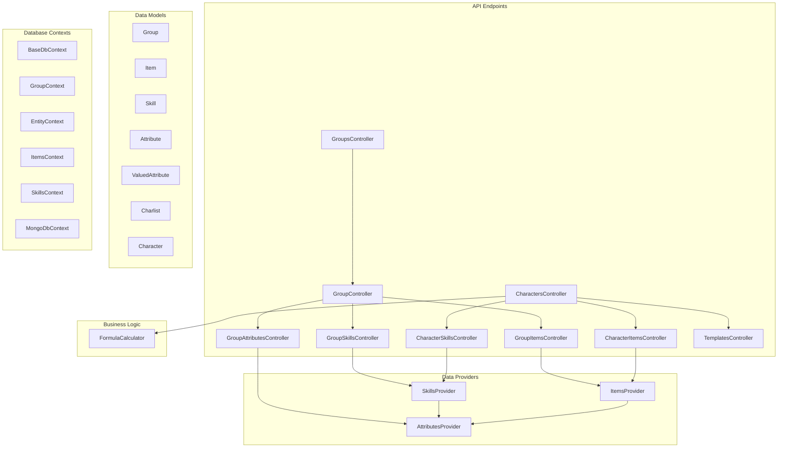
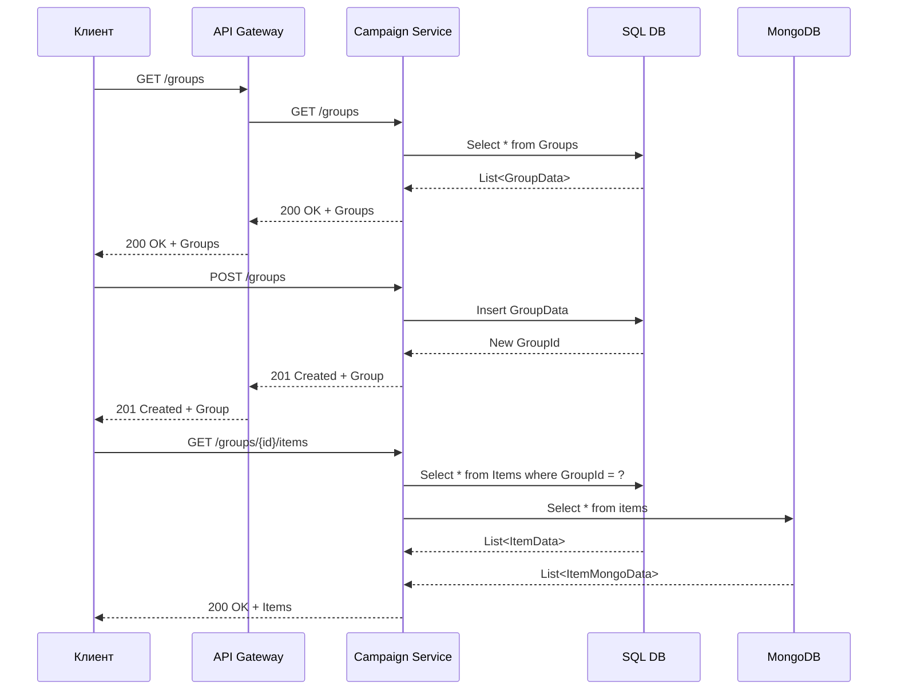
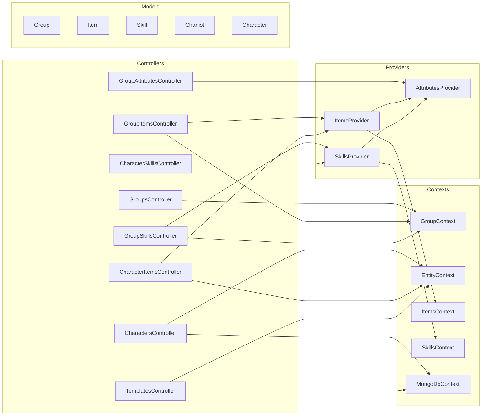

# Документация campaign-service

## 1. Введение

**campaign-service** — это сервис управления кампаниями (характеристиками персонажей) в системе TheDungeonNotebook. Сервис работает с группами, персонажами, предметами, навыками и шаблонами характеристик.

### Архитектура сервиса

Сервис использует гибридную архитектуру хранения данных:
- **SQL базы данных** (Entity Framework Core) для хранения метаданных (группы, предметы, навыки, шаблоны, связи)
- **MongoDB** для хранения полных данных сущностей (полные описания предметов, навыков, персонажей, шаблонов)



### Точка входа

[Program.cs](../backend/campaign-service/Program.cs:1) — точка входа в сервис, где регистрируются:
- Контексты БД (SQL и MongoDB)
- Провайдеры данных
- Конфигурация через `IEntityBuildersConfigurer`

### Базовый контроллер

[BaseController](../backend/campaign-service/Source/Controllers/BaseController.cs:1) предоставляет базовую функциональность:
- Метод `IsDebug()` для проверки режима отладки
- Переопределённые методы `Ok()` и `Created()` для возврата результатов
- Метод `NotImplemented()` для возврата 501 Not Implemented

---

## 2. API endpoints всех контроллеров

### 2.1 GroupsController (`/groups`)

Контроллер для работы с группами кампаний.

| Метод | Endpoint | Описание | Параметры |
|-----|------|----------|-------|
| GET | `/groups` | Получить все группы | - |
| POST | `/groups` | Создать новую группу | `GroupPostData` |
| GET | `/groups/{groupId}` | Получить группу по ID | `groupId` |
| PATCH | `/groups/{groupId}` | Обновить группу | `GroupPatchData` |
| DELETE | `/groups/{groupId}` | Удалить группу | `groupId` |

**Модели данных:**

```csharp
public struct GroupPostData
{
    public string Name { get; set; }
    public string? Icon { get; set; }
    
    public GroupData ToData()
    {
        return new()
        {
            Name = Name,
            Icon = Icon
        };
    }
}

public struct GroupPatchData
{
    public string? Name { get; set; }
    public string? Icon { get; set; }
}
```

**Примеры:**

```http
GET /groups
```

**Ответ:**
```json
[
  {
    "Id": 1,
    "Name": "My Campaign",
    "Description": "",
    "Icon": "🎲"
  }
]
```

```http
POST /groups
Content-Type: application/json

{
  "Name": "My Campaign",
  "Icon": "🎲"
}
```

**Ответ:**
```json
{
  "Id": 1,
  "Name": "My Campaign",
  "Description": "",
  "Icon": "🎲"
}
```

```http
GET /groups/1
```

**Ответ:**
```json
{
  "Id": 1,
  "Name": "My Campaign",
  "Description": "",
  "Icon": "🎲"
}
```

```http
PATCH /groups/1
Content-Type: application/json

{
  "Name": "Updated Campaign",
  "Icon": "⚔️"
}
```

**Ответ:**
```json
{
  "Id": 1,
  "Name": "Updated Campaign",
  "Description": "",
  "Icon": "⚔️"
}
```

```http
DELETE /groups/1
```

**Ответ:**
```json
{
  "Id": 1,
  "Name": "Updated Campaign",
  "Description": "",
  "Icon": "⚔️"
}
```

---

### 2.2 GroupController (`/groups/{groupId}`)

Контроллер предоставляет endpoints для работы с предметами и навыками группы.

#### 2.2.1 Предметы группы (`/groups/{groupId}/items`)

| Метод | Endpoint | Описание | Параметры |
|-----|------|----------|-------|
| GET | `/groups/{groupId}/items` | Получить все предметы группы | `withSecrets?: boolean` |
| POST | `/groups/{groupId}/items` | Создать предмет | `ItemPostData` |
| GET | `/groups/{groupId}/items/{itemId}` | Получить предмет | `itemId` |
| PUT | `/groups/{groupId}/items/{itemId}` | Обновить предмет | `ItemPostData` |
| DELETE | `/groups/{groupId}/items/{itemId}` | Удалить предмет | `itemId` |

#### 2.2.2 Навыки группы (`/groups/{groupId}/skills`)

| Метод | Endpoint | Описание | Параметры |
|-----|------|----------|-------|
| GET | `/groups/{groupId}/skills` | Получить все навыки группы | `withSecrets?: boolean`, `filters?: object` |
| GET | `/groups/{groupId}/skills/{skillId}` | Получить навык | `skillId` |
| POST | `/groups/{groupId}/skills` | Создать навык | `SkillPostData` |
| PUT | `/groups/{groupId}/skills/{skillId}` | Обновить навык | `SkillPostData` |
| DELETE | `/groups/{groupId}/skills/{skillId}` | Удалить навык | `skillId` |

#### 2.2.3 Атрибуты группы (`/groups/{groupId}/skills/attributes`)

| Метод | Endpoint | Описание | Параметры |
|-----|------|----------|-------|
| GET | `/groups/{groupId}/skills/attributes` | Получить атрибуты группы | - |
| PUT | `/groups/{groupId}/skills/attributes` | Обновить атрибуты | `PostData` |

**Модели данных:**

```csharp
public struct ItemPostData
{
    public string Name { get; set; }
    public string Description { get; set; }
    public int? Price { get; set; }
    public List<AttributePostData>? Attributes { get; set; }
    public bool? IsSecret { get; set; }
    public int? Amount { get; set; }
}

public struct AttributePostData
{
    public string? Key { get; set; }
    public string? Name { get; set; }
    public string? Value { get; set; }
    public string? Description { get; set; }
    public bool? isFiltered { get; set; }
}

public struct SkillPostData
{
    public string? Name { get; set; }
    public string? Description { get; set; }
    public List<AttributePostData>? Attributes { get; set; }
    public bool? IsSecret { get; set; }
}

public struct PostData
{
    public List<AttributePostData> attributes { get; set; }
}
```

---

### 2.3 CharactersController (`/groups/{groupId}/characters`)

Контроллер для работы с персонажами группы.

| Метод | Endpoint | Описание | Параметры |
|-----|------|----------|-------|
| GET | `/groups/{groupId}/characters` | Получить всех персонажей группы | `ownerId?: number` |
| POST | `/groups/{groupId}/characters` | Создать персонажа | `CharacterPostData`, `copyTemplate?: boolean` |
| GET | `/groups/{groupId}/characters/{characterId}` | Получить персонажа | `characterId`, `witEmptyFields?: boolean` |
| PATCH | `/groups/{groupId}/characters/{characterId}` | Обновить персонажа | `CharacterPatchData`, `witEmptyFields?: boolean` |
| DELETE | `/groups/{groupId}/characters/{characterId}` | Удалить персонажа | `characterId`, `witEmptyFields?: boolean` |

**Модели данных:**

```csharp
public struct CharacterPostData
{
    public string Name { get; set; }
    public string Description { get; set; }
    public int? TemplateId { get; set; }
}

public struct FieldPatchData
{
    public string? Name { get; set; }
    public string? Description { get; set; }
    public int? Value { get; set; }
    public int? MaxValue { get; set; }
    public string? Formula { get; set; }
}

public struct CharacterPatchData
{
    public string? Name { get; set; }
    public string? Description { get; set; }
    public int? OwnerId { get; set; }
    public Dictionary<string, FieldPatchData?>? Fields { get; set; }
}
```

**Примеры:**

```http
GET /groups/1/characters
```

**Ответ:**
```json
[
  {
    "Id": 1,
    "Name": "Hero",
    "Description": "Мой герой",
    "OwnerId": 1,
    "Fields": {
      "Strength": {
        "Name": "Сила",
        "Description": "Физическая сила",
        "Value": 10,
        "Formula": ""
      }
    }
  }
]
```

```http
POST /groups/1/characters
Content-Type: application/json

{
  "Name": "Hero",
  "Description": "Мой герой",
  "TemplateId": 1
}
```

**Ответ:**
```json
{
  "Id": 1,
  "Name": "Hero",
  "Description": "Мой герой",
  "OwnerId": 1,
  "Fields": {
    "Strength": {
      "Name": "Сила",
      "Description": "Физическая сила",
      "Value": 10,
      "Formula": ""
    }
  }
}
```

```http
GET /groups/1/characters/1?witEmptyFields=true
```

**Ответ:**
```json
{
  "Id": 1,
  "Name": "Hero",
  "Description": "Мой герой",
  "OwnerId": 1,
  "Fields": {
    "Strength": {
      "Name": "Сила",
      "Description": "Физическая сила",
      "Value": 10,
      "Formula": "",
      "CalculatedValue": 10
    }
  }
}
```

```http
PATCH /groups/1/characters/1
Content-Type: application/json

{
  "Name": "Hero Updated",
  "Description": "Обновленный герой",
  "Fields": {
    "Strength": {
      "Value": 12,
      "Formula": ":Dexterity: + 2"
    }
  }
}
```

**Ответ:**
```json
{
  "Id": 1,
  "Name": "Hero Updated",
  "Description": "Обновленный герой",
  "OwnerId": 1,
  "Fields": {
    "Strength": {
      "Name": "Сила",
      "Description": "Физическая сила",
      "Value": 10,
      "Formula": ":Dexterity: + 2",
      "CalculatedValue": 12
    }
  }
}
```

```http
DELETE /groups/1/characters/1
```

**Ответ:**
```json
{
  "Id": 1,
  "Name": "Hero Updated",
  "Description": "Обновленный герой",
  "OwnerId": 1,
  "Fields": {
    "Strength": {
      "Name": "Сила",
      "Description": "Физическая сила",
      "Value": 10,
      "Formula": ":Dexterity: + 2",
      "CalculatedValue": 12
    }
  }
}
```

---

### 2.4 TemplatesController (`/groups/{groupId}/characters/templates`)

Контроллер для работы с шаблонами характеристик.

| Метод | Endpoint | Описание | Параметры |
|-----|------|----------|-------|
| GET | `/groups/{groupId}/characters/templates` | Получить все шаблоны | - |
| POST | `/groups/{groupId}/characters/templates` | Создать шаблон | `CharlistPostData` |
| GET | `/groups/{groupId}/characters/templates/{templateId}` | Получить шаблон | `templateId` |
| PUT | `/groups/{groupId}/characters/templates/{templateId}` | Обновить шаблон | `CharlistPostData` |
| DELETE | `/groups/{groupId}/characters/templates/{templateId}` | Удалить шаблон | `templateId` |

**Модели данных:**

```csharp
public struct FieldPostData
{
    public string Name { get; set; }
    public string Description { get; set; }
    public int Value { get; set; }
    public int? MaxValue { get; set; }
    public string? Formula { get; set; }
    public string? ModifierFormula { get; set; }
}

public struct CharlistPostData
{
    public string Name { get; set; }
    public string Description { get; set; }
    public Dictionary<string, FieldPostData> Fields { get; set; }
}
```

**Примеры:**

```http
GET /groups/1/characters/templates
```

**Ответ:**
```json
{
  "templates": [
    {
      "Id": 1,
      "Name": "Warrior",
      "Description": "Шаблон воина",
      "Fields": {
        "Strength": {
          "Name": "Сила",
          "Description": "Физическая сила",
          "Value": 10,
          "Formula": ""
        },
        "Dexterity": {
          "Name": "Ловкость",
          "Description": "Ловкость рук",
          "Value": 8,
          "Formula": ""
        }
      }
    }
  ]
}
```

```http
POST /groups/1/characters/templates
Content-Type: application/json

{
  "Name": "Warrior",
  "Description": "Шаблон воина",
  "Fields": {
    "Strength": {
      "Name": "Сила",
      "Description": "Физическая сила",
      "Value": 10
    },
    "Dexterity": {
      "Name": "Ловкость",
      "Description": "Ловкость рук",
      "Value": 8
    }
  }
}
```

**Ответ:**
```json
{
  "Id": 1,
  "Name": "Warrior",
  "Description": "Шаблон воина",
  "Fields": {
    "Strength": {
      "Name": "Сила",
      "Description": "Физическая сила",
      "Value": 10,
      "Formula": ""
    },
    "Dexterity": {
      "Name": "Ловкость",
      "Description": "Ловкость рук",
      "Value": 8,
      "Formula": ""
    }
  }
}
```

```http
GET /groups/1/characters/templates/1
```

**Ответ:**
```json
{
  "Id": 1,
  "Name": "Warrior",
  "Description": "Шаблон воина",
  "Fields": {
    "Strength": {
      "Name": "Сила",
      "Description": "Физическая сила",
      "Value": 10,
      "Formula": ""
    },
    "Dexterity": {
      "Name": "Ловкость",
      "Description": "Ловкость рук",
      "Value": 8,
      "Formula": ""
    }
  }
}
```

```http
PUT /groups/1/characters/templates/1
Content-Type: application/json

{
  "Name": "Updated Warrior",
  "Description": "Обновленный шаблон воина",
  "Fields": {
    "Strength": {
      "Name": "Сила",
      "Description": "Физическая сила",
      "Value": 12
    }
  }
}
```

**Ответ:**
```json
{
  "Id": 1,
  "Name": "Updated Warrior",
  "Description": "Обновленный шаблон воина",
  "Fields": {
    "Strength": {
      "Name": "Сила",
      "Description": "Физическая сила",
      "Value": 12,
      "Formula": ""
    },
    "Dexterity": {
      "Name": "Ловкость",
      "Description": "Ловкость рук",
      "Value": 8,
      "Formula": ""
    }
  }
}
```

```http
DELETE /groups/1/characters/templates/1
```

**Ответ:**
```json
{
  "Id": 1,
  "Name": "Updated Warrior",
  "Description": "Обновленный шаблон воина",
  "Fields": {
    "Strength": {
      "Name": "Сила",
      "Description": "Физическая сила",
      "Value": 12,
      "Formula": ""
    },
    "Dexterity": {
      "Name": "Ловкость",
      "Description": "Ловкость рук",
      "Value": 8,
      "Formula": ""
    }
  }
}
```

---

### 2.5 CharacterItemsController (`/groups/{groupId}/characters/{characterId}/items`)

Контроллер для работы с предметами персонажа.

| Метод | Endpoint | Описание | Параметры |
|-----|------|----------|-------|
| GET | `/groups/{groupId}/characters/{characterId}/items` | Получить все предметы персонажа | - |
| POST | `/groups/{groupId}/characters/{characterId}/items` | Добавить предмет персонажу | `ItemPostData` |
| GET | `/groups/{groupId}/characters/{characterId}/items/{itemId}` | Получить предмет персонажа | `itemId` |
| PUT | `/groups/{groupId}/characters/{characterId}/items/{itemId}` | Обновить количество предмета | `ItemPostData` |
| DELETE | `/groups/{groupId}/characters/{characterId}/items/{itemId}` | Удалить предмет персонажа | - |

**Примеры:**

```http
GET /groups/1/characters/1/items
```

**Ответ:**
```json
{
  "items": [
    {
      "Id": 1,
      "Name": "Sword",
      "Description": "Меч героя",
      "Price": 100,
      "Attributes": [
        {
          "Key": "Damage",
          "Name": "Урон",
          "Description": "Урон меча",
          "Value": 15
        }
      ],
      "Amount": 1
    }
  ]
}
```

```http
POST /groups/1/characters/1/items
Content-Type: application/json

{
  "Name": "Sword",
  "Description": "Меч героя",
  "Price": 100,
  "Attributes": [
    {
      "Key": "Damage",
      "Name": "Урон",
      "Value": 15
    }
  ],
  "Amount": 1
}
```

**Ответ:**
```json
{
  "Id": 1,
  "Name": "Sword",
  "Description": "Меч героя",
  "Price": 100,
  "Attributes": [
    {
      "Key": "Damage",
      "Name": "Урон",
      "Description": "Урон меча",
      "Value": 15
    }
  ],
  "Amount": 1
}
```

```http
GET /groups/1/characters/1/items/1
```

**Ответ:**
```json
{
  "Id": 1,
  "Name": "Sword",
  "Description": "Меч героя",
  "Price": 100,
  "Attributes": [
    {
      "Key": "Damage",
      "Name": "Урон",
      "Description": "Урон меча",
      "Value": 15
    }
  ],
  "Amount": 1
}
```

```http
PUT /groups/1/characters/1/items/1
Content-Type: application/json

{
  "Name": "Sword",
  "Description": "Меч героя",
  "Price": 100,
  "Attributes": [
    {
      "Key": "Damage",
      "Name": "Урон",
      "Value": 15
    }
  ],
  "Amount": 2
}
```

**Ответ:**
```json
{
  "Id": 1,
  "Name": "Sword",
  "Description": "Меч героя",
  "Price": 100,
  "Attributes": [
    {
      "Key": "Damage",
      "Name": "Урон",
      "Description": "Урон меча",
      "Value": 15
    }
  ],
  "Amount": 2
}
```

```http
DELETE /groups/1/characters/1/items/1
```

**Ответ:**
```json
{
  "Id": 1,
  "Name": "Sword",
  "Description": "Меч героя",
  "Price": 100,
  "Attributes": [
    {
      "Key": "Damage",
      "Name": "Урон",
      "Description": "Урон меча",
      "Value": 15
    }
  ],
  "Amount": 2
}
```

---

### 2.6 CharacterSkillsController (`/groups/{groupId}/characters/{characterId}/skills`)

Контроллер для работы с навыками персонажа.

| Метод | Endpoint | Описание | Параметры |
|-----|------|----------|-------|
| GET | `/groups/{groupId}/characters/{characterId}/skills` | Получить все навыки персонажа | `filters?: object` |
| PUT | `/groups/{groupId}/characters/{characterId}/skills/{skillId}` | Добавить навык персонажу | - |
| DELETE | `/groups/{groupId}/characters/{characterId}/skills/{skillId}` | Удалить навык персонажа | - |

**Примеры:**

```http
GET /groups/1/characters/1/skills
```

**Ответ:**
```json
{
  "skills": [
    {
      "Id": 1,
      "Name": "Fireball",
      "Description": "Огненный шар",
      "Attributes": [
        {
          "Key": "Damage",
          "Name": "Урон",
          "Description": "Урон огненного шара",
          "Value": 25
        }
      ]
    }
  ],
  "total": 1
}
```

```http
PUT /groups/1/characters/1/skills/1
```

**Ответ:**
```json
{
  "Id": 1,
  "Name": "Fireball",
  "Description": "Огненный шар",
  "Attributes": [
    {
      "Key": "Damage",
      "Name": "Урон",
      "Description": "Урон огненного шара",
      "Value": 25
    }
  ]
}
```

```http
DELETE /groups/1/characters/1/skills/1
```

**Ответ:**
```json
{
  "Id": 1,
  "Name": "Fireball",
  "Description": "Огненный шар",
  "Attributes": [
    {
      "Key": "Damage",
      "Name": "Урон",
      "Description": "Урон огненного шара",
      "Value": 25
    }
  ]
}
```

---

## 3. Модели данных

### 3.1 Group (Группа)

```csharp
public class Group
{
    public int Id;              // Уникальный идентификатор группы
    public string Name = "";    // Название группы
    public string Description = "";  // Описание группы
}
```

### 3.2 Item (Предмет)

```csharp
public class Item
{
    public int Id;              // Уникальный идентификатор предмета
    public string Name = "";    // Название предмета
    public string Description = "";  // Описание предмета
    public int Price;           // Цена предмета
    public int? Amount;         // Количество предмета (для персонажа)
    public Group Group;         // Ссылка на группу
    public List<ValuedAttribute> Attributes = new();  // Атрибуты предмета
    public bool IsSecret;       // Является ли предмет секретным
}
```

**ItemPostData (DTO для создания):**

```csharp
public struct ItemPostData
{
    public string Name { get; set; }
    public string Description { get; set; }
    public int? Price { get; set; }
    public List<AttributePostData>? Attributes { get; set; }
    public bool? IsSecret { get; set; }
    public int? Amount { get; set; }
}
```

### 3.3 Skill (Навык)

```csharp
public class Skill
{
    public int Id;              // Уникальный идентификатор навыка
    public string Name = "";    // Название навыка
    public string Description = "";  // Описание навыка
    public Group Group;         // Ссылка на группу
    public List<ValuedAttribute> Attributes = new();  // Атрибуты навыка
    public bool IsSecret;       // Является ли навык секретным
}
```

**SkillPostData (DTO для создания):**

```csharp
public struct SkillPostData
{
    public string? Name { get; set; }
    public string? Description { get; set; }
    public List<AttributePostData>? Attributes { get; set; }
    public bool? IsSecret { get; set; }
}
```

### 3.4 Attribute (Атрибут)

```csharp
public class Attribute
{
    public string Key { get; set; } = "";           // Ключ атрибута
    public string Name { get; set; } = "";          // Название атрибута
    public string Description { get; set; } = "";   // Описание атрибута
    public bool IsFiltered { get; set; } = false;   // Используется ли для фильтрации
    public List<string> KnownValues { get; set; } = new();  // Известные значения
}
```

**AttributePostData (DTO для создания):**

```csharp
public struct AttributePostData
{
    public string? Key { get; set; }
    public string? Name { get; set; }
    public string? Value { get; set; }
    public string? Description { get; set; }
    public bool? isFiltered { get; set; }
}
```

### 3.5 ValuedAttribute (Значимый атрибут)

```csharp
public class ValuedAttribute
{
    public string Key = "";           // Ключ атрибута
    public string Name = "";          // Название атрибута
    public string Description = "";   // Описание атрибута
    public string Value = "";         // Значение атрибута
}
```

### 3.6 Charlist (Шаблон характеристики)

```csharp
public class Charlist
{
    public int Id;                    // Уникальный идентификатор шаблона
    public string Name = "";          // Название шаблона
    public string Description = "";   // Описание шаблона
    public Dictionary<string, FieldMongoData> Fields { get; set; }  // Поля шаблона
}
```

### 3.7 Character (Персонаж)

```csharp
public class Character
{
    public int Id;                    // Уникальный идентификатор персонажа
    public string Name = "";          // Название персонажа
    public string Description = "";   // Описание персонажа
    public int OwnerId;               // ID владельца (создателя)
    public Dictionary<string, FieldMongoData> Fields { get; set; }  // Поля персонажа
    public List<Item> Items { get; set; }  // Предметы персонажа
    public List<Skill> Skills { get; set; }  // Навыки персонажа
}
```

### 3.8 FieldMongoData (Базовое поле)

```csharp
public class FieldMongoData
{
    public string Name { get; set; }           // Название поля
    public string Description { get; set; }    // Описание поля
    public int Value { get; set; }             // Значение поля
    public string Formula { get; set; }        // Формула вычисления
}
```

### 3.9 PropertyMongoData (Поле с максимальным значением)

```csharp
public class PropertyMongoData : FieldMongoData
{
    public int MaxValue { get; set; }          // Максимальное значение
}
```

### 3.10 ModifiedFieldMongoData (Поле с модификатором)

```csharp
public class ModifiedFieldMongoData : FieldMongoData
{
    public string ModifierFormula { get; set; }  // Формула модификатора
}
```

---

## 4. Контексты БД

### 4.1 BaseDbContext<T>

Базовый класс всех контекстов БД.

```csharp
public abstract class BaseDbContext<T> : DbContext where T : BaseDbContext<T>
{
    protected IEntityBuildersConfigurer Configurer => _configurer;
}
```

**Использование:**
- Конфигурация через `IEntityBuildersConfigurer`
- Регистрация в DI контейнере через `EntityBuildersConfigurer`

### 4.2 GroupContext

Контекст для работы с группами.

```csharp
public class GroupContext : BaseDbContext<GroupContext>
{
    public GroupContext(DbContextOptions<GroupContext> options, IEntityBuildersConfigurer configurer) : base(options, configurer)
    {
    }
    
    protected override void OnModelCreating(ModelBuilder builder)
    {
        Configurer.ConfigureModel(builder.Entity<GroupData>());
        base.OnModelCreating(builder);
    }
    
    public DbSet<GroupData> Groups => Set<GroupData>();
}
```

**Сущности:**
- `GroupData` — данные группы

### 4.3 EntityContext

Основной контекст для работы с сущностями.

```csharp
public class EntityContext : BaseDbContext<EntityContext>
{
    public EntityContext(DbContextOptions<EntityContext> options, IEntityBuildersConfigurer configurer) : base(options, configurer)
    {
    }
    
    protected override void OnModelCreating(ModelBuilder builder)
    {
        Configurer.ConfigureModel(builder.Entity<GroupData>());
        Configurer.ConfigureModel(builder.Entity<ItemData>());
        Configurer.ConfigureModel(builder.Entity<CharlistData>());
        Configurer.ConfigureModel(builder.Entity<CharacterData>());
        Configurer.ConfigureModel(builder.Entity<SkillData>());
        Configurer.ConfigureModel(builder.Entity<CharacterSkillData>());
        Configurer.ConfigureModel(builder.Entity<CharacterItemData>());
        base.OnModelCreating(builder);
    }
}
```

**Сущности:**
- `GroupData` — данные группы
- `ItemData` — данные предмета
- `CharlistData` — данные шаблона
- `CharacterData` — данные персонажа
- `SkillData` — данные навыка
- `CharacterSkillData` — связь персонажа и навыка
- `CharacterItemData` — связь персонажа и предмета

### 4.4 ItemsContext

Контекст для работы с предметами.

```csharp
public class ItemsContext : EntityContext
{
    public ItemsContext(DbContextOptions<EntityContext> options, IEntityBuildersConfigurer configurer) : base(options, configurer)
    {
    }

    public DbSet<ItemData> Items => Set<ItemData>();
    public DbSet<CharacterItemData> CharacterItems => Set<CharacterItemData>();
}
```

**Дополнительные сущности:**
- `CharacterItemData` — связь персонажа и предмета (количество)

### 4.5 SkillsContext

Контекст для работы с навыками.

```csharp
public class SkillsContext : EntityContext
{
    public SkillsContext(DbContextOptions<EntityContext> options, IEntityBuildersConfigurer configurer) : base(options, configurer)
    {
    }

    public DbSet<SkillData> Skills => Set<SkillData>();
    public DbSet<CharacterSkillData> CharacterSkills => Set<CharacterSkillData>();
}
```

**Дополнительные сущности:**
- `CharacterSkillData` — связь персонажа и навыка

### 4.6 MongoDbContext

Контекст для работы с MongoDB.

```csharp
public class MongoDbContext
{
    public class MongoEntity
    {
        public ObjectId Id;
    }
    
    private readonly IMongoDatabase _database;
    
    public MongoDbContext(MongoDbSettings mongoDbSettings)
    {
        var client = new MongoClient(mongoDbSettings.ConnectionString);
        _database = client.GetDatabase(mongoDbSettings.DatabaseName);
    }

    public IMongoCollection<T> GetCollection<T>(string collectionName)
    {
        return _database.GetCollection<T>(collectionName);
    }
    
    public T? GetEntity<T>(string collectionName, string uuid) where T : MongoEntity
    {
        ObjectId objectId = ObjectId.Parse(uuid);
        var collection = GetCollection<T>(collectionName);
        var filter = Builders<T>.Filter.Eq(e => e.Id, objectId);
        return collection.Find(filter).FirstOrDefault();
    }
    
    public IEnumerable<T> GetMany<T>(string collectionName, IEnumerable<string> uuids) where T : MongoEntity
    {
        List<T> result = new();
        foreach (var uuid in uuids)
        {
            var entity = GetEntity<T>(collectionName, uuid);
            if (entity != null)
                result.Add(entity);
        }
        return result.ToArray();
    }
}
```

**Коллекции MongoDB:**
- `templates` — шаблоны характеристик
- `characters` — персонажи
- `items` — предметы
- `skills` — навыки
- `skills_attributes` — атрибуты навыков

---

## 5. Провайдеры данных

### 5.1 AttributesProvider

Работа с атрибутами групп.

```csharp
public class AttributesProvider
{
    private readonly MongoDbContext _mongo;
    private IMongoCollection<GroupAttributesMongoData> Collection => _mongo.GetCollection<GroupAttributesMongoData>("skills_attributes");
}
```

**Методы:**

| Метод | Описание | Возврат |
|-----|----------|---|
| `GetAttributes(groupId)` | Получить все атрибуты группы | `List<Attribute>` |
| `TryGetAttribute(groupId, key, out attribute)` | Получить атрибут по ключу | `bool` |
| `TrySaveAttributes(groupId, attributes)` | Сохранить атрибуты группы | `bool` |
| `TryAddAttribute(groupId, attribute)` | Добавить атрибут | `bool` |
| `TryPatchAttribute(groupId, attribute)` | Обновить атрибут | `bool` |

**Использование:**
- Управление списком атрибутов группы
- Добавление новых атрибутов
- Обновление существующих атрибутов
- Управление известными значениями для фильтрации

### 5.2 SkillsProvider

Работа с навыками.

```csharp
public class SkillsProvider
{
    private SkillsContext _sql;
    private MongoDbContext _mongo;
    private AttributesProvider _attributes;
    private ILogger<SkillsProvider> _logger;
}
```

**Методы:**

| Метод | Описание | Возврат |
|-----|----------|---|
| `GetSkill(groupId, skillId)` | Получить навык | `Skill?` |
| `GetSkills(groupId)` | Получить все навыки группы | `IEnumerable<Skill>` |
| `GetSkills(groupId, characterId)` | Получить навыки персонажа | `IEnumerable<Skill>` |
| `TryCreateSkill(groupId, skill)` | Создать навык | `bool` |
| `TryUpdateSkill(skill)` | Обновить навык | `bool` |
| `TryDeleteSkill(groupId, skillId)` | Удалить навык | `bool` |
| `TryAddSkillToCharacter(skill, characterId)` | Добавить навык персонажу | `bool` |
| `TryRemoveSkillFromCharacter(skill, characterId)` | Удалить навык персонажа | `bool` |
| `ApplyFilters(skills, filters)` | Применить фильтры к навыкам | `IEnumerable<Skill>` |

**Использование:**
- CRUD операций с навыками
- Управление навыками персонажей
- Фильтрация навыков по атрибутам

### 5.3 ItemsProvider

Работа с предметами.

```csharp
public class ItemsProvider
{
    private ItemsContext _sql;
    private MongoDbContext _mongo;
    private AttributesProvider _attributes;
    private ILogger<ItemsProvider> _logger;
}
```

**Методы:**

| Метод | Описание | Возврат |
|-----|----------|---|
| `GetItem(groupId, itemId)` | Получить предмет | `Item?` |
| `GetItem(groupId, itemId, characterId)` | Получить предмет персонажа | `Item?` |
| `GetItems(groupId)` | Получить все предметы группы | `IEnumerable<Item>` |
| `GetItems(groupId, characterId)` | Получить предметы персонажа | `IEnumerable<Item>` |
| `TryCreateItem(groupId, item)` | Создать предмет | `bool` |
| `TryUpdateItem(item)` | Обновить предмет | `bool` |
| `TryDeleteItem(groupId, itemId)` | Удалить предмет | `bool` |
| `TrySetItemToCharacter(item, characterId, amount)` | Установить предмет персонажу | `bool` |
| `TryRemoveItemFromCharacter(item, characterId)` | Удалить предмет персонажа | `bool` |

**Использование:**
- CRUD операций с предметами
- Управление инвентарем персонажей
- Управление количеством предметов

---

## 6. Бизнес-логика (FormulaCalculator)

`FormulaCalculator` отвечает за вычисление значений пол��й характеристик персонажей на основе формул.

### 6.1 Поддерживаемые математические функции

| Функция | Описание | Аргументы |
|-----|------|---|
| `abs(x)` | Абсолютное значение | 1 |
| `sin(x)` | Синус | 1 |
| `cos(x)` | Косинус | 1 |
| `tan(x)` | Тангенс | 1 |
| `sqrt(x)` | Квадратный корень | 1 |
| `pow(x, y)` | Возведение в степень | 2 |
| `min(x, y)` | Минимум | 2 |
| `max(x, y)` | Максимум | 2 |
| `round(x)` | Округление | 1 |
| `floor(x)` | Округление вниз | 1 |
| `ceiling(x)` | Округление вверх | 1 |
| `pi` | Число π | 0 |
| `e` | Число e | 0 |

### 6.2 Метод CalculateFields

```csharp
public static void CalculateFields(CharlistMongoData charlist)
```

**Описание:**
Вычисляет значения всех полей характеристики на основе формул.

**Алгоритм:**

1. **Инициализация:**
   - Для полей без формул устанавливает `CalculatedValue = Value`
   - Добавляет такие поля в `computed`

2. **Основной цикл вычислений:**
   - Повторяется до тех пор, пока не будут вычислены все поля или не останется невычисленных
   - Для каждого невычисленного поля:
     - Заменяет ссылки на другие поля (`:FieldName:`)
     - Заменяет ссылки на модификаторы (`!:FieldName:`)
     - Вычисляет выражение через `DataTable.Compute`
     - Если вычисление успешно, добавляет поле в `computed`
     - Иначе добавляет в `unresolved`

3. **Обработка модификаторов:**
   - Аналогичный цикл для полей типа `ModifiedFieldMongoData`
   - Поддерживает ссылку `:value:` для текущего поля

**Ссылки в формулах:**
- `:FieldName:` — ссылка на значение поля
- `!:FieldName:` — ссылка на модификатор поля
- `:value:` — ссылка на значение текущего поля

**Пример формулы:**
```
:Strength: * 2 + :Dexterity:
```

### 6.3 Метод TryCalculateField

```csharp
private static bool TryCalculateField(
    FieldMongoData field,
    Dictionary<string, FieldMongoData> allFields,
    out int result)
```

**Описание:**
Пытается вычислить значение поля.

**Возврат:**
- `true` — вычисление успешно
- `false` — вычисление не удалось (поле не найдено, ошибка формулы)

**Алгоритм:**
1. Если формула пуста — возвращает `false`
2. Заменяет все ссылки на поля и модификаторы
3. Вычисляет выражение
4. Возвращает результат

### 6.4 Метод TryCalculateModifier

```csharp
private static bool TryCalculateModifier(
    ModifiedFieldMongoData field,
    Dictionary<string, FieldMongoData> allFields,
    out int result)
```

**Описание:**
Пытается вычислить модификатор поля.

**Особенности:**
- Поддерживает ссылку `:value:` для текущего поля
- Обрабатывает ссылки на модификаторы других полей

### 6.5 Метод EvaluateExpression

```csharp
private static int EvaluateExpression(string expression)
```

**Описание:**
Вычисляет математическое выражение.

**Алгоритм:**
1. Заменяет математические функции (sin, cos, и т.д.)
2. Вычисляет выражение через `DataTable.Compute`
3. Возвращает округленное целое число

### 6.6 Метод EvaluateMathFunctions

```csharp
private static string EvaluateMathFunctions(string expression)
```

**Описание:**
Заменяет математические функции на их вычисленные значения.

**Алгоритм:**
1. Находит все математические функции в выражении
2. Для каждой функции:
   - Парсит аргументы
   - Вычисляет аргументы
   - Вызывает функцию
   - Заменяет функцию на результат

### 6.7 Метод ParseArguments

```csharp
private static IEnumerable<string> ParseArguments(string argsString)
```

**Описание:**
Парсит аргументы математической функции.

**Алгоритм:**
1. Делит строку по запятым (только на уровне 0 скобок)
2. Возвращает список аргументов

### 6.8 Метод EvaluateBasicExpression

```csharp
private static double EvaluateBasicExpression(string expression)
```

**Описание:**
Вычисляет простое математическое выражение.

**Использование:**
- Вычисление аргументов математических функций

---

## 7. Конфигурация

### 7.1 appsettings.json

```json
{
  "MongoDbSettings": {
    "ConnectionString": "mongodb://localhost:27017",
    "DatabaseName": "tdn"
  },
  "EntityContexts": {
    "ConnectionStrings": {
      "GroupContext": "Server=localhost;Database=tdn_groups;",
      "EntityContext": "Server=localhost;Database=tdn_entities;",
      "ItemsContext": "Server=localhost;Database=tdn_items;",
      "SkillsContext": "Server=localhost;Database=tdn_skills;"
    }
  }
}
```

### 7.2 Регистрация сервисов в Program.cs

```csharp
var builder = WebApplication.CreateBuilder(args);
var config = new ConfigParser();

// General
builder.Services.AddMvc();
builder.Services.AddHttpContextAccessor();
builder.Services.AddLogging(e => e.AddConsole());

// DataBase Contexts
builder.Services.Configure<MongoDbSettings>(builder.Configuration.GetSection("MongoDbSettings"));
builder.Services.AddSingleton<IEntityBuildersConfigurer, EntityBuildersConfigurer>();
builder.Services.AddDbContext<GroupContext>(config.ConfigDbConnections);
builder.Services.AddDbContext<EntityContext>(config.ConfigDbConnections);
builder.Services.AddDbContext<SkillsContext>(config.ConfigDbConnections);
builder.Services.AddDbContext<ItemsContext>(config.ConfigDbConnections);
builder.Services.AddScoped(_ => new MongoDbContext(config.GetMongoDbSettings()));

// Providers
builder.Services.AddScoped<AttributesProvider, AttributesProvider>();
builder.Services.AddScoped<SkillsProvider, SkillsProvider>();
builder.Services.AddScoped<ItemsProvider, ItemsProvider>();

// General
builder.Services.AddEndpointsApiExplorer();
builder.Services.AddControllers();

var app = builder.Build();
app.UseHttpMetrics();
app.MapMetrics();
app.MapControllers();
app.Run();
```

---

## 8. Диаграммы

### 8.1 Диаграмма потоков данных



### 8.2 Диаграмма зависимостей



---

## 9. Структура проекта

```
campaign-service/
├── Program.cs                          # Точка входа
├── appsettings.json                    # Конфигурация
├── Source/
│   ├── Controllers/
│   │   ├── Characters/
│   │   │   ├── CharactersController.cs
│   │   │   ├── CharactersBaseController.cs
│   │   │   ├── CharacterItemsController.cs
│   │   │   ├── CharacterSkillsController.cs
│   │   │   └── TemlatesController.cs
│   │   ├── Groups/
│   │   │   ├── GroupController.cs
│   │   │   ├── GroupBaseController.cs
│   │   │   ├── Items/
│   │   │   │   └── GroupItemsController.cs
│   │   │   └── Skills/
│   │   │       ├── GroupSkillsController.cs
│   │   │       └── GroupAttributesController.cs
│   │   ├── BaseController.cs           # Базовый контроллер
│   │   └── Paths.cs                    # Маршрутизация
│   ├── Db/
│   │   ├── Contexts/
│   │   │   ├── BaseDbContext.cs
│   │   │   ├── GroupContext.cs
│   │   │   ├── EntityContext.cs
│   │   │   ├── ItemsContext.cs
│   │   │   ├── SkillsContext.cs
│   │   │   └── MongoDbContext.cs
│   │   └── EntityBuildersConfigurer.cs
│   ├── Models/
│   │   ├── Entities/
│   │   │   ├── Group.cs
│   │   │   ├── Item.cs
│   │   │   └── Skill.cs
│   │   ├── Providing/
│   │   │   ├── AttributesProvider.cs
│   │   │   ├── Items/
│   │   │   │   └── ItemsProvider.cs
│   │   │   └── Skills/
│   │   │       ├── SkillsProvider.cs
│   │   │       └── AttributesProvider.cs
│   │   ├── Processing/
│   │   │   └── FormulaCalculator.cs
│   │   └── Conversions/
│   │       ├── CharlistsComparing.cs
│   │       ├── DataToDict.cs
│   │       ├── DTO.cs
│   │       └── ToResponse.cs
├── Properties/
│   └── launchSettings.json
└── backend-cs.sln
```

---

## 10. Заключение

Документация campaign-service охватывает:
1. ✅ API endpoints всех контроллеров
2. ✅ Модели данных (Group, Item, Skill, Attribute, ValuedAttribute, Charlist, Character, DTO модели)
3. ✅ Контексты БД (BaseDbContext, GroupContext, EntityContext, ItemsContext, SkillsContext, MongoDbContext)
4. ✅ Провайдеры данных (AttributesProvider, SkillsProvider, ItemsProvider)
5. ✅ Бизнес-логику (FormulaCalculator)
6. ✅ Конфигурацию сервиса

---

*Создано: 2026-04-10*  
*Версия: 1.0*
