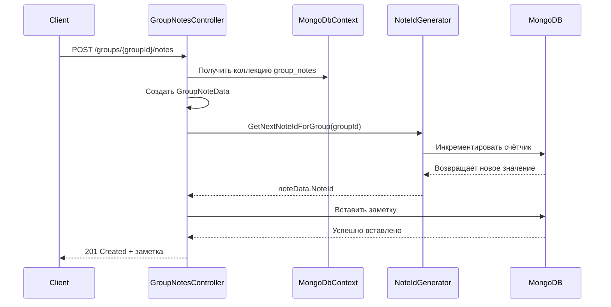
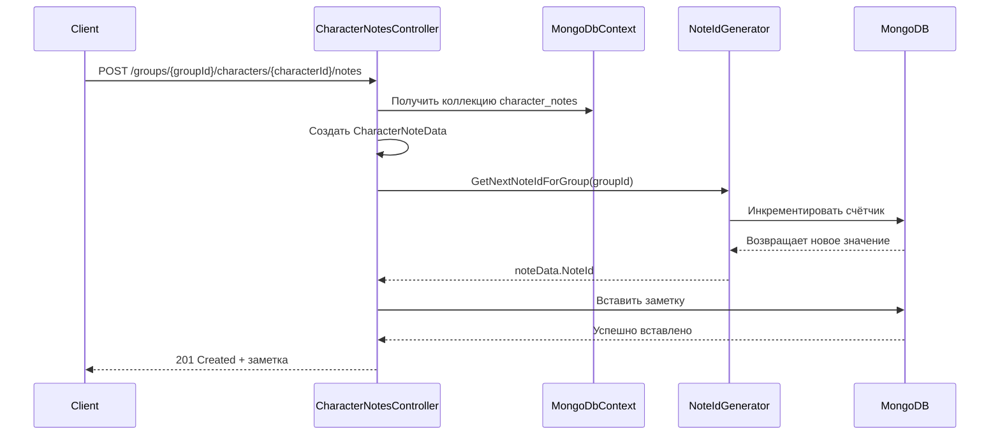
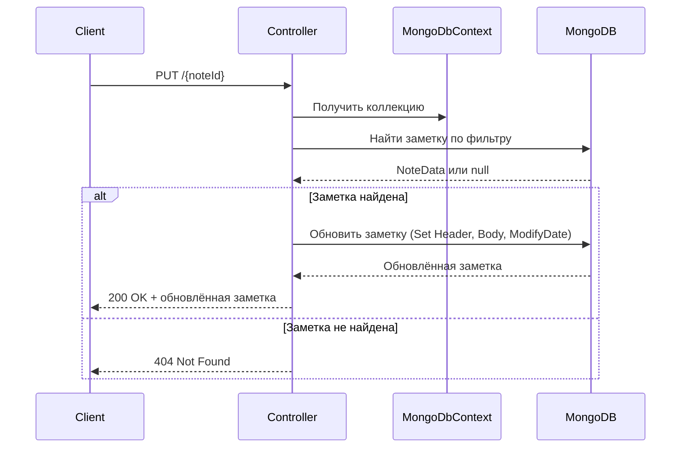
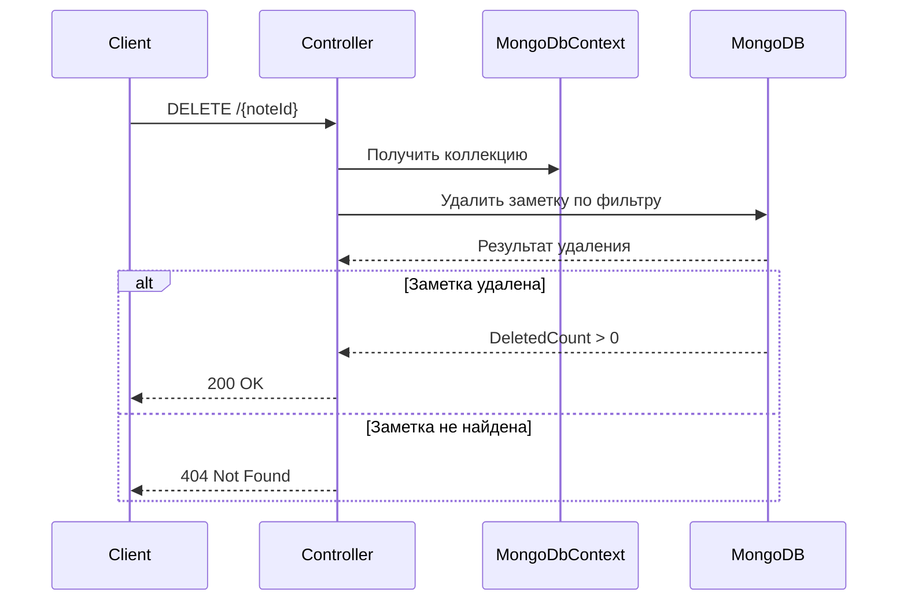

# notes-service

**notes-service** — сервис управления заметками в системе TheDungeonNotebook. Он отвечает за:
- Создание заметок для групп
- Создание заметок для персонажей
- CRUD операции с заметками
- Генерацию уникальных ID для заметок

**Приоритет:** Средний (работа с MongoDB)  
**Сложность:** Средняя (CRUD операции, специфика MongoDB)

---

## 1. Введение

### Описание сервиса

`notes-service` — это микросервис на базе .NET 8, который предоставляет REST API для работы с заметками в системе TheDungeonNotebook. Сервис использует MongoDB в качестве базы данных и реализует полную CRUD-логику для двух типов заметок: групповых и персонажных.

### Роль в архитектуре

Сервис интегрируется с API Gateway через стандартные HTTP-запросы. Он работает в связке с другими сервисами системы:
- **auth-service** — для аутентификации пользователей
- **users-service** — для получения информации о пользователях
- **groups-service** — для работы с группами
- **characters-service** — для работы с персонажами

### Технологический стек

- **.NET 8** — фреймворк приложения
- **MongoDB** — база данных
- **MongoDB.Driver** — драйвер для работы с MongoDB
- **Bson** — библиотека для сериализации данных

---

## 2. API endpoints контроллеров заметок

### Общая структура контроллеров

Сервис использует два контроллера для работы с заметками:
- **GroupNotesController** — управление заметками групп
- **CharacterNotesController** — управление заметками персонажей

Оба контроллера наследуются от базового класса `BaseController<T>`, который предоставляет общую логику CRUD-операций.

---

### 2.1 GroupNotesController (`/groups/{groupId}/notes`)

Контроллер для работы с заметками, привязанными к группам.

#### Маршруты

| Метод | Endpoint | Описание | Параметры |
|-------|----------|----------|-----------|
| GET | `/groups/{groupId}/notes` | Получить все заметки группы | `groupId` |
| POST | `/groups/{groupId}/notes` | Создать заметку группы | `groupId`, `NotePostData` |
| GET | `/groups/{groupId}/notes/{noteId}` | Получить заметку по ID | `groupId`, `noteId` |
| PUT | `/groups/{groupId}/notes/{noteId}` | Обновить заметку | `groupId`, `noteId`, `NotePostData` |
| DELETE | `/groups/{groupId}/notes/{noteId}` | Удалить заметку | `groupId`, `noteId` |

#### Примеры запросов

**Получить все заметки группы:**

```http
GET /groups/1/notes
Authorization: Bearer <token>
```

**Ответ (200 OK):**

```json
[
  {
    "id": 1,
    "header": "Первое задание",
    "body": "Описание первого задания...",
    "created_at": "2026-04-10T06:17:44.163Z",
    "updated_at": "2026-04-10T06:17:44.163Z",
    "group_id": 1
  },
  {
    "id": 2,
    "header": "Второе задание",
    "body": "Описание второго задания...",
    "created_at": "2026-04-10T06:18:00.000Z",
    "updated_at": "2026-04-10T06:18:00.000Z",
    "group_id": 1
  }
]
```

**Создать заметку группы:**

```http
POST /groups/1/notes
Authorization: Bearer <token>
Content-Type: application/json

{
  "header": "Новое задание",
  "body": "Описание нового задания..."
}
```

**Ответ (201 Created):**

```json
{
  "id": 1,
  "header": "Новое задание",
  "body": "Описание нового задания...",
  "created_at": "2026-04-10T06:18:00.000Z",
  "updated_at": "2026-04-10T06:18:00.000Z",
  "group_id": 1
}
```

**Получить заметку по ID:**

```http
GET /groups/1/notes/1
Authorization: Bearer <token>
```

**Ответ (200 OK):**

```json
{
  "id": 1,
  "header": "Первое задание",
  "body": "Описание первого задания...",
  "created_at": "2026-04-10T06:17:44.163Z",
  "updated_at": "2026-04-10T06:17:44.163Z",
  "group_id": 1
}
```

**Обновить заметку:**

```http
PUT /groups/1/notes/1
Authorization: Bearer <token>
Content-Type: application/json

{
  "header": "Обновлённое задание",
  "body": "Обновлённое описание..."
}
```

**Ответ (200 OK):**

```json
{
  "id": 1,
  "header": "Обновлённое задание",
  "body": "Обновлённое описание...",
  "created_at": "2026-04-10T06:17:44.163Z",
  "updated_at": "2026-04-10T06:18:30.000Z",
  "group_id": 1
}
```

**Удалить заметку:**

```http
DELETE /groups/1/notes/1
Authorization: Bearer <token>
```

**Ответ (200 OK):**

```json
{}
```

---

### 2.2 CharacterNotesController (`/groups/{groupId}/characters/{characterId}/notes`)

Контроллер для работы с заметками, привязанными к персонажам внутри групп.

#### Маршруты

| Метод | Endpoint | Описание | Параметры |
|-------|----------|----------|-----------|
| GET | `/groups/{groupId}/characters/{characterId}/notes` | Получить все заметки персонажа | `groupId`, `characterId` |
| POST | `/groups/{groupId}/characters/{characterId}/notes` | Создать заметку персонажа | `groupId`, `characterId`, `NotePostData` |
| GET | `/groups/{groupId}/characters/{characterId}/notes/{noteId}` | Получить заметку по ID | `groupId`, `characterId`, `noteId` |
| PUT | `/groups/{groupId}/characters/{characterId}/notes/{noteId}` | Обновить заметку | `groupId`, `characterId`, `noteId`, `NotePostData` |
| DELETE | `/groups/{groupId}/characters/{characterId}/notes/{noteId}` | Удалить заметку | `groupId`, `characterId`, `noteId` |

#### Примеры запросов

**Получить все заметки персонажа:**

```http
GET /groups/1/characters/5/notes
Authorization: Bearer <token>
```

**Ответ (200 OK):**

```json
[
  {
    "id": 1,
    "header": "Первое наблюдение",
    "body": "Первое наблюдение за персонажем...",
    "created_at": "2026-04-10T06:17:44.163Z",
    "updated_at": "2026-04-10T06:17:44.163Z",
    "group_id": 1,
    "character_id": 5
  },
  {
    "id": 2,
    "header": "Второе наблюдение",
    "body": "Второе наблюдение за персонажем...",
    "created_at": "2026-04-10T06:18:00.000Z",
    "updated_at": "2026-04-10T06:18:00.000Z",
    "group_id": 1,
    "character_id": 5
  }
]
```

**Создать заметку персонажа:**

```http
POST /groups/1/characters/5/notes
Authorization: Bearer <token>
Content-Type: application/json

{
  "header": "Новое наблюдение",
  "body": "Описание нового наблюдения..."
}
```

**Ответ (201 Created):**

```json
{
  "id": 1,
  "header": "Новое наблюдение",
  "body": "Описание нового наблюдения...",
  "created_at": "2026-04-10T06:18:00.000Z",
  "updated_at": "2026-04-10T06:18:00.000Z",
  "group_id": 1,
  "character_id": 5
}
```

**Получить заметку по ID:**

```http
GET /groups/1/characters/5/notes/1
Authorization: Bearer <token>
```

**Ответ (200 OK):**

```json
{
  "id": 1,
  "header": "Первое наблюдение",
  "body": "Первое наблюдение за персонажем...",
  "created_at": "2026-04-10T06:17:44.163Z",
  "updated_at": "2026-04-10T06:17:44.163Z",
  "group_id": 1,
  "character_id": 5
}
```

**Обновить заметку:**

```http
PUT /groups/1/characters/5/notes/1
Authorization: Bearer <token>
Content-Type: application/json

{
  "header": "Обновлённое наблюдение",
  "body": "Обновлённое описание..."
}
```

**Ответ (200 OK):**

```json
{
  "id": 1,
  "header": "Обновлённое наблюдение",
  "body": "Обновлённое описание...",
  "created_at": "2026-04-10T06:17:44.163Z",
  "updated_at": "2026-04-10T06:18:30.000Z",
  "group_id": 1,
  "character_id": 5
}
```

**Удалить заметку:**

```http
DELETE /groups/1/characters/5/notes/1
Authorization: Bearer <token>
```

**Ответ (200 OK):**

```json
{}
```

---

### 2.3 BaseController<CharacterNoteData>

Базовый класс для всех контроллеров заметок.

#### Свойства

- **`CollectionName`** — имя коллекции MongoDB (переопределяется в наследниках)
- **`IdGenerator`** — экземпляр `NoteIdGenerator` для генерации ID заметок
- **`Collection`** — свойство для получения коллекции MongoDB

#### Методы

| Метод | Описание |
|-------|----------|
| `GetAll()` | Получить все заметки из коллекции |
| `PostNote()` | Создать новую заметку |
| `GetNote()` | Получить заметку по ID |
| `PutNote()` | Обновить существующую заметку |
| `DeleteNote()` | Удалить заметку |

#### Реализация методов

**`GetAll()`** — получает все заметки из коллекции с применением фильтра по `GroupId`:

```csharp
var filter = Builders<CharacterNoteData>.Filter.Eq(n => n.GroupId, groupId) & 
            Builders<CharacterNoteData>.Filter.Eq(n => n.CharacterId, characterId);
var result = Collection.Find(filter).ToList();
return Ok(result.AsResult());
```

**`PostNote()`** — создаёт новую заметку, генерирует ID через `NoteIdGenerator`:

```csharp
var noteData = new CharacterNoteData(){
    CharacterId = characterId,
    GroupId = groupId,
    Header = data.Header,
    Body = data.Body,
    AdditionDate = DateTime.UtcNow,
    ModifyDate = DateTime.UtcNow
};
noteData.NoteId = IdGenerator.GetNextNoteIdForGroup(noteData.GroupId);
Collection.InsertOne(noteData);
return Created($"/groups/{groupId}/characters/{characterId}/notes/{noteData.NoteId}", noteData.AsResult());
```

**`GetNote()`** — получает заметку по фильтру (GroupId, CharacterId, NoteId):

```csharp
var filter = Builders<CharacterNoteData>.Filter.Eq(n => n.GroupId, groupId) & 
            Builders<CharacterNoteData>.Filter.Eq(n => n.CharacterId, characterId) &
            Builders<CharacterNoteData>.Filter.Eq(n => n.NoteId, noteId);
var note = Collection.Find<CharacterNoteData>(filter).FirstOrDefault();
if (note == null)
    return NotFound();
return Ok(note.AsResult());
```

**`PutNote()`** — обновляет заметку с использованием `FindOneAndUpdate`:

```csharp
var filter = Builders<CharacterNoteData>.Filter.Eq(n => n.GroupId, groupId) & 
            Builders<CharacterNoteData>.Filter.Eq(n => n.CharacterId, characterId) &
            Builders<CharacterNoteData>.Filter.Eq(n => n.NoteId, noteId);
var update = Builders<CharacterNoteData>.Update
    .Set(n => n.Header, data.Header)
    .Set(n => n.Body, data.Body)
    .Set(n => n.ModifyDate, DateTime.UtcNow);
var options = new FindOneAndUpdateOptions<CharacterNoteData>
{
    IsUpsert = true,
    ReturnDocument = ReturnDocument.After
};
var note = Collection.FindOneAndUpdate<CharacterNoteData>(filter, update, options);
if (note == null)
    return NotFound();
return Ok(note.AsResult());
```

**`DeleteNote()`** — удаляет заметку по фильтру:

```csharp
var filter = Builders<CharacterNoteData>.Filter.Eq(n => n.GroupId, groupId) & 
            Builders<CharacterNoteData>.Filter.Eq(n => n.CharacterId, characterId) &
            Builders<CharacterNoteData>.Filter.Eq(n => n.NoteId, noteId);
var result = Collection.DeleteOne(filter);
if (result.DeletedCount > 0)
    return Ok();
return NotFound();
```

---

## 3. Модели данных

### 3.1 NoteData (базовая сущность)

Базовая сущность для всех заметок.

```csharp
public class NoteData : MongoDbContext.MongoEntity
{
    [BsonElement("id")]
    public int NoteId;              // Уникальный идентификатор заметки (генерируется)
    [BsonElement("header")]
    public string Header = "";      // Заголовок заметки
    [BsonElement("body")]
    public string Body = "";        // Тело заметки
    [BsonElement("created_at")]
    public DateTime AdditionDate;   // Дата создания
    [BsonElement("updated_at")]
    public DateTime ModifyDate;     // Дата последнего обновления
}
```

#### Поля

| Поле | Тип | Описание |
|------|-----|----------|
| `NoteId` | `int` | Уникальный идентификатор заметки (генерируется автоматически) |
| `Header` | `string` | Заголовок заметки (по умолчанию пустая строка) |
| `Body` | `string` | Тело заметки (по умолчанию пустая строка) |
| `AdditionDate` | `DateTime` | Дата создания заметки (всегда UTC) |
| `ModifyDate` | `DateTime` | Дата последнего обновления (всегда UTC) |

#### Наследование

- **`NoteData`** — базовая сущность
- **`GroupNoteData`** — добавляет `GroupId`
- **`CharacterNoteData`** — добавляет `CharacterId`

---

### 3.2 GroupNoteData (заметка группы)

Сущность для заметок, привязанных к группам.

```csharp
public class GroupNoteData : NoteData
{
    [BsonElement("group_id")]
    public int GroupId;             // ID группы, к которой относится заметка
}
```

#### Поля

| Поле | Тип | Описание |
|------|-----|----------|
| `GroupId` | `int` | ID группы, к которой относится заметка |

#### Использование

- **Коллекция:** `group_notes`
- **Фильтрация:** по `GroupId`
- **Пример документа в MongoDB:**

```json
{
  "_id": ObjectId("..."),
  "id": 1,
  "header": "Первое задание",
  "body": "Описание первого задания...",
  "created_at": "2026-04-10T06:17:44.163Z",
  "updated_at": "2026-04-10T06:17:44.163Z",
  "group_id": 1
}
```

---

### 3.3 CharacterNoteData (заметка персонажа)

Сущность для заметок, привязанных к персонажам внутри групп.

```csharp
public class CharacterNoteData : GroupNoteData
{
    [BsonElement("character_id")]
    public int CharacterId;         // ID персонажа, к которому относится заметка
}
```

#### Поля

| Поле | Тип | Описание |
|------|-----|----------|
| `CharacterId` | `int` | ID персонажа, к которому относится заметка |

#### Использование

- **Коллекция:** `character_notes`
- **Фильтрация:** по `GroupId` и `CharacterId`
- **Пример документа в MongoDB:**

```json
{
  "_id": ObjectId("..."),
  "id": 1,
  "header": "Первое наблюдение",
  "body": "Первое наблюдение за персонажем...",
  "created_at": "2026-04-10T06:17:44.163Z",
  "updated_at": "2026-04-10T06:17:44.163Z",
  "group_id": 1,
  "character_id": 5
}
```

---

### 3.4 NotePostData (DTO для создания/обновления заметки)

Структура для передачи данных при создании или обновлении заметки.

```csharp
public struct NotePostData
{
    public string Header { get; set; }
    public string Body { get; set; }
}
```

#### Поля

| Поле | Тип | Описание |
|------|-----|----------|
| `Header` | `string` | Заголовок заметки |
| `Body` | `string` | Тело заметки |

#### Пример запроса

```json
{
  "header": "Новое задание",
  "body": "Описание нового задания..."
}
```

---

## 4. Контекст MongoDB

### 4.1 MongoDbContext

Контекст для работы с MongoDB, предоставляющий методы для получения коллекций и сущностей.

```csharp
public class MongoDbContext
{
    public class MongoEntity
    {
        [BsonId]
        public ObjectId Id;             // ObjectId MongoDB
    }
    
    private readonly IMongoDatabase _database;
    
    public MongoDbContext(MongoDbSettings mongoDbSettings)
    {
        var client = new MongoClient(mongoDbSettings.ConnectionString);
        _database = client.GetDatabase(mongoDbSettings.DatabaseName);
        IdGenerator = new NoteIdGenerator(this);
    }

    public NoteIdGenerator IdGenerator { get; private set; }

    public IMongoCollection<T> GetCollection<T>(string collectionName)
    {
        return _database.GetCollection<T>(collectionName);
    }
    
    public T? GetEntity<T>(string collectionName, string uuid) where T : MongoEntity
    {
        ObjectId objectId = ObjectId.Parse(uuid);
        var collection = GetCollection<T>(collectionName);
        var filter = Builders<T>.Filter.Eq(e => e.Id, objectId);
        return collection.Find(filter).FirstOrDefault();
    }
    
    public IEnumerable<T> GetMany<T>(string collectionName, IEnumerable<string> uuids) where T : MongoEntity
    {
        List<T> result = new();
        foreach (var uuid in uuids)
        {
            var entity = GetEntity<T>(collectionName, uuid);
            if (entity != null)
                result.Add(entity);
        }
        return result.ToArray();
    }
}
```

#### Конструктор

```csharp
public MongoDbContext(MongoDbSettings mongoDbSettings)
{
    var client = new MongoClient(mongoDbSettings.ConnectionString);
    _database = client.GetDatabase(mongoDbSettings.DatabaseName);
    IdGenerator = new NoteIdGenerator(this);
}
```

#### Свойства

| Свойство | Тип | Описание |
|----------|-----|----------|
| `IdGenerator` | `NoteIdGenerator` | Экземпляр `NoteIdGenerator` для генерации ID заметок |

#### Методы

| Метод | Описание | Возврат |
|-------|----------|---------|
| `GetCollection<T>(collectionName)` | Получить коллекцию | `IMongoCollection<T>` |
| `GetEntity<T>(collectionName, uuid)` | Получить сущность по ObjectId | `T?` |
| `GetMany<T>(collectionName, uuids)` | Получить несколько сущностей | `IEnumerable<T>` |

---

### 4.2 MongoEntity (базовая сущность)

Базовая сущность для всех сущностей, работающих с MongoDB.

```csharp
public class MongoEntity
{
    [BsonId]
    public ObjectId Id;             // ObjectId MongoDB
}
```

#### Использование

- Все сущности наследуются от `MongoEntity`
- `Id` используется как первичный ключ в MongoDB
- Атрибут `[BsonId]` указывает MongoDB, что это поле является идентификатором документа

---

### 4.3 Коллекции MongoDB

| Коллекция | Описание | Сущность |
|-----------|----------|----------|
| `group_notes` | Заметки групп | `GroupNoteData` |
| `character_notes` | Заметки персонажей | `CharacterNoteData` |
| `counters` | Счётчики для генерации ID | `Counter` |

---

## 5. Генератор ID

### 5.1 Counter (счётчик)

Сущность счётчика для генерации уникальных ID заметок.

```csharp
public class Counter
{
    [BsonId]
    public string Name { get; set; } = "";  // Имя счётчика
    [BsonElement("value")]
    public int Value { get; set; }          // Текущее значение
}
```

#### Поля

| Поле | Тип | Описание |
|------|-----|----------|
| `Name` | `string` | Имя счётчика (уникальный идентификатор) |
| `Value` | `int` | Текущее значение счётчика |

#### Использование

- Хранится в коллекции `counters`
- Имя счётчика: `notes_group_{groupId}`
- **Пример документа в MongoDB:**

```json
{
  "_id": "notes_group_1",
  "value": 42
}
```

---

### 5.2 NoteIdGenerator

Генератор уникальных ID для заметок.

```csharp
public class NoteIdGenerator
{
    private readonly IMongoCollection<Counter> _counters;
    
    public NoteIdGenerator(MongoDbContext database)
    {
        _counters = database.GetCollection<Counter>("counters");
    }
    
    public int GetNextNoteIdForGroup(int groupId)
    {
        var counterName = $"notes_group_{groupId}";
        
        var filter = Builders<Counter>.Filter.Eq(c => c.Name, counterName);
        var update = Builders<Counter>.Update.Inc(c => c.Value, 1);
        var options = new FindOneAndUpdateOptions<Counter>
        {
            IsUpsert = true,
            ReturnDocument = ReturnDocument.After
        };
        
        var counter = _counters.FindOneAndUpdate(filter, update, options);
        return counter.Value;
    }
}
```

#### Конструктор

```csharp
public NoteIdGenerator(MongoDbContext database)
{
    _counters = database.GetCollection<Counter>("counters");
}
```

#### Методы

| Метод | Описание | Возврат |
|-------|----------|---------|
| `GetNextNoteIdForGroup(groupId)` | Получить следующий ID для группы | `int` |

#### Алгоритм генерации

1. Формирует имя счётчика: `notes_group_{groupId}`
2. Создаёт фильтр по имени счётчика
3. Инкрементирует значение счётчика через `FindOneAndUpdate` с `IsUpsert = true`
4. Возвращает новое значение

#### Пример

```csharp
var counterName = $"notes_group_{groupId}";
var filter = Builders<Counter>.Filter.Eq(c => c.Name, counterName);
var update = Builders<Counter>.Update.Inc(c => c.Value, 1);
var options = new FindOneAndUpdateOptions<Counter>
{
    IsUpsert = true,
    ReturnDocument = ReturnDocument.After
};
var counter = _counters.FindOneAndUpdate(filter, update, options);
return counter.Value;
```

---

## 6. Конфигурация

### 6.1 ConfigParser

Парсинг конфигурации из переменных окружения.

```csharp
public class ConfigParser
{	
	private string? _mongoConnectionString;
	private string? _mongoDBName;

	public ConfigParser(){
		_mongoConnectionString = Environment.GetEnvironmentVariable("MONGO_CONNECTION_STRING");
		_mongoDBName = Environment.GetEnvironmentVariable("MONGO_DATABASE");
		if (_mongoConnectionString == null || _mongoDBName == null)
		{
			throw new Exception($"Can't find information to connect to databases:\n"+
								$" |-mongo:{_mongoConnectionString}\n"+
								$" |-dbname: {_mongoDBName}"
							);
		}
	}
	
	public MongoDbSettings GetMongoDbSettings()
	{	
		string dbName;
		string connection;
		connection = _mongoConnectionString!;
		dbName = _mongoDBName!;
		var settings = new MongoDbSettings
		{
			ConnectionString = connection,
			DatabaseName = dbName
		};
		return settings;
	}
}
```

#### Конструктор

```csharp
public ConfigParser(){
	_mongoConnectionString = Environment.GetEnvironmentVariable("MONGO_CONNECTION_STRING");
	_mongoDBName = Environment.GetEnvironmentVariable("MONGO_DATABASE");
	if (_mongoConnectionString == null || _mongoDBName == null)
	{
		throw new Exception($"Can't find information to connect to databases:\n"+
							$" |-mongo:{_mongoConnectionString}\n"+
							$" |-dbname: {_mongoDBName}"
						);
	}
}
```

#### Методы

| Метод | Описание | Возврат |
|-------|----------|---------|
| `GetMongoDbSettings()` | Получить настройки MongoDB | `MongoDbSettings` |

---

### 6.2 MongoDbSettings

Настройки подключения к MongoDB.

```csharp
public class MongoDbSettings
{
    public string ConnectionString { get; set; }
    public string DatabaseName { get; set; }
}
```

#### Поля

| Поле | Тип | Описание |
|------|-----|----------|
| `ConnectionString` | `string` | Строка подключения к MongoDB |
| `DatabaseName` | `string` | Имя базы данных MongoDB |

---

### 6.3 Переменные окружения

| Переменная | Описание |
|------------|----------|
| `MONGO_CONNECTION_STRING` | Строка подключения к MongoDB |
| `MONGO_DATABASE` | Имя базы данных MongoDB |

---

### 6.4 appsettings.json

```json
{
  "Logging": {
    "LogLevel": {
      "Default": "Information",
      "Microsoft.AspNetCore": "Warning"
    }
  },
  "AllowedHosts": "*"
}
```

---

### 6.5 Настройка зависимостей в Program.cs

```csharp
var builder = WebApplication.CreateBuilder(args);
var config = new ConfigParser();

// General
builder.Services.AddMvc();
builder.Services.AddHttpContextAccessor();
builder.Services.AddLogging(e => e.AddConsole());

// DataBase Contexts
builder.Services.Configure<MongoDbSettings>(builder.Configuration.GetSection("MongoDbSettings"));
builder.Services.AddScoped(_ => new MongoDbContext(config.GetMongoDbSettings()));

// General
builder.Services.AddEndpointsApiExplorer();
builder.Services.AddControllers();

var app = builder.Build();
app.MapControllers();
app.Run();
```

---

## 7. Бизнес-логика

### 7.1 Процесс создания заметки группы



---

### 7.2 Процесс создания заметки персонажа



---

### 7.3 Процесс обновления заметки



---

### 7.4 Процесс удаления заметки



---

## 8. Конвертация данных

### 8.1 AsResult (конвертация в JSON)

Метод расширения для конвертации сущностей в JSON-объекты.

```csharp
public static Dictionary<string, object?> AsResult(this NoteData note)
{
    var result = new Dictionary<string, object?>()
    {
        {"id", note.NoteId},
        {"header", note.Header},
        {"body", note.Body},
        {"created_at", note.AdditionDate},
        {"updated_at", note.ModifyDate}
    };
    
    if (note.GetType().IsSubclassOf(typeof(GroupNoteData)) || note is GroupNoteData)
        result.Add("group_id", (note as GroupNoteData)?.GroupId);
    
    if (note is CharacterNoteData)
        result.Add("character_id", (note as CharacterNoteData)?.CharacterId);
    
    return result;
}
```

#### Возврат для GroupNoteData

```json
{
  "id": 1,
  "header": "Заголовок",
  "body": "Тело заметки",
  "created_at": "2026-04-10T06:17:44.163Z",
  "updated_at": "2026-04-10T06:17:44.163Z",
  "group_id": 1
}
```

#### Возврат для CharacterNoteData

```json
{
  "id": 1,
  "header": "Заголовок",
  "body": "Тело заметки",
  "created_at": "2026-04-10T06:17:44.163Z",
  "updated_at": "2026-04-10T06:17:44.163Z",
  "group_id": 1,
  "character_id": 1
}
```

---

## 9. Обработка ошибок

### 9.1 Коды ошибок

| Код | Описание | Когда возникает |
|-----|----------|-----------------|
| 200 OK | Успешный запрос | - |
| 201 Created | Заметка создана | POST /notes |
| 404 Not Found | Заметка не найдена | GET, PUT, DELETE с невалидным ID |

---

### 9.2 Фильтры поиска

**Полный фильтр (CharacterNoteData):**

```csharp
var filter = Builders<CharacterNoteData>.Filter.Eq(n => n.GroupId, groupId) & 
            Builders<CharacterNoteData>.Filter.Eq(n => n.CharacterId, characterId) &
            Builders<CharacterNoteData>.Filter.Eq(n => n.NoteId, noteId);
```

**Фильтр по группе (GroupNoteData):**

```csharp
var filter = Builders<GroupNoteData>.Filter.Eq(n => n.GroupId, groupId);
```

---

## 10. Структура проекта

```
backend/notes-service/
├── Program.cs                          # Точка входа, настройка DI
├── Source/
│   ├── Controllers/
│   │   ├── CharacterNotesController.cs # Контроллер заметок персонажей
│   │   ├── GroupNotesController.cs     # Контроллер заметок групп
│   │   └── BaseController.cs           # Базовый контроллер
│   ├── DB/
│   │   ├── Contexts/
│   │   │   └── MongoDbContext.cs       # Контекст MongoDB
│   │   ├── Entities/
│   │   │   └── NoteData.cs             # Сущности заметок
│   │   ├── NoteIdGenerator.cs          # Генератор ID заметок
│   │   └── Settings.cs                 # Настройки MongoDB
│   ├── ConfigParser.cs                 # Парсинг конфигурации
│   └── DataConversion.cs               # Конвертация данных в JSON
├── appsettings.json                    # Настройки приложения
├── appsettings.Development.json        # Настройки для разработки
├── notes-service.csproj                # Файл проекта
├── notes-service.http                  # HTTP тестовый файл
├── Dockerfile                          # Docker конфигурация
└── README.md                          # Существующая документация
```

---

*Создано: 2026-04-10*  
*Версия: 1.0*
