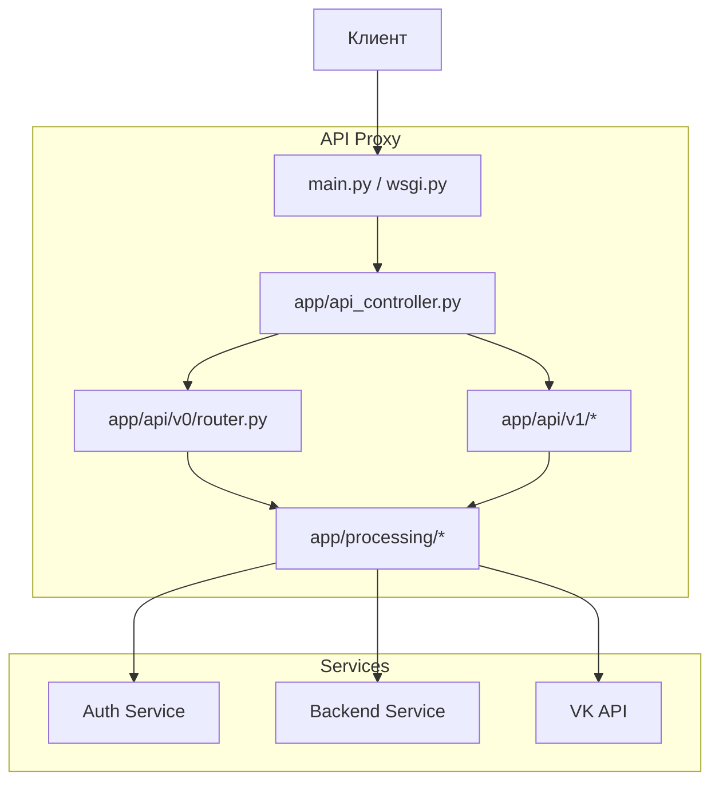
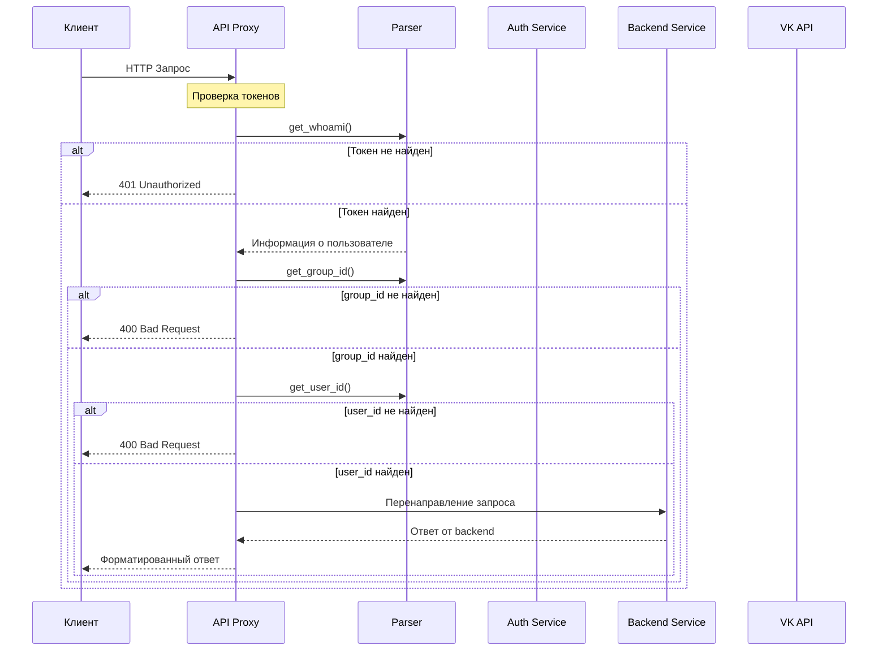

# Анализ API Endpoints API Proxy

**Дата анализа:** 2026-04-10  
**Источник:** `/docs/api-proxy.md`

---

## 1. Сводная таблица всех API Endpoints

| Версия | Endpoint | Методы | Доступ | Сервисы |
|--------|----------|--------|--------|---------|
| v0 | `/api/get_api` | GET | all | — |
| v0 | `/api/auth` | POST | all | auth-service |
| v0 | `/api/check_access` | GET | users_and_groups | auth-service |
| v0 | `/api/groups` | GET | users | backend-service |
| v1 | `/api/v1/notes` | GET | users_and_groups | backend-service |
| v1 | `/api/v1/notes/{note_id}` | GET, PUT, DELETE | users_and_groups | backend-service |
| v1 | `/api/v1/notes/add` | POST | users_and_groups | backend-service |
| v1 | `/api/v1/groups` | GET | users_and_groups | backend-service |
| v1 | `/api/v1/groups/{group_id}` | GET | users_and_groups | backend-service |
| v1 | `/api/v1/users` | GET | users_and_groups | backend-service |
| v1 | `/api/v1/users/{user_id}` | GET, DELETE | groups | backend-service |
| v1 | `/api/v1/users/add` | POST | groups | backend-service |
| v1 | `/api/v1/items` | GET | users_and_groups | backend-service |
| v1 | `/api/v1/items/{item_id}` | GET, PUT, DELETE, POST | users_and_groups | backend-service |
| v1 | `/api/v1/items/create` | POST | users_and_groups | backend-service |

---

## 2. Детальный анализ по версиям API

### 2.1 Версия v0 (базовые endpoints)

#### 2.1.1 `/api/get_api`

| Параметр | Тип | Обязательный | Описание |
|----------|-----|--------------|----------|
| — | — | — | — |

- **Метод:** `GET`
- **Доступ:** `all` (без авторизации)
- **Сервисы:** — (информационный endpoint)
- **Описание:** Возвращает список всех доступных API методов

**Ответ (200 OK):**
```json
{
  "api_methods": {
    "v0": [...],
    "v1": [...]
  }
}
```

---

#### 2.1.2 `/api/auth`

| Параметр | Тип | Обязательный | Описание |
|----------|-----|--------------|----------|
| `access_token` | string | Да (в ответе) | Токен авторизации пользователя |

- **Метод:** `POST`
- **Доступ:** `all` (без авторизации)
- **Сервисы:** `auth-service`
- **Описание:** Конвертация сервисного токена VK в токен доступа пользователя

**Запрос:**
```json
{
  "access_token": "VK_ID_from_vk"
}
```

**Ответ (200 OK):**
```json
{
  "access_token": "user_access_token"
}
```

---

#### 2.1.3 `/api/check_access`

| Параметр | Тип | Обязательный | Описание |
|----------|-----|--------------|----------|
| — | — | — | — |

- **Метод:** `GET`
- **Доступ:** `users_and_groups`
- **Сервисы:** `auth-service`
- **Описание:** Проверка типа доступа (user/group)

**Ответ (200 OK):**
```json
{
  "access.type": "user \| group"
}
```

**Ответ (401 Unauthorized):**
```json
{
  "error": "Unauthorized"
}
```

---

#### 2.1.4 `/api/groups`

| Параметр | Тип | Обязательный | Описание |
|----------|-----|--------------|----------|
| — | — | — | — |

- **Метод:** `GET`
- **Доступ:** `users`
- **Сервисы:** `backend-service`
- **Описание:** Получение списка всех групп

**Ответ (200 OK):**
```json
{
  "groups": [
    {
      "id": 1,
      "name": "Название группы",
      "privileges": []
    }
  ]
}
```

---

### 2.2 Версия v1 (расширенные endpoints)

#### 2.2.1 `/api/v1/notes`

| Параметр | Тип | Обязательный | Описание |
|----------|-----|--------------|----------|
| — | — | — | — |

- **Метод:** `GET`
- **Доступ:** `users_and_groups`
- **Сервисы:** `backend-service`
- **Описание:** Получение списка всех заметок группы

**Ответ (200 OK):**
```json
{
  "notes": [
    {
      "id": 1,
      "header": "Заголовок",
      "body": "Текст заметки",
      "last_modify": "2026-04-10 06:00:00",
      "group_id": 1,
      "owner_id": 1,
      "author": {
        "vk_id": 123,
        "first_name": "Иван",
        "last_name": "Иванов",
        "photo": "https://..."
      }
    }
  ]
}
```

---

#### 2.2.2 `/api/v1/notes/{note_id}`

| Параметр | Тип | Обязательный | Описание |
|----------|-----|--------------|----------|
| `note_id` | string | Да | ID заметки (формат: `{character_id}{note_index}`) |

- **Методы:** `GET`, `PUT`, `DELETE`
- **Доступ:** `users_and_groups`
- **Сервисы:** `backend-service`
- **Описание:** CRUD операции над конкретной заметкой

**GET — Ответ (200 OK):**
```json
{
  "id": 1,
  "header": "Заголовок",
  "body": "Текст заметки",
  "last_modify": "2026-04-10 06:00:00",
  "group_id": 1,
  "owner_id": 1,
  "author": {
    "vk_id": 123,
    "first_name": "Иван",
    "last_name": "Иванов",
    "photo": "https://..."
  }
}
```

**PUT — Запрос:**
```json
{
  "header": "Новый заголовок",
  "body": "Новое тело"
}
```

**PUT — Ответ (200 OK):**
```json
{
  "id": 1,
  "header": "Новый заголовок",
  "body": "Новое тело",
  "last_modify": "2026-04-10 06:05:00",
  "group_id": 1,
  "owner_id": 1,
  "author": {
    "vk_id": 123,
    "first_name": "Иван",
    "last_name": "Иванов",
    "photo": "https://..."
  }
}
```

**DELETE — Ответ (204 No Content):**
```json
{}
```

---

#### 2.2.3 `/api/v1/notes/add`

| Параметр | Тип | Обязательный | Описание |
|----------|-----|--------------|----------|
| `header` | string | Да | Заголовок заметки |
| `body` | string | Да | Тело заметки |
| `group_id` | integer | Да (для пользователя) | ID группы |
| `user_id` | integer | Да (для группы) | ID пользователя |

- **Метод:** `POST`
- **Доступ:** `users_and_groups`
- **Сервисы:** `backend-service`
- **Описание:** Создание новой заметки

**Запрос:**
```json
{
  "header": "Новая заметка",
  "body": "Текст заметки",
  "group_id": 1
}
```

**Ответ (201 Created):**
```json
{
  "last_id": 1
}
```

---

#### 2.2.4 `/api/v1/groups`

| Параметр | Тип | Обязательный | Описание |
|----------|-----|--------------|----------|
| — | — | — | — |

- **Метод:** `GET`
- **Доступ:** `users_and_groups`
- **Сервисы:** `backend-service`
- **Описание:** Получение списка групп с правами доступа

**Ответ (200 OK) — от имени пользователя:**
```json
{
  "groups": [
    {
      "id": 1,
      "is_admin": true,
      "name": "Название группы"
    }
  ]
}
```

**Ответ (200 OK) — от имени группы:**
```json
{
  "id": 1,
  "name": "Название группы",
  "admins": [
    {
      "id": 123,
      "first_name": "Админ",
      "last_name": "Админов"
    }
  ],
  "users": [
    {
      "id": 456,
      "first_name": "Пользователь",
      "last_name": "Пользователь"
    }
  ]
}
```

---

#### 2.2.5 `/api/v1/groups/{group_id}`

| Параметр | Тип | Обязательный | Описание |
|----------|-----|--------------|----------|
| `group_id` | integer | Да | ID группы |

- **Метод:** `GET`
- **Доступ:** `users_and_groups`
- **Сервисы:** `backend-service`
- **Описание:** Получение информации о конкретной группе

**Ответ (200 OK):**
```json
{
  "id": 1,
  "name": "Название группы",
  "admins": [
    {
      "id": 123,
      "first_name": "Админ",
      "last_name": "Админов"
    }
  ],
  "is_admin": true,
  "users": [
    {
      "id": 456,
      "first_name": "Пользователь",
      "last_name": "Пользователь"
    }
  ]
}
```

---

#### 2.2.6 `/api/v1/users`

| Параметр | Тип | Обязательный | Описание |
|----------|-----|--------------|----------|
| — | — | — | — |

- **Метод:** `GET`
- **Доступ:** `users_and_groups`
- **Сервисы:** `backend-service`
- **Описание:** Получение списка пользователей/админов

**Ответ (200 OK) — от имени группы:**
```json
{
  "admins": [
    {
      "id": 123,
      "first_name": "Админ",
      "last_name": "Админов"
    }
  ],
  "users": [
    {
      "id": 456,
      "first_name": "Пользователь",
      "last_name": "Пользователь"
    }
  ]
}
```

**Ответ (200 OK) — от имени пользователя:**
```json
{
  "id": 123,
  "first_name": "Иван",
  "last_name": "Иванов",
  "photo_link": "https://..."
}
```

---

#### 2.2.7 `/api/v1/users/{user_id}`

| Параметр | Тип | Обязательный | Описание |
|----------|-----|--------------|----------|
| `user_id` | integer | Да | ID пользователя |

- **Методы:** `GET`, `DELETE`
- **Доступ:** `groups`
- **Сервисы:** `backend-service`
- **Описание:** Получение/удаление информации о пользователе

**GET — Ответ (200 OK):**
```json
{
  "id": 123,
  "first_name": "Иван",
  "last_name": "Иванов",
  "photo_link": "https://..."
}
```

**DELETE — Ответ (204 No Content):**
```json
{}
```

---

#### 2.2.8 `/api/v1/users/add`

| Параметр | Тип | Обязательный | Описание |
|----------|-----|--------------|----------|
| `user_id` | integer | Да | ID пользователя |
| `is_admin` | boolean | Да | Статус администратора |

- **Метод:** `POST`
- **Доступ:** `groups`
- **Сервисы:** `backend-service`
- **Описание:** Добавление нового пользователя

**Запрос:**
```json
{
  "user_id": 123,
  "is_admin": true
}
```

**Ответ (201 Created):**
```json
{
  "user_id": 123,
  "is_admin": true
}
```

---

#### 2.2.9 `/api/v1/items`

| Параметр | Тип | Обязательный | Описание |
|----------|-----|--------------|----------|
| `group_id` | integer | Да (для пользователя) | ID группы |
| `owner_id` | integer | Да (для инвентаря) | ID владельца |

- **Метод:** `GET`
- **Доступ:** `users_and_groups`
- **Сервисы:** `backend-service`
- **Описание:** Получение списка предметов инвентаря

**Ответ (200 OK):**
```json
{
  "items": [
    {
      "id": 1,
      "name": "Меч",
      "description": "Стальной меч",
      "amount": 1,
      "icon": "https://..."
    }
  ]
}
```

---

#### 2.2.10 `/api/v1/items/{item_id}`

| Параметр | Тип | Обязательный | Описание |
|----------|-----|--------------|----------|
| `item_id` | string | Да | ID или название предмета |

- **Методы:** `GET`, `PUT`, `DELETE`, `POST`
- **Доступ:** `users_and_groups`
- **Сервисы:** `backend-service`
- **Описание:** CRUD операции над предметом

**GET — Ответ (200 OK):**
```json
{
  "id": 1,
  "name": "Меч",
  "description": "Стальной меч",
  "amount": 1,
  "icon": "https://..."
}
```

**PUT — Запрос (от лица группы):**
```json
{
  "name": "Новое название",
  "description": "Новое описание"
}
```

**PUT — Запрос (от лица пользователя):**
```json
{
  "amount": 5
}
```

**PUT — Ответ (200 OK):**
```json
{
  "id": 1,
  "name": "Новое название",
  "description": "Новое описание",
  "amount": 5,
  "icon": "https://..."
}
```

**DELETE — Ответ (204 No Content):**
```json
{}
```

**POST — Запрос (добавление предмета):**
```json
{
  "name": "Новый предмет",
  "description": "Описание",
  "amount": 1
}
```

**POST — Ответ (201 Created):**
```json
{
  "id": 2,
  "name": "Новый предмет",
  "description": "Описание"
}
```

---

#### 2.2.11 `/api/v1/items/create`

| Параметр | Тип | Обязательный | Описание |
|----------|-----|--------------|----------|
| `name` | string | Да | Название предмета |
| `description` | string | Да | Описание предмета |

- **Метод:** `POST`
- **Доступ:** `users_and_groups` (только группы/админы)
- **Сервисы:** `backend-service`
- **Описание:** Создание нового предмета (упрощённый endpoint)

**Запрос:**
```json
{
  "name": "Новый предмет",
  "description": "Описание предмета"
}
```

**Ответ (201 Created):**
```json
{
  "created_item": {
    "id": 2,
    "name": "Новый предмет",
    "description": "Описание предмета"
  }
}
```

---

## 3. Архитектура взаимодействия с сервисами



---

## 4. Матрица сопоставления Endpoint → Сервис

| Endpoint | Сервис | URL сервиса | Описание взаимодействия |
|----------|--------|-------------|------------------------|
| `/api/auth` | auth-service | `{AUTH_SERVICE_URL}/whoami` | Конвертация сервисного токена в токен доступа |
| `/api/check_access` | auth-service | `{AUTH_SERVICE_URL}/whoami` | Проверка типа доступа |
| `/api/v1/notes*` | backend-service | `{BACKEND_SERVICE_URL}/notes/*` | CRUD операции над заметками |
| `/api/v1/groups*` | backend-service | `{BACKEND_SERVICE_URL}/groups/*` | CRUD операции над группами |
| `/api/v1/users*` | backend-service | `{BACKEND_SERVICE_URL}/users/*` | CRUD операции над пользователями |
| `/api/v1/items*` | backend-service | `{BACKEND_SERVICE_URL}/items/*` | CRUD операции над предметами |
| `/api/v1/items/*/{item_id}` | backend-service | `{BACKEND_SERVICE_URL}/items/{item_id}` | CRUD операции над предметами |
| `/api/v1/notes/{note_id}/characters` | backend-service | `{BACKEND_SERVICE_URL}/notes/{note_id}/characters` | Получение ID персонажа для группы |
| `/api/v1/items/*/{item_id}/characters` | backend-service | `{BACKEND_SERVICE_URL}/items/{item_id}/characters` | Получение ID персонажа для предмета |
| — | VK API | `https://api.vk.com/method/users.get` | Получение информации о пользователе от VK |

---

## 5. Диаграмма потоков данных



---

## 6. Статус реализации

| Компонент | Статус | Примечания |
|-----------|--------|------------|
| v0 endpoints | ✅ Реализовано | get_api, auth, check_access, groups |
| v1 notes | ✅ Реализовано | GET, PUT, DELETE, POST |
| v1 groups | ✅ Реализовано | GET |
| v1 users | ✅ Реализовано | GET, DELETE, POST |
| v1 items | ⚠️ Частично | GET реализован, PUT/POST/DELETE не реализованы |
| Парсинг запросов | ✅ Реализовано | request_parser.py |
| Обработка запросов | ✅ Реализовано | common_methods.py, vk_methods.py |

---

## 7. Следующие шаги

1. Реализовать PUT/POST/DELETE для items
2. Добавить валидацию входных данных
3. Добавить обработку ошибок
4. Добавить документацию по ошибкам
5. Добавить примеры запросов в curl/bash формат

---

## 8. Заключение

Всего обнаружено **16 API endpoints** в API Proxy:
- **4 endpoint** в версии v0 (базовые)
- **12 endpoint** в версии v1 (расширенные)

Все endpoints (кроме `/api/get_api`) взаимодействуют с **backend-service**.  
Один endpoint (`/api/auth`) взаимодействует с **auth-service**.  
Один endpoint использует **VK API** для получения информации о пользователях.
