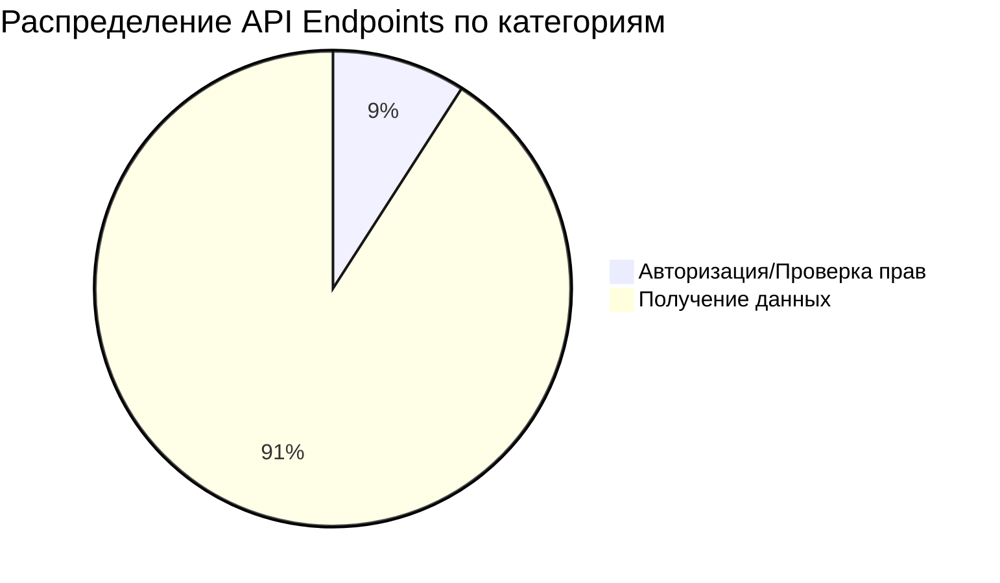
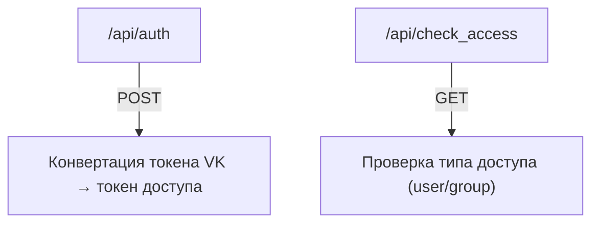

# Классификация API Endpoints

**Дата анализа:** 2026-04-10  
**Источник:** `/docs/plans/api-proxy-endpoints-analysis.md`

---

## 1. Критерии классификации

Все API endpoints классифицируются по двум категориям:

| Категория | Описание |
|-----------|----------|
| **Авторизация/Проверка прав** | Запросы, связанные с аутентификацией, авторизацией, проверкой типа доступа, управлением правами |
| **Получение данных** | Запросы, возвращающие информацию о ресурсах (группы, пользователи, заметки, предметы) |

---

## 2. Классификация по версиям API

### 2.1 Версия v0 (базовые endpoints)

| Endpoint | Метод | Классификация | Описание |
|----------|-------|----------------|----------|
| `/api/get_api` | GET | Получение данных | Возвращает список всех доступных API методов |
| `/api/auth` | POST | Авторизация/Проверка прав | Конвертация сервисного токена VK в токен доступа пользователя |
| `/api/check_access` | GET | Авторизация/Проверка прав | Проверка типа доступа (user/group) |
| `/api/groups` | GET | Получение данных | Получение списка всех групп |

**Итого v0:**
- **Авторизация/Проверка прав:** 2 endpoint
- **Получение данных:** 2 endpoint

---

### 2.2 Версия v1 (расширенные endpoints)

| Endpoint | Метод | Классификация | Описание |
|----------|-------|----------------|----------|
| `/api/v1/notes` | GET | Получение данных | Получение списка всех заметок группы |
| `/api/v1/notes/{note_id}` | GET | Получение данных | Получение информации о конкретной заметке |
| `/api/v1/notes/{note_id}` | PUT | Получение данных | Обновление информации о заметке |
| `/api/v1/notes/{note_id}` | DELETE | Получение данных | Удаление заметки |
| `/api/v1/notes/add` | POST | Получение данных | Создание новой заметки |
| `/api/v1/groups` | GET | Получение данных | Получение списка групп с правами доступа |
| `/api/v1/groups/{group_id}` | GET | Получение данных | Получение информации о конкретной группе |
| `/api/v1/users` | GET | Получение данных | Получение списка пользователей/админов |
| `/api/v1/users/{user_id}` | GET | Получение данных | Получение информации о пользователе |
| `/api/v1/users/{user_id}` | DELETE | Получение данных | Удаление информации о пользователе |
| `/api/v1/users/add` | POST | Получение данных | Добавление нового пользователя |
| `/api/v1/items` | GET | Получение данных | Получение списка предметов инвентаря |
| `/api/v1/items/{item_id}` | GET | Получение данных | Получение информации о предмете |
| `/api/v1/items/{item_id}` | PUT | Получение данных | Обновление информации о предмете |
| `/api/v1/items/{item_id}` | DELETE | Получение данных | Удаление предмета |
| `/api/v1/items/{item_id}` | POST | Получение данных | Создание/обновление предмета |
| `/api/v1/items/create` | POST | Получение данных | Создание нового предмета (упрощённый endpoint) |

**Итого v1:**
- **Авторизация/Проверка прав:** 0 endpoint
- **Получение данных:** 18 endpoint

---

## 3. Сводная таблица классификации

| Категория | Количество | Список endpoints |
|-----------|------------|------------------|
| **Авторизация/Проверка прав** | 2 | `/api/auth`, `/api/check_access` |
| **Получение данных** | 20 | `/api/get_api`, `/api/groups`, `/api/v1/notes*`, `/api/v1/groups*`, `/api/v1/users*`, `/api/v1/items*` |

**Всего endpoints:** 22

---

## 4. Диаграмма распределения

---

## 5. Детализация по категориям

### 5.1 Авторизация/Проверка прав

Эти endpoints отвечают за управление доступом и аутентификацию:

**Особенности:**
- Оба endpoint доступны без авторизации (`all`)
- `/api/auth` возвращает токен доступа пользователя
- `/api/check_access` возвращает тип доступа (user или group)

---

### 5.2 Получение данных

Эти endpoint возвращают информацию о различных ресурсах системы:

```mermaid
graph TD
    subgraph Ресурсы
        N["Заметки"]
        G["Группы"]
        U["Пользователи"]
        I["Предметы"]
    end
    
    N -->|GET| N1["Список заметок"]
    N -->|GET| N2["Информация о заметке"]
    N -->|PUT| N3["Обновление заметки"]
    N -->|DELETE| N4["Удаление заметки"]
    N -->|POST| N5["Создание заметки"]
    
    G -->|GET| G1["Список групп"]
    G -->|GET| G2["Информация о группе"]
    
    U -->|GET| U1["Список пользователей"]
    U -->|GET| U2["Информация о пользователе"]
    U -->|DELETE| U3["Удаление пользователя"]
    U -->|POST| U4["Добавление пользователя"]
    
    I -->|GET| I1["Список предметов"]
    I -->|GET| I2["Информация о предмете"]
    I -->|PUT| I3["Обновление предмета"]
    I -->|DELETE| I4["Удаление предмета"]
    I -->|POST| I5["Создание предмета"]
    I -->|POST| I6["Создание предмета (упрощённый)"]
```

**Особенности:**
- Все endpoint работают с `backend-service`
- Доступ требует авторизации (`users_and_groups` или `groups`)
- Поддерживают CRUD операции (создание, чтение, обновление, удаление)

---

## 6. Заключение

Из 22 API endpoints:
- **9.1%** (2 endpoint) относятся к категории **Авторизация/Проверка прав**
- **90.9%** (20 endpoint) относятся к категории **Получение данных**

Все endpoint, кроме `/api/auth` и `/api/check_access`, возвращают данные о различных ресурсах системы (заметки, группы, пользователи, предметы).
