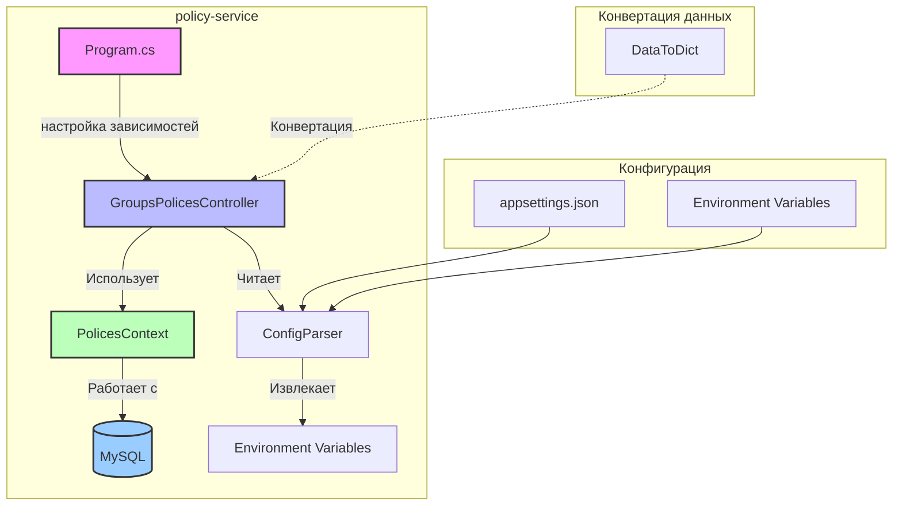
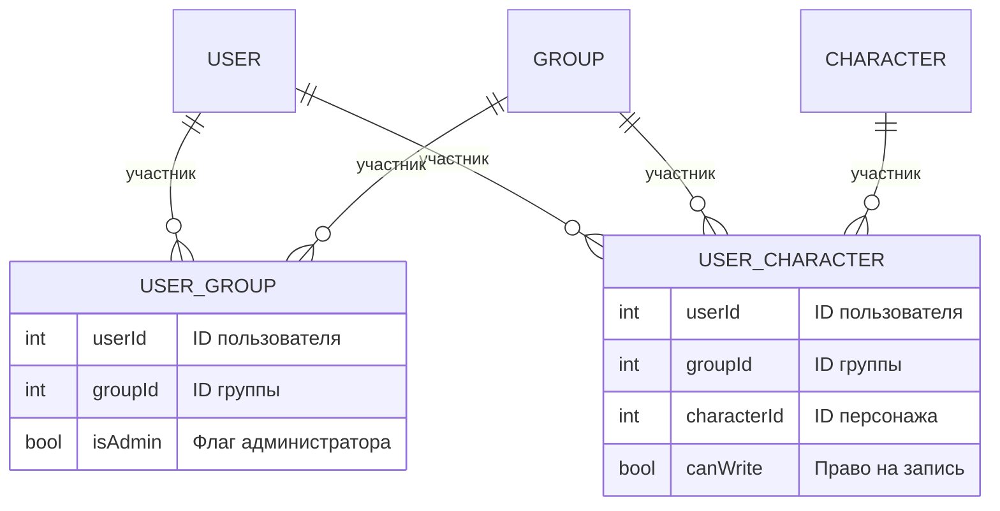
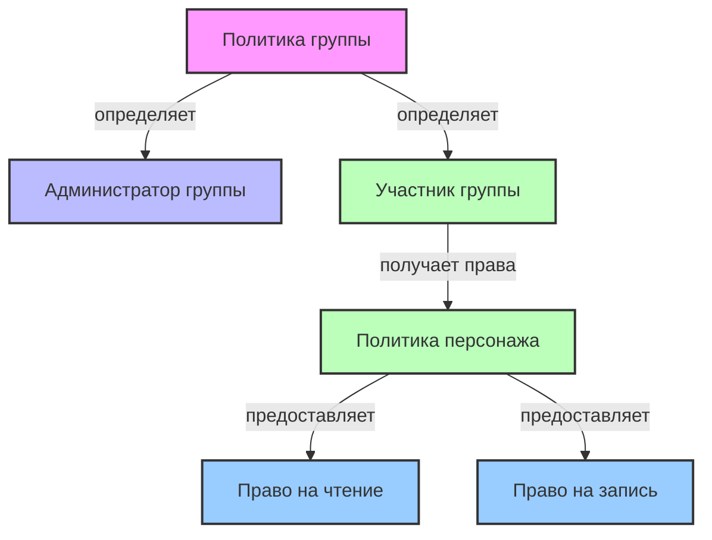
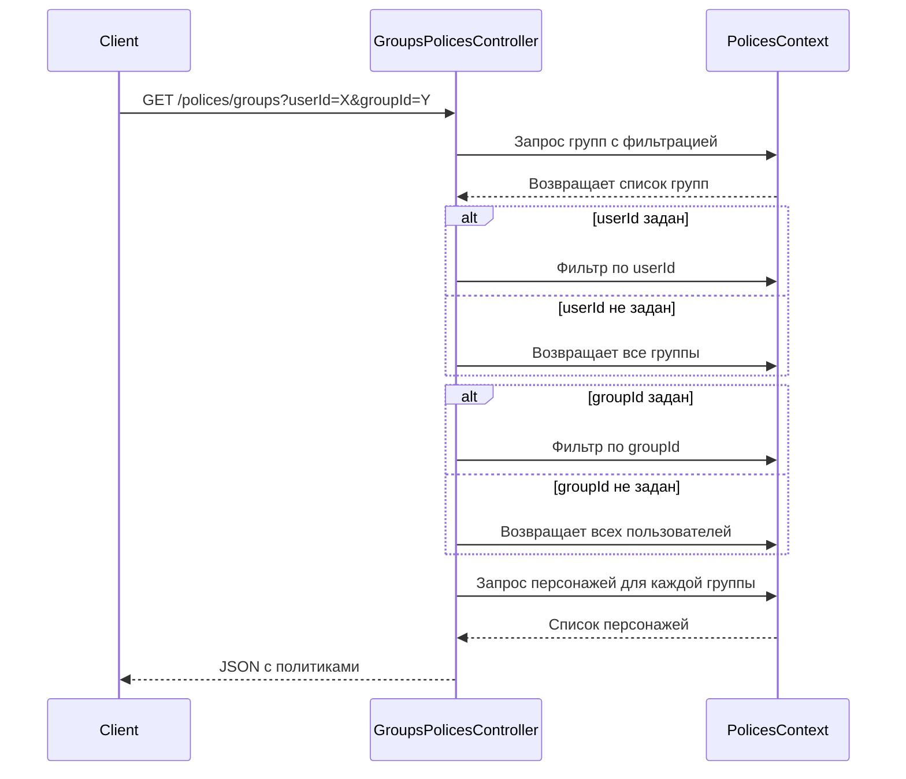
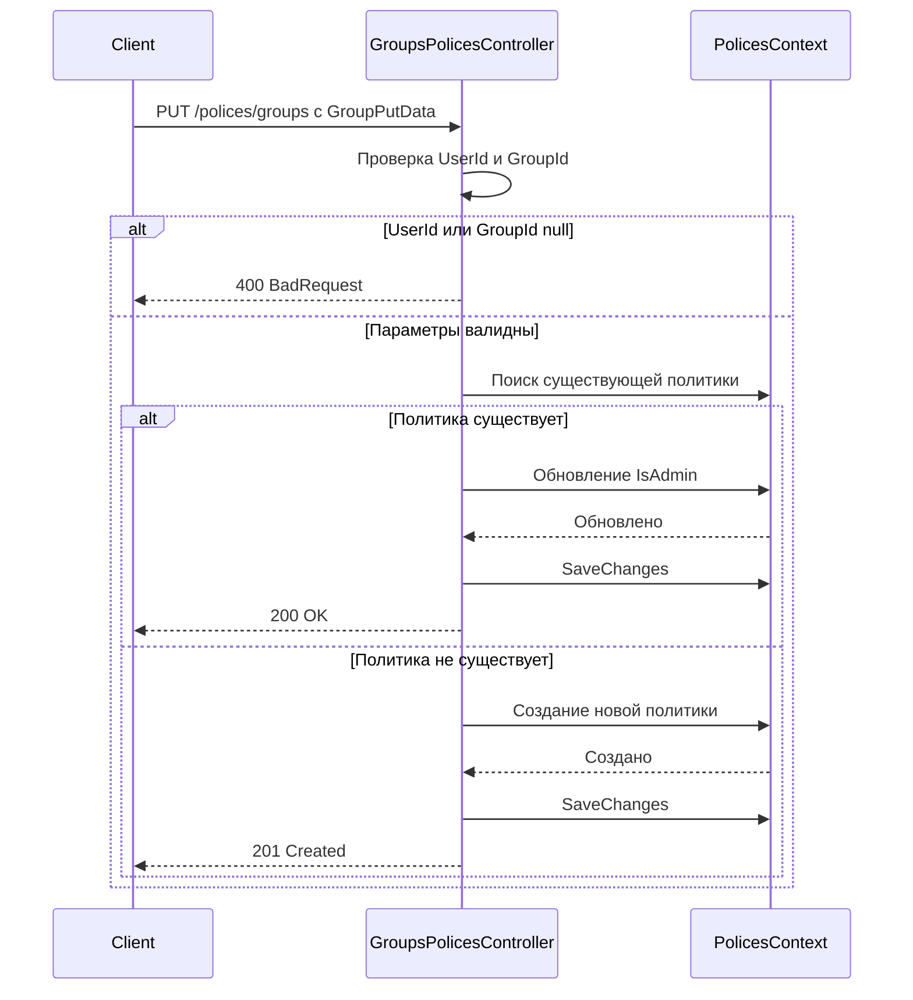
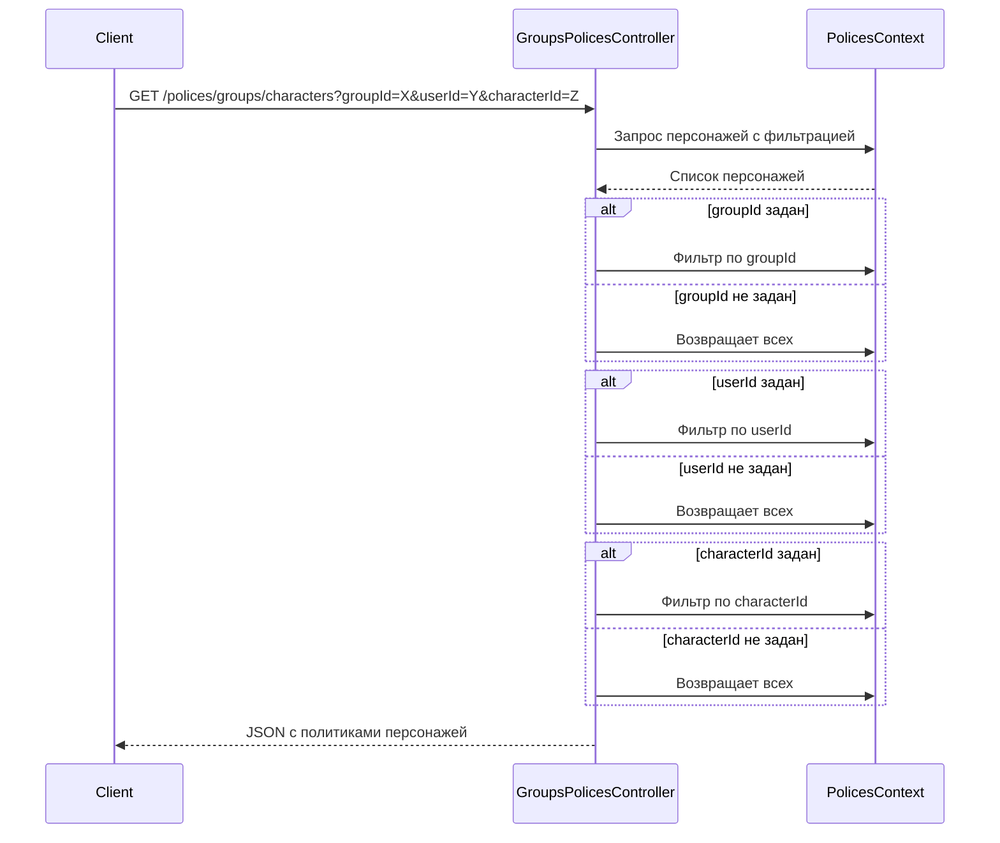
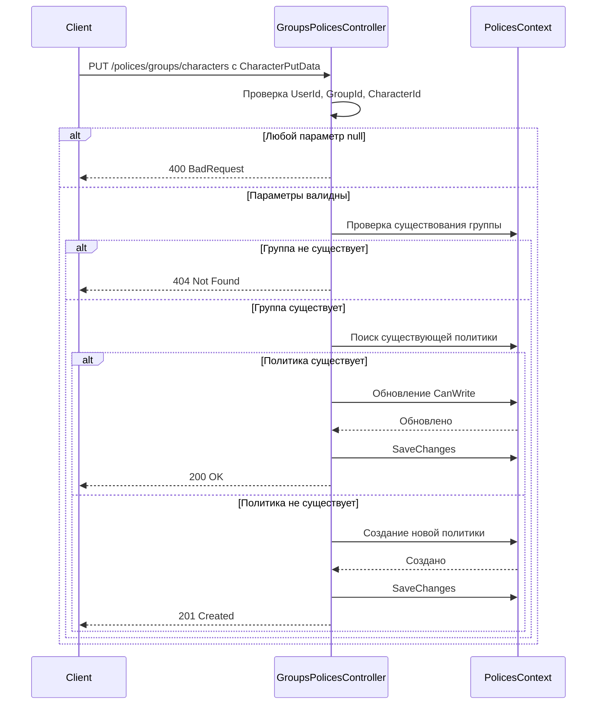
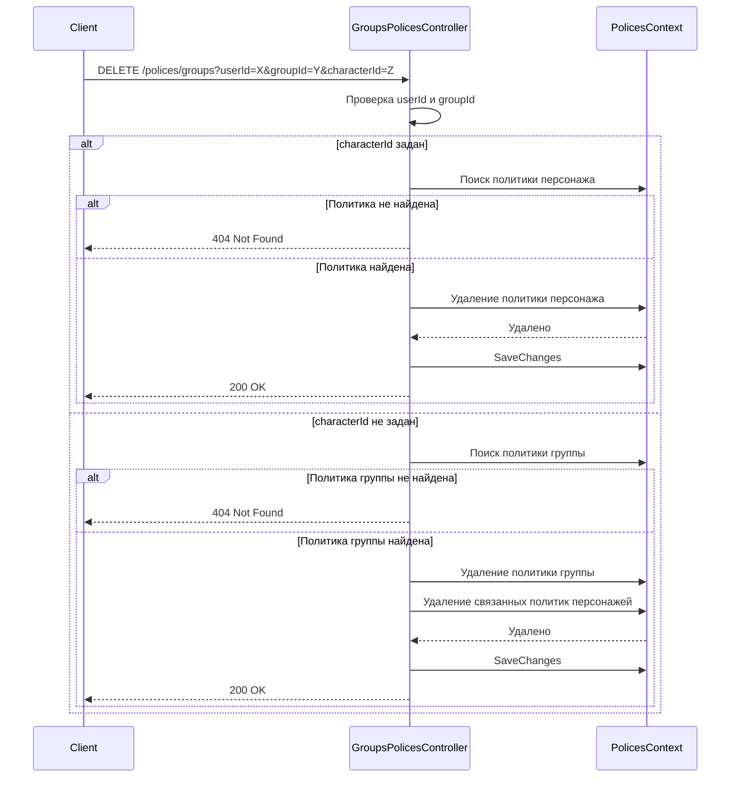

# policy-service

Сервис управления политиками доступа в экосистеме TheDungeonNotebook.

---

## 1. Введение

### Описание сервиса

`policy-service` — сервис управления политиками доступа, отвечающий за:

- Управление политиками групп (администраторство, права доступа)
- Управление политиками персонажей (право на запись)
- Валидация политик перед выполнением операций

**Приоритет:** Средний (управление политиками)  
**Сложность:** Средняя (работа с политиками, валидация)

### Роль в архитектуре

Сервис интегрируется в общую архитектуру через API Gateway и предоставляет endpoints для управления политиками доступа.



### Структура проекта

```
backend/policy-service/
├── Program.cs                          # Точка входа, настройка DI
├── Source/
│   ├── Controllers/
│   │   └── GroupsPolicesController.cs  # Контроллер политик групп
│   ├── Db/
│   │   ├── Contexts/
│   │   │   ├── BaseDbContext.cs        # Базовый контекст
│   │   │   └── PolicesContext.cs       # Контекст для политик
│   │   └── Entities/
│   │       └── PolicesEntities.cs      # Сущности (UserGroupData, UserCharacterData)
│   ├── ConfigParser.cs                 # Парсинг конфигурации
│   └── DataToDict.cs                   # Конвертация данных
├── sql_script.sql                      # Миграции БД
├── appsettings.json                    # Настройки приложения
└── README.md                           # Существующая документация
```

---

## 2. API endpoints контроллера политик

### Контроллер: `GroupsPolicesController`

Расположение: `Source/Controllers/GroupsPolicesController.cs`

#### 2.1 GET `/polices/groups` — Получение всех политик групп с фильтрацией

Получает список политик групп с возможностью фильтрации по `userId` и `groupId`.

**Параметры запроса:**

| Параметр | Тип | Описание |
|----------|-----|----------|
| `userId` | int? (optional) | ID пользователя для фильтрации |
| `groupId` | int? (optional) | ID группы для фильтрации |

**Ответ (успешный):**

```json
{
    "users": [
        {
            "userId": 1,
            "groupId": 10,
            "isAdmin": true,
            "characters": [
                {
                    "characterId": 100,
                    "canWrite": true
                },
                {
                    "characterId": 101,
                    "canWrite": false
                }
            ]
        }
    ]
}
```

**Коды ответов:**

| Код | Описание |
|-----|----------|
| 200 OK | Успешный запрос |

---

#### 2.2 PUT `/polices/groups` — Создание/обновление политики группы

Создаёт или обновляет политику группы (права администратора).

**Запрос:**

```json
{
    "userId": 1,
    "groupId": 10,
    "isAdmin": true
}
```

**Схема запроса (`GroupPutData`):**

| Поле | Тип | Описание |
|------|-----|----------|
| `UserId` | int? | ID пользователя (обязательно) |
| `GroupId` | int? | ID группы (обязательно) |
| `IsAdmin` | bool? | Флаг администратора (опционально) |

**Ответы:**

| Код | Описание | Пример ответа |
|-----|----------|---------------|
| 200 OK | Политика обновлена | `{}` |
| 201 Created | Политика создана | `{}` |
| 400 BadRequest | Отсутствуют обязательные параметры | `{}` |

**Примеры:**

**Создание новой политики:**

```bash
curl -X PUT http://localhost:5000/polices/groups \
  -H "Content-Type: application/json" \
  -d '{"userId": 1, "groupId": 10, "isAdmin": true}'
```

**Обновление существующей политики:**

```bash
curl -X PUT http://localhost:5000/polices/groups \
  -H "Content-Type: application/json" \
  -d '{"userId": 1, "groupId": 10, "isAdmin": false}'
```

---

#### 2.3 GET `/polices/groups/characters` — Получение политик персонажей для группы

Получает список политик персонажей для указанной группы с фильтрацией.

**Параметры запроса:**

| Параметр | Тип | Описание |
|----------|-----|----------|
| `groupId` | int | ID группы (обязательно) |
| `userId` | int? (optional) | ID пользователя для фильтрации |
| `characterId` | int? (optional) | ID персонажа для фильтрации |

**Ответ (успешный):**

```json
{
    "users": [
        {
            "userId": 1,
            "canWrite": true
        },
        {
            "userId": 2,
            "canWrite": false
        }
    ]
}
```

**Коды ответов:**

| Код | Описание |
|-----|----------|
| 200 OK | Успешный запрос |

---

#### 2.4 PUT `/polices/groups/characters` — Создание/обновление политики персонажа

Создаёт или обновляет политику персонажа (право на запись).

**Запрос:**

```json
{
    "userId": 1,
    "groupId": 10,
    "characterId": 100,
    "canWrite": true
}
```

**Схема запроса (`CharacterPutData`):**

| Поле | Тип | Описание |
|------|-----|----------|
| `UserId` | int? | ID пользователя (обязательно) |
| `GroupId` | int? | ID группы (обязательно) |
| `CharacterId` | int? | ID персонажа (обязательно) |
| `CanWrite` | bool? | Право на запись (опционально) |

**Ответы:**

| Код | Описание | Пример ответа |
|-----|----------|---------------|
| 200 OK | Политика обновлена | `{}` |
| 201 Created | Политика создана | `{}` |
| 400 BadRequest | Отсутствуют обязательные параметры | `{}` |
| 404 Not Found | Группа не существует | `{}` |

**Примеры:**

**Создание новой политики персонажа:**

```bash
curl -X PUT http://localhost:5000/polices/groups/characters \
  -H "Content-Type: application/json" \
  -d '{"userId": 1, "groupId": 10, "characterId": 100, "canWrite": true}'
```

**Обновление существующей политики:**

```bash
curl -X PUT http://localhost:5000/polices/groups/characters \
  -H "Content-Type: application/json" \
  -d '{"userId": 1, "groupId": 10, "characterId": 100, "canWrite": false}'
```

---

#### 2.5 DELETE `/polices/groups` — Удаление политик

Удаляет политики групп и/или персонажей.

**Параметры запроса:**

| Параметр | Тип | Описание |
|----------|-----|----------|
| `userId` | int | ID пользователя (обязательно) |
| `groupId` | int | ID группы (обязательно) |
| `characterId` | int? (optional) | ID персонажа для удаления политики персонажа |

**Поведение:**

- Если `characterId` задан — удаляется только политика персонажа
- Если `characterId` не задан — удаляются все политики персонажей и политика группы

**Ответы:**

| Код | Описание |
|-----|----------|
| 200 OK | Политика удалена |
| 404 Not Found | Политика не найдена |

**Примеры:**

**Удаление политики персонажа:**

```bash
curl -X DELETE "http://localhost:5000/polices/groups?userId=1&groupId=10&characterId=100"
```

**Удаление политики группы (вместе со всеми политиками персонажей):**

```bash
curl -X DELETE "http://localhost:5000/polices/groups?userId=1&groupId=10"
```

---

## 3. Модели данных политик

### 3.1 UserGroupData (политика группы)

Сущность, определяющая права администратора пользователя в группе.

**Файл:** `Source/Db/Entities/PolicesEntities.cs`

| Поле | Тип | Описание |
|------|-----|----------|
| `UserId` | int | ID пользователя (ссылка) |
| `GroupId` | int | ID группы (ссылка) |
| `IsAdmin` | bool | Флаг администратора группы |

**Связи:**

- Наследуется от базовой сущности (через `EntityBuildersConfigurer`)
- Уникальное сочетание `UserId` + `GroupId` (первичный ключ составной)

---

### 3.2 UserCharacterData (политика персонажа)

Сущность, определяющая право на запись пользователя для конкретного персонажа в группе.

**Файл:** `Source/Db/Entities/PolicesEntities.cs`

| Поле | Тип | Описание |
|------|-----|----------|
| `UserId` | int | ID пользователя (ссылка) |
| `GroupId` | int | ID группы (ссылка) |
| `CharacterId` | int | ID персонажа (ссылка) |
| `CanWrite` | bool | Право на запись для персонажа |

**Связи:**

- Наследуется от `UserGroupData` (через навигационное свойство `Group`)
- Уникальное сочетание `UserId` + `GroupId` + `CharacterId` (первичный ключ составной)

**Навигационное свойство `Group`:**

```csharp
public UserGroupData? Group;
```

Свойство предоставляет доступ к родительской сущности `UserGroupData` для валидации существования группы перед добавлением политики персонажа.

---

## 4. Контекст БД

### 4.1 BaseDbContext<T>

Абстрактный базовый класс для всех контекстов.

**Файл:** `Source/Db/Contexts/BaseDbContext.cs`

**Конструктор:**

```csharp
public BaseDbContext(DbContextOptions<T> options, IEntityBuildersConfigurer configurer)
```

**Свойства:**

- `Configurer` — доступ к `IEntityBuildersConfigurer` для конфигурации моделей

---

### 4.2 PolicesContext

Контекст для работы с таблицами политик.

**Файл:** `Source/Db/Contexts/PolicesContext.cs`

**Наследование:** `PolicesContext : BaseDbContext<PolicesContext>`

**Конструктор:**

```csharp
public PolicesContext(DbContextOptions<PolicesContext> options, IEntityBuildersConfigurer configurer) : base(options, configurer)
```

**Настройка моделей:**

```csharp
protected override void OnModelCreating(ModelBuilder builder)
{
    Configurer.ConfigureModel(builder.Entity<UserGroupData>());
    Configurer.ConfigureModel(builder.Entity<UserCharacterData>());
    base.OnModelCreating(builder);    
}
```

- `OnModelCreating` — конфигурация через `IEntityBuildersConfigurer`
- Регистрация `DbSet<UserGroupData>` (Groups)
- Регистрация `DbSet<UserCharacterData>` (Characters)

**Подключение к БД:**

- MySQL 9.0.1
- Подключение через `ConfigParser.ConfigDbConnections`

**DbSet свойства:**

```csharp
public DbSet<UserGroupData> Groups => Set<UserGroupData>();
public DbSet<UserCharacterData> Characters => Set<UserCharacterData>();
```

---

## 5. Конфигурация

### 5.1 ConfigParser

Парсинг конфигурации из переменных окружения.

**Файл:** `Source/ConfigParser.cs`

**Назначение:** Парсинг конфигурации из переменных окружения.

**Переменные окружения:**

| Переменная | Описание |
|------------|----------|
| `MYSQL_CONNECTION_STRING` | Строка подключения к MySQL |
| `MYSQL_DATABASE` | Имя базы данных |

**Логика инициализации:**

```csharp
public ConfigParser()
{
    _mysqlConnectionString = Environment.GetEnvironmentVariable("MYSQL_CONNECTION_STRING");
    _databaseName = Environment.GetEnvironmentVariable("MYSQL_DATABASE");
    // Выбрасывает исключение, если переменные не заданы
}
```

**Методы:**

- `ConfigDbConnections(DbContextOptionsBuilder opt)` — настройка подключения к MySQL
- `Connection` — свойство для получения строки подключения

**Обработка ошибок:**

Если переменные окружения не заданы, выбрасывается `Exception` с описанием недостающих переменных:

```csharp
throw new Exception($"Can't find information to connect to databases:\n"+
                     $" |-mysql:{_mysqlConnectionString}\n"+
                     $" |-dbname: {_databaseName}"
                 );
```

---

### 5.2 Program.cs (настройка зависимостей)

**Файл:** `Program.cs`

**Зависимости:**

```csharp
builder.Services.AddMvc();
builder.Services.AddHttpContextAccessor();
builder.Services.AddLogging(e => e.AddConsole());
builder.Services.AddSingleton<IEntityBuildersConfigurer, EntityBuildersConfigurer>();
builder.Services.AddDbContext<PolicesContext>(config.ConfigDbConnections);
builder.Services.AddEndpointsApiExplorer();
builder.Services.AddControllers();
```

**Настройка middleware:**

```csharp
app.UseHttpMetrics();
app.MapMetrics();
app.MapControllers();
```

---

### 5.3 sql_script.sql (миграции БД)

**Файл:** `sql_script.sql`

**Таблицы:**

```sql
-- Таблица user_groups (политики групп)
CREATE TABLE IF NOT EXISTS `user_groups` (
    `user_id` INT NOT NULL,
    `group_id` INT NOT NULL,
    `is_admin` BOOLEAN NOT NULL DEFAULT FALSE,
    PRIMARY KEY (`user_id`, `group_id`)
) ENGINE=InnoDB DEFAULT CHARSET=utf8mb4;

-- Таблица user_characters (политики персонажей)
CREATE TABLE IF NOT EXISTS `user_characters` (
    `user_id` INT NOT NULL,
    `group_id` INT NOT NULL,
    `character_id` INT NOT NULL,
    `can_write` BOOLEAN NOT NULL DEFAULT FALSE,
    PRIMARY KEY (`user_id`, `group_id`, `character_id`)
) ENGINE=InnoDB DEFAULT CHARSET=utf8mb4;
```

**Поля:**

| Таблица | Поле | Тип | Описание |
|---------|------|-----|----------|
| user_groups | user_id | INT | Первичный ключ (часть) |
| user_groups | group_id | INT | Первичный ключ (часть) |
| user_groups | is_admin | BOOLEAN | Флаг администратора |
| user_characters | user_id | INT | Первичный ключ (часть) |
| user_characters | group_id | INT | Первичный ключ (часть) |
| user_characters | character_id | INT | Первичный ключ (часть) |
| user_characters | can_write | BOOLEAN | Право на запись |

---

## 6. Бизнес-логика работы с политиками

### 6.1 Модель политик доступа



### 6.2 Иерархия прав доступа



### 6.3 Валидация политик

**Правила валидации:**

1. **При создании политики группы:**
   - `UserId` и `GroupId` должны быть не null
   - Пользователь должен существовать
   - Группа должна существовать

2. **При создании политики персонажа:**
   - `UserId`, `GroupId`, `CharacterId` должны быть не null
   - Группа должна существовать (проверка через `_dbContext.Groups.Any()`)
   - Пользователь должен быть участником группы

3. **При удалении политик:**
   - Если задан `characterId` — удаляется только политика персонажа
   - Если `characterId` не задан — удаляются все политики персонажей и политика группы

---

## 7. Обработка ошибок

### 7.1 Коды ошибок

| Код | Описание | Когда возникает |
|-----|----------|-----------------|
| 200 OK | Успешный запрос | - |
| 201 Created | Ресурс создан | Создание новой политики |
| 400 BadRequest | Неверные параметры | UserId/GroupId/CharacterId null |
| 404 Not Found | Ресурс не найден | Группа не существует, политика не найдена |

### 7.2 Сценарии ошибок

#### 7.2.1 Создание политики без параметров

```json
{
    "error": "Missing required parameters",
    "message": "UserId and GroupId are required for group policy"
}
```

#### 7.2.2 Создание политики персонажа для несуществующей группы

```json
{
    "error": "Group not found",
    "message": "The specified group does not exist"
}
```

#### 7.2.3 Удаление несуществующей политики персонажа

```json
{
    "error": "Policy not found",
    "message": "No policy found for the specified parameters"
}
```

### 7.3 Обработка ошибок в контроллере

**BadRequest (400):** Возвращается при отсутствии обязательных параметров:

```csharp
if (data.GroupId == null || data.UserId == null)
    return BadRequest();
```

**NotFound (404):** Возвращается при попытке создать политику персонажа для несуществующей группы:

```csharp
if (!_dbContext.Groups.Any(e => e.GroupId == (int)data.GroupId && e.UserId == (int)data.UserId))
    return NotFound();
```

**NotFound (404):** Возвращается при попытке удалить несуществующую политику:

```csharp
if (character == null)
    return NotFound();
```

---

## 8. Конвертация данных (DataToDict)

**Файл:** `Source/DataToDict.cs`

**Назначение:** Конвертация данных из сущностей в дикт-формат (если требуется).

**Текущее состояние:** Класс пустой — функциональность ещё не реализована.

**Рекомендации:**

- Если конвертация не требуется, документировать как "не используется"
- Если планируется реализация, описать ожидаемую функциональность

---

## 9. Процесс работы с API

### 9.1 Процесс получения политик групп



### 9.2 Процесс создания/обновления политики группы



### 9.3 Процесс получения политик персонажей



### 9.4 Процесс создания/обновления политики персонажа



### 9.5 Процесс удаления политик



---

## 10. Оценка сложности документирования

| Раздел | Оценка (1-5) | Комментарий |
|--------|--------------|--------------|
| API endpoints | 2/5 | Минимум endpoints, простая логика CRUD |
| Модели данных | 4/5 | Простые сущности, но важно описать связи |
| Бизнес-логика | 4/5 | Логика применения политик, валидация |
| Конфигурация | 2/5 | Простая, стандартные переменные окружения |
| Обработка ошибок | 3/5 | Стандартные коды HTTP, описать сценарии |

---

## 11. Примечания

- `policy-service` управляет политиками доступа, что критично для безопасности системы
- Важно подробно описать валидацию политик и правила создания/удаления
- Навигационные свойства в сущностях требуют пояснения
- `DataToDict.cs` пока пуст — функциональность будет добавлена в будущем
- Все примеры запросов должны быть валидными и проверенными
