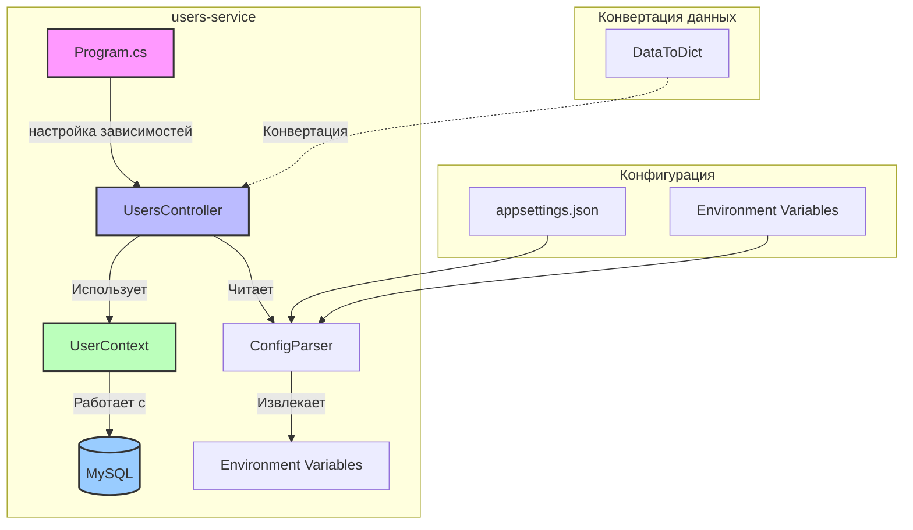
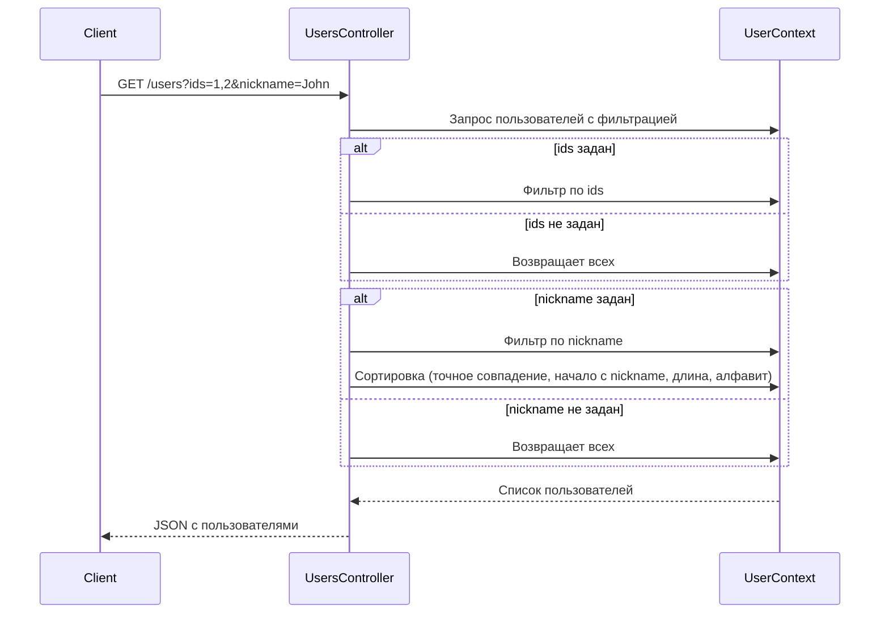
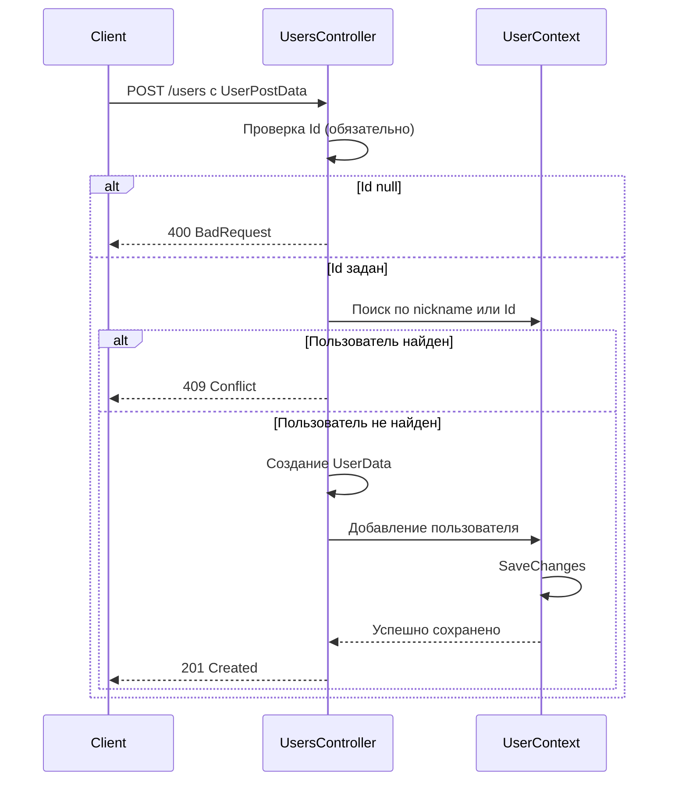
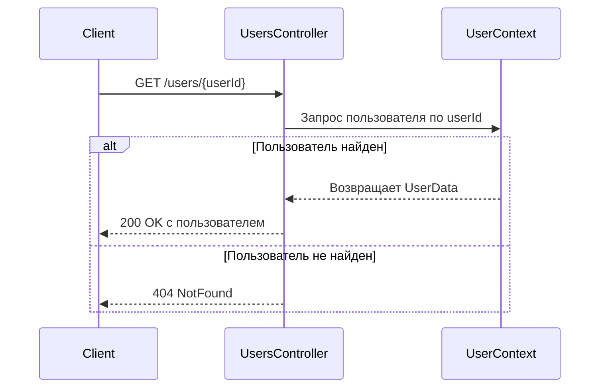
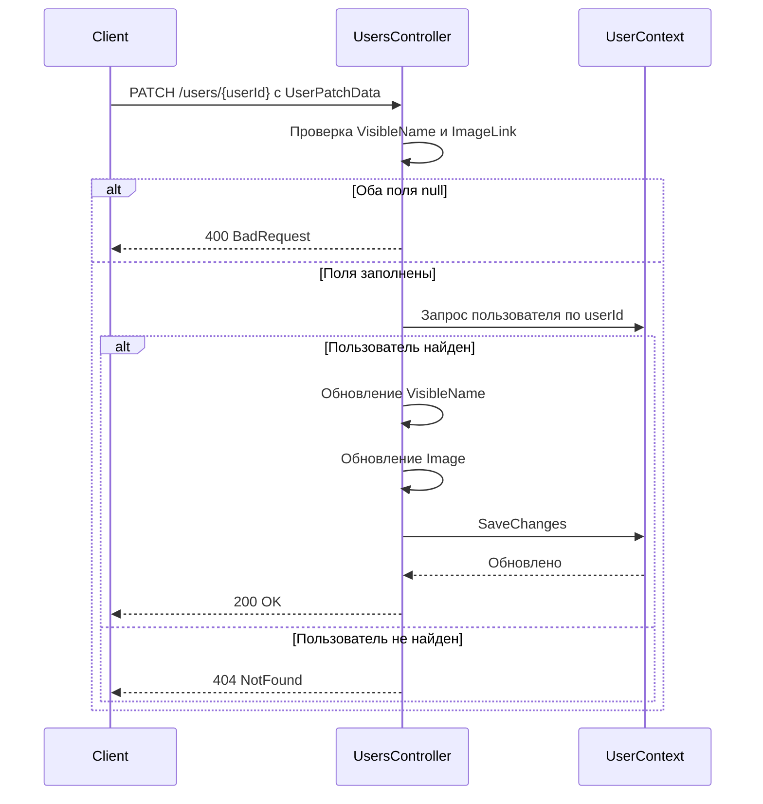
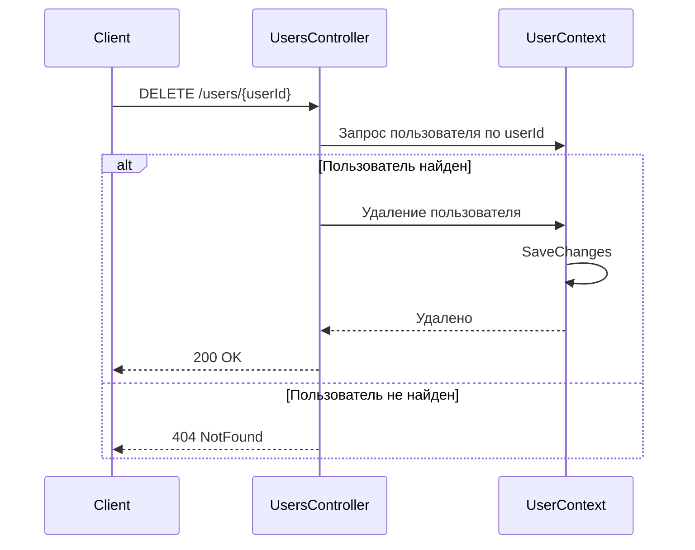
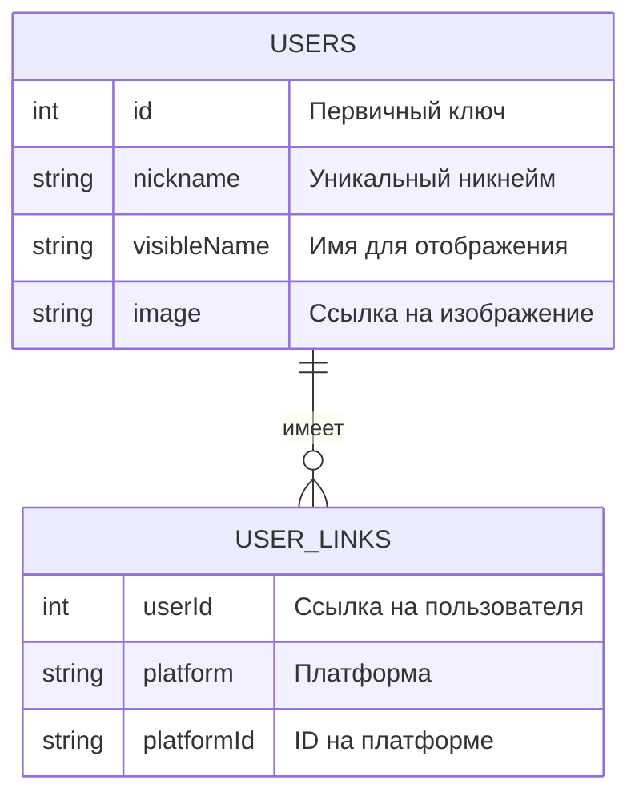

# users-service

users-service — сервис управления пользователями в экосистеме TheDungeonNotebook. Он отвечает за:

- CRUD-операции с пользователями (создание, чтение, обновление, удаление)
- Фильтрацию и поиск пользователей по nickname
- Управление ссылками на внешние сервисы (LinkedServicesData)

**Приоритет:** Средний (управление пользователями)  
**Сложность:** Низкая (простая CRUD-логика)

---

## 1. Введение

users-service предоставляет REST API для управления пользователями в системе. Сервис интегрируется с API Gateway и предоставляет endpoints для работы с данными пользователей, включая их профили и ссылки на внешние платформы (VK, Telegram, Instagram и др.).

### Роль в архитектуре



### Структура проекта

```
backend/users-service/
├── Program.cs                          # Точка входа, настройка DI
├── Source/
│   ├── Controllers/
│   │   ├── BaseController.cs           # Базовый контроллер
│   │   └── UsersController.cs          # Контроллер пользователей
│   ├── Db/
│   │   ├── Contexts/
│   │   │   ├── BaseDbContext.cs        # Базовый контекст
│   │   │   ├── EntityBuildersConfigurer.cs # Конфигурация моделей
│   │   │   └── UserContext.cs          # Контекст для пользователей
│   │   └── Entities/
│   │       └── UserEntities.cs         # Сущности (UserData, LinkedServicesData)
│   ├── ConfigParser.cs                 # Парсинг конфигурации
│   └── DataToDict.cs                   # Конвертация данных в дикт-формат
├── sql_script.sql                      # Миграции БД
├── appsettings.json                    # Настройки приложения
└── README.md                           # Существующая документация
```

---

## 2. API endpoints контроллера пользователей (UsersController)

### 2.1 Список всех пользователей

**Endpoint:** `GET /users`

Получение всех пользователей с возможностью фильтрации по ID и nickname.

#### Параметры запроса

| Параметр | Тип | Описание |
|----------|-----|----------|
| `ids` | `IEnumerable<int>` | Список ID пользователей для фильтрации |
| `nickname` | `string` | Никнейм для поиска (подстрока) |

#### Сортировка по nickname

При фильтрации по nickname применяется умная сортировка:

1. **Точное совпадение** — приоритет
2. **Начинается с nickname** — префиксное совпадение
3. **По длине nickname** — короче сначала
4. **Алфавитная сортировка** — стандартная сортировка

#### Примеры запросов

```bash
# Получить всех пользователей
GET /users

# Получить пользователей по ID
GET /users?ids=1,2,3

# Поиск по nickname
GET /users?nickname=John
```

#### Примеры ответов

**Успешный ответ (200 OK):**

```json
{
    "users": [
        {
            "id": 1,
            "nickname": "John Doe",
            "visibleName": "John",
            "imageLink": "https://example.com/john.jpg"
        },
        {
            "id": 2,
            "nickname": "Jane Smith",
            "visibleName": "Jane",
            "imageLink": "https://example.com/jane.jpg"
        }
    ]
}
```

**Ответ с одним пользователем:**

```json
{
    "users": [
        {
            "id": 1,
            "nickname": "John Doe",
            "visibleName": "John",
            "imageLink": "https://example.com/john.jpg"
        }
    ]
}
```

#### Обработка ошибок

| Код | Описание | Пример ответа |
|-----|----------|---------------|
| 200 | Успешный запрос | См. выше |
| 500 | Внутренняя ошибка сервера | `{"Message": "Internal server error"}` |

---

### 2.2 Создание пользователя

**Endpoint:** `POST /users`

Создание нового пользователя.

#### Параметры запроса

| Параметр | Тип | Описание | Обязательный |
|----------|-----|----------|--------------|
| `id` | `int` | ID пользователя | Да |
| `nickname` | `string` | Никнейм пользователя | Да |
| `visibleName` | `string` | Имя для отображения | Нет |
| `imageLink` | `string` | Ссылка на изображение | Нет |

#### Пример запроса

```bash
POST /users
Content-Type: application/json

{
    "id": 1,
    "nickname": "John Doe",
    "visibleName": "John",
    "imageLink": "https://example.com/john.jpg"
}
```

#### Пример ответа

**Успешное создание (201 Created):**

```json
{
    "id": 1,
    "nickname": "John Doe",
    "visibleName": "John",
    "imageLink": "https://example.com/john.jpg"
}
```

**Ответ с заголовком Location:**

```json
HTTP/1.1 201 Created
Location: /users/1

{
    "id": 1,
    "nickname": "John Doe",
    "visibleName": "John",
    "imageLink": "https://example.com/john.jpg"
}
```

#### Обработка ошибок

| Код | Описание | Пример ответа |
|-----|----------|---------------|
| 400 | Неверные данные | `{"Message": "Id is required for creating a user"}` |
| 409 | Конфликт | `{"Message": "User with this nickname already exist"}` |
| 500 | Внутренняя ошибка | `{"Message": "Internal server error"}` |

---

### 2.3 Получение пользователя по ID

**Endpoint:** `GET /users/{userId}`

Получение информации о конкретном пользователе.

#### Параметры запроса

| Параметр | Тип | Описание |
|----------|-----|----------|
| `userId` | `int` | ID пользователя |

#### Пример запроса

```bash
GET /users/1
```

#### Пример ответа

**Успешный ответ (200 OK):**

```json
{
    "id": 1,
    "nickname": "John Doe",
    "visibleName": "John",
    "imageLink": "https://example.com/john.jpg"
}
```

#### Обработка ошибок

| Код | Описание | Пример ответа |
|-----|----------|---------------|
| 200 | Успешный запрос | См. выше |
| 404 | Пользователь не найден | `{"Message": "No user found with the specified ID"}` |
| 500 | Внутренняя ошибка | `{"Message": "Internal server error"}` |

---

### 2.4 Частичное обновление пользователя

**Endpoint:** `PATCH /users/{userId}`

Частичное обновление пользователя (только `visibleName` или `imageLink`).

#### Параметры запроса

| Параметр | Тип | Описание | Обязательный |
|----------|-----|----------|--------------|
| `visibleName` | `string` | Имя для отображения | Нет |
| `imageLink` | `string` | Ссылка на изображение | Нет |

**Важно:** Хотя бы одно поле (`visibleName` или `imageLink`) должно быть заполнено.

#### Пример запроса

```bash
PATCH /users/1
Content-Type: application/json

{
    "visibleName": "Johnny",
    "imageLink": "https://example.com/johnny.jpg"
}
```

#### Пример ответа

**Успешное обновление (200 OK):**

```json
{
    "id": 1,
    "nickname": "John Doe",
    "visibleName": "Johnny",
    "imageLink": "https://example.com/johnny.jpg"
}
```

#### Обработка ошибок

| Код | Описание | Пример ответа |
|-----|----------|---------------|
| 200 | Успешный запрос | См. выше |
| 400 | Неверные данные | `{"Message": "Image Link or Visible Name must be not null"}` |
| 404 | Пользователь не найден | `{"Message": "No user found with the specified ID"}` |
| 500 | Внутренняя ошибка | `{"Message": "Internal server error"}` |

---

### 2.5 Удаление пользователя

**Endpoint:** `DELETE /users/{userId}`

Удаление пользователя по ID.

#### Параметры запроса

| Параметр | Тип | Описание |
|----------|-----|----------|
| `userId` | `int` | ID пользователя |

#### Пример запроса

```bash
DELETE /users/1
```

#### Пример ответа

**Успешное удаление (200 OK):**

```json
{
    "id": 1,
    "nickname": "John Doe",
    "visibleName": "John",
    "imageLink": "https://example.com/john.jpg"
}
```

#### Обработка ошибок

| Код | Описание | Пример ответа |
|-----|----------|---------------|
| 200 | Успешный запрос | См. выше |
| 404 | Пользователь не найден | `{"Message": "No user found with the specified ID"}` |
| 500 | Внутренняя ошибка | `{"Message": "Internal server error"}` |

---

## 3. Модели данных пользователей (UserEntities)

### 3.1 IndexedData (базовая сущность)

Базовая сущность, предоставляющая общий идентификатор.

```csharp
public class IndexedData
{
    public int Id;
}
```

| Поле | Тип | Описание |
|------|-----|----------|
| `Id` | `int` | Автоматический первичный ключ |

---

### 3.2 UserData (пользователь)

Основная сущность пользователя, наследуется от `IndexedData`.

```csharp
public class UserData : IndexedData
{
    public string Nickname = "";
    public string VisibleName = "";
    public string Image = "";
}
```

| Поле | Тип | Описание | Значение по умолчанию |
|------|-----|----------|----------------------|
| `Id` | `int` | Автоматический первичный ключ | — |
| `Nickname` | `string` | Никнейм пользователя (уникальный) | `""` |
| `VisibleName` | `string` | Имя для отображения | `""` |
| `Image` | `string` | Ссылка на изображение | `""` |

#### Валидация

- **Nickname** — должно быть уникальным в базе данных
- **VisibleName** — может быть null, тогда используется значение `Nickname`
- **Image** — может быть пустой строкой по умолчанию

#### Вставка в БД

```csharp
public class UserData : IndexedData
{
    public string Nickname = "";
    public string VisibleName = "";
    public string Image = "";
}
```

**SQL схема:**

```sql
CREATE TABLE IF NOT EXISTS `user` (
    `user_id` INT PRIMARY KEY,
    `nickname` VARCHAR(255) NOT NULL UNIQUE,
    `visible_name` VARCHAR(255),
    `image_link` TEXT
) ENGINE=InnoDB DEFAULT CHARSET=utf8mb4 COLLATE=utf8mb4_0900_ai_ci;
```

---

### 3.3 LinkedServicesData (ссылки на внешние сервисы)

Сущность для хранения ссылок на внешние сервисы (VK, Telegram, Instagram и др.).

```csharp
public class LinkedServicesData
{
    public int UserId;
    public string Platform = "";
    public string PlatformId = "";
    
    public UserData? User;
}
```

| Поле | Тип | Описание | Значение по умолчанию |
|------|-----|----------|----------------------|
| `UserId` | `int` | ID пользователя (ссылка) | — |
| `Platform` | `string` | Название платформы | `""` |
| `PlatformId` | `string` | ID на платформе | `""` |
| `User` | `UserData?` | Навигационное свойство на пользователя | `null` |

#### Вставка в БД

**SQL схема:**

```sql
CREATE TABLE IF NOT EXISTS `linked_services` (
    `user_id` INT,
    `platform` ENUM('VK', 'Telegram', 'Instagram') NOT NULL,
    `platform_id` VARCHAR(255) NOT NULL,
    
    PRIMARY KEY (`user_id`, `platform`),
    FOREIGN KEY (`user_id`) REFERENCES `user`(`user_id`)
) ENGINE=InnoDB CHARSET=utf8mb4 COLLATE=utf8mb4_0900_ai_ci;
```

#### Навигационное свойство

Свойство `User` позволяет получать ссылку без полной информации о пользователе. Если пользователь не найден, создаётся временный `UserData` с только `Id`.

```csharp
public class LinkedServicesData
{
    public int UserId;
    public string Platform = "";
    public string PlatformId = "";
    
    public UserData? User { get; set; }
}
```

**Конвертация в дикт-формат:**

```csharp
public static Dictionary<string, object?> ToDict(this LinkedServicesData data)
{
    return new()
    {
        {"user", data.User != null ? data.User.ToDict() : new UserData(){ Id = data.UserId }.ToDict() },
        {"platform", data.Platform},
        {"platformId", data.PlatformId},
    };
}
```

---

## 4. Контекст БД (UserContext)

### 4.1 BaseDbContext<T>

Абстрактный базовый класс для всех контекстов.

```csharp
public abstract class BaseDbContext<T> : DbContext where T : BaseDbContext<T>
{
    private IEntityBuildersConfigurer _configurer;
    
    public BaseDbContext(DbContextOptions<T> options, IEntityBuildersConfigurer configurer): base(options)
    {
        _configurer = configurer;
    }
    
    protected IEntityBuildersConfigurer Configurer => _configurer;
}
```

#### Конструктор

```csharp
public BaseDbContext(DbContextOptions<T> options, IEntityBuildersConfigurer configurer)
```

#### Свойства

- **Configurer** — доступ к `IEntityBuildersConfigurer` для конфигурации моделей

---

### 4.2 UserContext

Контекст для работы с таблицами пользователей и ссылок на сервисы.

```csharp
public class UserContext : BaseDbContext<UserContext>
{
    public UserContext(DbContextOptions<UserContext> options, IEntityBuildersConfigurer configurer) : base(options, configurer)
    {
    }
    
    protected override void OnModelCreating(ModelBuilder builder)
    {
        Configurer.ConfigureModel(builder.Entity<UserData>());
        Configurer.ConfigureModel(builder.Entity<LinkedServicesData>());
        base.OnModelCreating(builder);    
    }
    
    public DbSet<UserData> Users => Set<UserData>();
    public DbSet<LinkedServicesData> Links => Set<LinkedServicesData>();
}
```

#### Наследование

```csharp
public class UserContext : BaseDbContext<UserContext>
```

#### Настройка моделей

- **OnModelCreating** — конфигурация через `IEntityBuildersConfigurer`
- **Регистрация `DbSet<UserData>`** (Users)
- **Регистрация `DbSet<LinkedServicesData>`** (Links)

#### Подключение к БД

- **MySQL 9.0.1**
- **Подключение через `ConfigParser.ConfigDbConnections`**

#### DbSet свойства

```csharp
public DbSet<UserData> Users => Set<UserData>();
public DbSet<LinkedServicesData> Links => Set<LinkedServicesData>();
```

---

## 5. Конфигурация

### 5.1 ConfigParser

Парсинг конфигурации из переменных окружения.

```csharp
public class ConfigParser
{	
    private string? _databaseName;
    private string? _mysqlConnectionString;
    private string? _connection = null;
    
    public string Connection { get {
        if (_connection == null)
            _connection = _mysqlConnectionString!;
        return _connection;
    }}
    
    public ConfigParser(){
        _mysqlConnectionString = Environment.GetEnvironmentVariable("MYSQL_CONNECTION_STRING");
        _databaseName = Environment.GetEnvironmentVariable("MYSQL_DATABASE");
        if (_mysqlConnectionString == null || _databaseName == null)
        {
            throw new Exception($"Can't find information to connect to databases:\n"+
                                $" |-mysql:{_mysqlConnectionString}\n"+
                                $" |-dbname: {_databaseName}"
                       			);
        }
    }
    
    public void ConfigDbConnections(DbContextOptionsBuilder opt)
    {
        opt.UseMySql(Connection, new MySqlServerVersion(new Version(9, 0, 1)));
    }
}
```

#### Переменные окружения

| Переменная | Описание |
|-----|------|
| `MYSQL_CONNECTION_STRING` | Строка подключения к MySQL |
| `MYSQL_DATABASE` | Имя базы данных |

#### Логика инициализации

```csharp
public ConfigParser(){
    _mysqlConnectionString = Environment.GetEnvironmentVariable("MYSQL_CONNECTION_STRING");
    _databaseName = Environment.GetEnvironmentVariable("MYSQL_DATABASE");
    // Выбрасывает исключение, если переменные не заданы
}
```

#### Обработка ошибок

Если переменные окружения не заданы, выбрасывается `Exception` с описанием недостающих переменных:

```csharp
throw new Exception($"Can't find information to connect to databases:\n"+
                     $" |-mysql:{_mysqlConnectionString}\n"+
                     $" |-dbname: {_databaseName}"
                 );
```

#### Методы

- **ConfigDbConnections(DbContextOptionsBuilder opt)** — настройка подключения к MySQL
- **Connection** — свойство для получения строки подключения

---

### 5.2 Program.cs (настройка зависимостей)

```csharp
var builder = WebApplication.CreateBuilder(args);
var config = new ConfigParser();

// General
builder.Services.AddMvc();
builder.Services.AddHttpContextAccessor();
builder.Services.AddLogging(e => e.AddConsole());

builder.Services.AddSingleton<IEntityBuildersConfigurer, EntityBuildersConfigurer>();
builder.Services.AddDbContext<UserContext>(config.ConfigDbConnections);

// General
builder.Services.AddEndpointsApiExplorer();
builder.Services.AddControllers();
var app = builder.Build();
app.UseHttpMetrics();
app.MapMetrics();
app.MapControllers();
app.Run();
```

#### Зависимости

```csharp
builder.Services.AddMvc();
builder.Services.AddHttpContextAccessor();
builder.Services.AddLogging(e => e.AddConsole());
builder.Services.AddSingleton<IEntityBuildersConfigurer, EntityBuildersConfigurer>();
builder.Services.AddDbContext<UserContext>(config.ConfigDbConnections);
builder.Services.AddEndpointsApiExplorer();
builder.Services.AddControllers();
```

#### Настройка middleware

```csharp
app.UseHttpMetrics();
app.MapMetrics();
app.MapControllers();
```

---

### 5.3 Миграции БД (sql_script.sql)

```sql
CREATE TABLE IF NOT EXISTS `user` (
    `user_id` INT PRIMARY KEY,
    `nickname` VARCHAR(255) NOT NULL UNIQUE,
    `visible_name` VARCHAR(255),
    `image_link` TEXT
) ENGINE=InnoDB DEFAULT CHARSET=utf8mb4 COLLATE=utf8mb4_0900_ai_ci;

CREATE TABLE IF NOT EXISTS `linked_services` (
    `user_id` INT,
    `platform` ENUM('VK', 'Telegram', 'Instagram') NOT NULL,
    `platform_id` VARCHAR(255) NOT NULL,
    
    PRIMARY KEY (`user_id`, `platform`),
    FOREIGN KEY (`user_id`) REFERENCES `user`(`user_id`)
) ENGINE=InnoDB CHARSET=utf8mb4 COLLATE=utf8mb4_0900_ai_ci;
```

#### Таблицы

| Таблица | Поле | Тип | Описание |
|-----|------|-----|----------|
| `user` | `user_id` | INT AUTO_INCREMENT | Первичный ключ |
| `user` | `nickname` | VARCHAR(255) | Никнейм (уникальный) |
| `user` | `visible_name` | VARCHAR(255) | Имя для отображения |
| `user` | `image_link` | TEXT | Ссылка на изображение |
| `linked_services` | `user_id` | INT | Первичный ключ (часть) |
| `linked_services` | `platform` | ENUM | Название платформы |
| `linked_services` | `platform_id` | VARCHAR(255) | ID на платформе |

---

### 5.4 DataToDict (конвертация данных)

Конвертация данных из сущностей в дикт-формат для JSON-ответов.

```csharp
public static class DataToDictExtensions
{
    public static Dictionary<string, object?> ToDict(this IndexedData data)
    {
        return new Dictionary<string, object?>(){{"id", data.Id}};
    }
    
    public static Dictionary<string, object?> ToDict(this UserData data)
    {
        var result = (data as IndexedData).ToDict();
        result.Add("nickname", data.Nickname);
        result.Add("visibleName", data.VisibleName);
        result.Add("imageLink", data.Image);
        return result;
    }
    
    public static Dictionary<string, object?> ToDict(this LinkedServicesData data)
    {
        return new()
        {
            {"user", data.User != null ? data.User.ToDict() : new UserData(){ Id = data.UserId }.ToDict() },
            {"platform", data.Platform},
            {"platformId", data.PlatformId},
        };
    }
}
```

#### Методы расширения

**ToDict для IndexedData:**

```csharp
public static Dictionary<string, object?> ToDict(this IndexedData data)
{
    return new Dictionary<string, object?>(){{"id", data.Id}};
}
```

**ToDict для UserData:**

```csharp
public static Dictionary<string, object?> ToDict(this UserData data)
{
    var result = (data as IndexedData).ToDict();
    result.Add("nickname", data.Nickname);
    result.Add("visibleName", data.VisibleName);
    result.Add("imageLink", data.Image);
    return result;
}
```

**ToDict для LinkedServicesData:**

```csharp
public static Dictionary<string, object?> ToDict(this LinkedServicesData data)
{
    return new()
    {
        {"user", data.User != null ? data.User.ToDict() : new UserData(){ Id = data.UserId }.ToDict() },
        {"platform", data.Platform},
        {"platformId", data.PlatformId},
    };
}
```

#### Примечание

- Если `User` null, создаётся временный `UserData` с только `Id`
- Это позволяет возвращать ссылки без полной информации о пользователе

---

## 6. Бизнес-логика работы с пользователями

### 6.1 CRUD-операции с пользователями

#### 6.1.1 Получение всех пользователей



**Фильтрация:**

- **ids** — список ID пользователей (через `Contains`)
- **nickname** — поиск по подстроке с умной сортировкой:
  1. Точное совпадение (приоритет)
  2. Начинается с nickname
  3. По длине nickname
  4. Алфавитная сортировка

---

#### 6.1.2 Создание пользователя



**Валидация:**

- **Id** — обязательно, иначе 400 BadRequest
- **Nickname** — уникальное, иначе 409 Conflict
- **VisibleName** — опционально (по умолчанию = Nickname)
- **ImageLink** — опционально (по умолчанию = "")

---

#### 6.1.3 Получение пользователя по ID



---

#### 6.1.4 Частичное обновление пользователя



**Валидация:**

- **VisibleName** или **ImageLink** — хотя бы одно поле должно быть не null
- Обновляется только указанное поле

---

#### 6.1.5 Удаление пользователя



---

### 6.2 Модель данных пользователей



---

### 6.3 Связи между сущностями

**LinkedServicesData:**

- Навигационное свойство `User` — ссылка на `UserData` через `UserId`
- Уникальное сочетание `UserId + Platform + PlatformId`
- Позволяет хранить ссылки на внешние сервисы (VK, Steam, Discord и т.д.)

---

## 7. Обработка ошибок

### 7.1 Коды ошибок

| Код | Описание | Когда возникает |
|-----|----------|-----------------|
| 200 OK | Успешный запрос | — |
| 201 Created | Пользователь создан | POST /users |
| 400 BadRequest | Неверные данные | Id null, оба поля PATCH null |
| 404 NotFound | Пользователь не найден | GET/DELETE по несуществующему userId |
| 409 Conflict | Конфликт | Nickname уже существует |

---

### 7.2 Сценарии ошибок

#### 7.2.1 Создание пользователя без Id

```json
{
    "error": "Missing required parameters",
    "message": "Id is required for creating a user"
}
```

---

#### 7.2.2 Создание пользователя с существующим никнеймом

```json
{
    "error": "Conflict",
    "message": "User with this nickname already exist"
}
```

---

#### 7.2.3 Обновление пользователя без данных

```json
{
    "error": "Bad Request",
    "message": "Image Link or Visible Name must be not null"
}
```

---

#### 7.2.4 Получение несуществующего пользователя

```json
{
    "error": "Not Found",
    "message": "No user found with the specified ID"
}
```

---

## 8. Ссылки

- [План документирования](../plans/users-service_plan.md)
- [API Gateway](../api-proxy.md)
